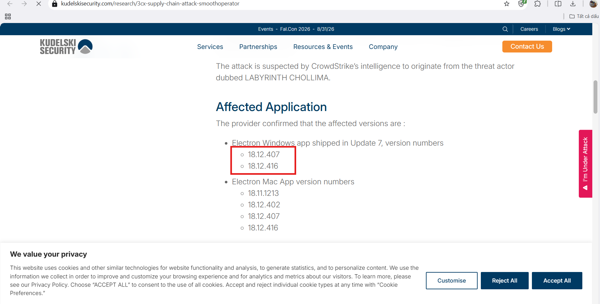
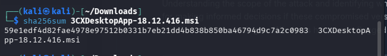
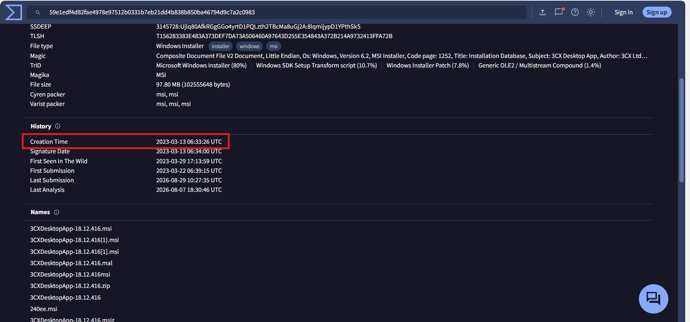
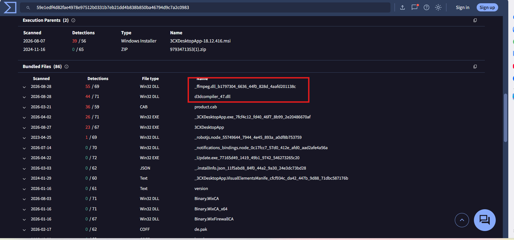
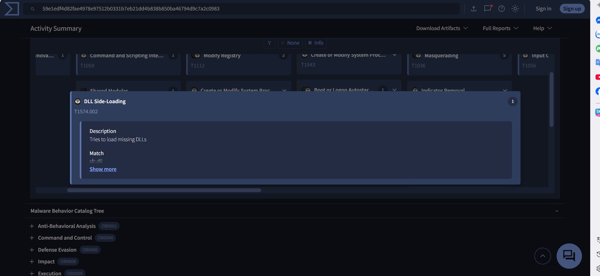
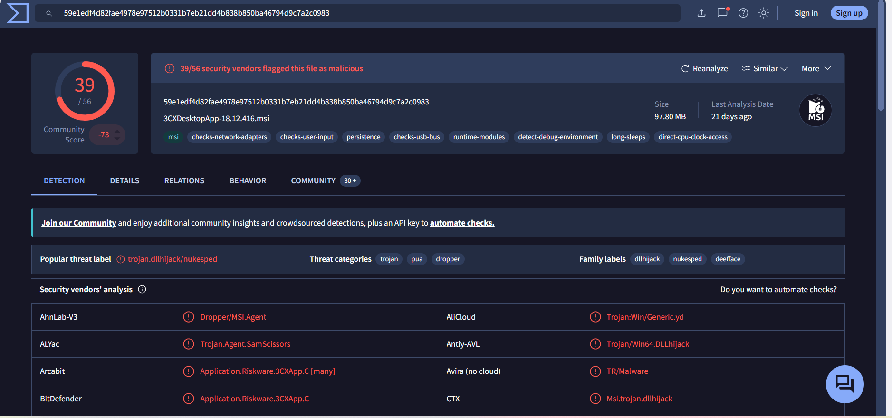
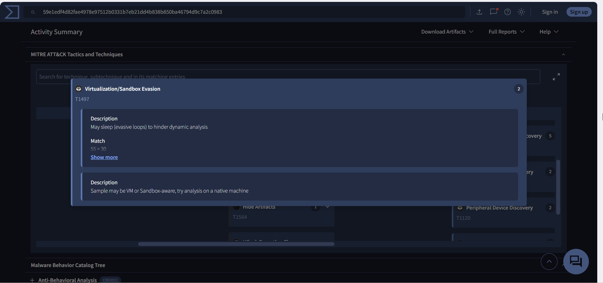
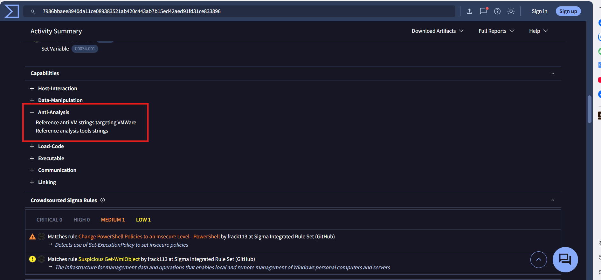
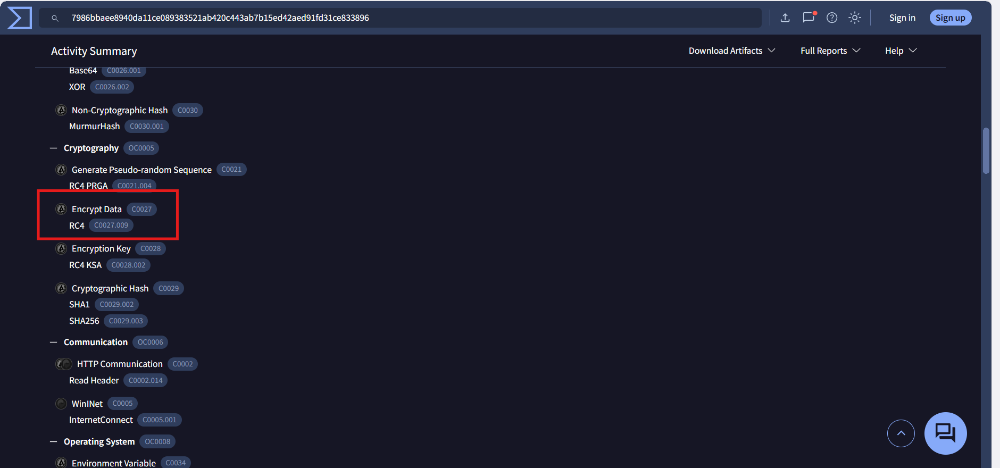
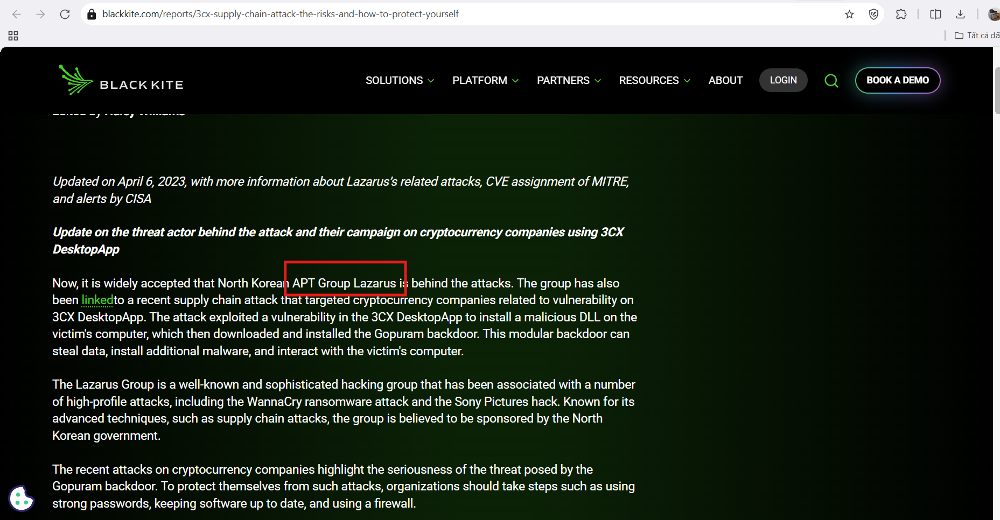

# CyberDefenders Lab: 3CX Supply Chain Writeup

**Category:** Threat Intel | **Difficulty:** Easy | **Tools:** VirusTotal, OSINT

**Scenario:** A large multinational corporation heavily relies on the 3CX software for phone communication. After a recent update to the 3CX Desktop App, antivirus alerts flag sporadic instances of the software being wiped from some workstations. As a threat intelligence analyst, your objective is to examine this supply chain attack, uncover how the attackers compromised the 3CX app, identify the potential threat actor, and assess the extent of the incident.

---

### Q1: How many versions of 3CX running on Windows have been flagged as malware?
*   **Cách làm:** Tra cứu báo cáo OSINT về vụ tấn công chuỗi cung ứng 3CX để xác định danh sách phiên bản bị ảnh hưởng.
*   **Thao tác thực hiện:** Theo báo cáo phân tích của **Kudelski Security**, tại mục *Affected Application*, nhà cung cấp xác nhận có **2 phiên bản** Electron Windows App bị chèn mã độc: `18.12.407` và `18.12.416`.
*   **Bằng chứng:**
    
*   **Flag:** `2`

---

### Q2: What's the UTC creation time of the .msi malware?
*   **Cách làm:** Trích xuất mã hash của file `.msi` và tra cứu Creation Time trên VirusTotal.
*   **Thao tác thực hiện:** Tính hash của file được cung cấp, thu được SHA-256: `59e1edf4d82fae4978e97512b0331b7eb21dd4b838b850ba46794d9c7a2c0983`. Tra cứu hash này trên **VirusTotal**, tại tab **Details**, xác định được Creation Time của file là `2023-03-13 06:33` (UTC).
*   **Bằng chứng:**
    
    
*   **Flag:** `2023-03-13 06:33`

---

### Q3: Which malicious DLLs were dropped by the .msi file?
*   **Cách làm:** Kiểm tra tab **Relations** trên VirusTotal để xác định các file được thả ra (dropped files) bởi file `.msi`.
*   **Thao tác thực hiện:** Tại VirusTotal, chuyển sang tab **Relations**, mục *Dropped Files* liệt kê 2 DLL độc hại: `ffmpeg.dll` và `d3dcompiler_47.dll`.
*   **Bằng chứng:**
    
*   **Flag:** `ffmpeg.dll,d3dcompiler_47.dll`

---

### Q4: What is the MITRE Technique ID employed by the .msi files to load the malicious DLL?
*   **Cách làm:** Kiểm tra tab **Behavior** trên VirusTotal để xác định kỹ thuật MITRE ATT&CK liên quan đến việc load DLL.
*   **Thao tác thực hiện:** Tại tab **Behavior**, mục *MITRE ATT&CK Tactics and Techniques*, file `.msi` được ghi nhận sử dụng kỹ thuật `T1574.002` (**DLL Side-Loading**) để load DLL độc hại. Do câu hỏi chỉ yêu cầu Technique ID gốc (không tính sub-technique), đáp án là `T1574`.
*   **Bằng chứng:**
    
*   **Flag:** `T1574`

---

### Q5: What is the threat category of the two malicious DLLs?
*   **Cách làm:** Kiểm tra mục Popular Threat Category trên trang tổng quan (Summary) của VirusTotal.
*   **Thao tác thực hiện:** Tại trang Summary của cả 2 file DLL trên VirusTotal, mục *Popular Threat Category* đều được gắn nhãn là `Trojan`.
*   **Bằng chứng:**
    
*   **Flag:** `Trojan`

---

### Q6: What is the MITRE ID for the virtualization/sandbox evasion techniques used by the two malicious DLLs?
*   **Cách làm:** Kiểm tra tab **Behavior** trên VirusTotal, tìm kỹ thuật thuộc nhóm Defense Evasion.
*   **Thao tác thực hiện:** Tại tab **Behavior**, mục MITRE ATT&CK, kỹ thuật Virtualization/Sandbox Evasion mà 2 file DLL sử dụng có ID là `T1497`.
*   **Bằng chứng:**
    
*   **Flag:** `T1497`

---

### Q7: Which hypervisor is targeted by the anti-analysis techniques in the ffmpeg.dll file?
*   **Cách làm:** Phân tích báo cáo sandbox (Capa/Behavior report) của `ffmpeg.dll` để xác định các chuỗi (string) liên quan đến kỹ thuật anti-VM.
*   **Thao tác thực hiện:** Trong báo cáo sandbox, mục **Capabilities → Anti-Analysis**, phát hiện dòng ghi chú *"Reference anti-VM strings targeting VMware"* — cho thấy mã độc chủ động kiểm tra và né tránh môi trường ảo hóa **VMware**.
*   **Bằng chứng:**
    
*   **Flag:** `Vmware`

---

### Q8: What encryption algorithm is used by the ffmpeg.dll file?
*   **Cách làm:** Phân tích báo cáo sandbox (Capa/Behavior report), kiểm tra mục Cryptography để xác định thuật toán mã hóa được sử dụng.
*   **Thao tác thực hiện:** Trong báo cáo sandbox, mục **Capabilities → Cryptography → Encrypt Data**, ghi nhận thuật toán mã hóa được `ffmpeg.dll` sử dụng là `RC4`.
*   **Bằng chứng:**
    
*   **Flag:** `RC4`

---

### Q9: Which group is responsible for this attack?
*   **Cách làm:** Tra cứu báo cáo Threat Intelligence liên quan đến chiến dịch tấn công 3CX Supply Chain để xác định nhóm APT đứng sau.
*   **Thao tác thực hiện:** Theo báo cáo phân tích của **Black Kite**, cuộc tấn công được cộng đồng an ninh mạng xác nhận là do nhóm **APT Lazarus** (được nhà nước Triều Tiên hậu thuẫn) thực hiện, với mục tiêu triển khai backdoor Gopuram sau khi khai thác lỗ hổng trên 3CX DesktopApp.
*   **Bằng chứng:**
    
*   **Flag:** `Lazarus`
