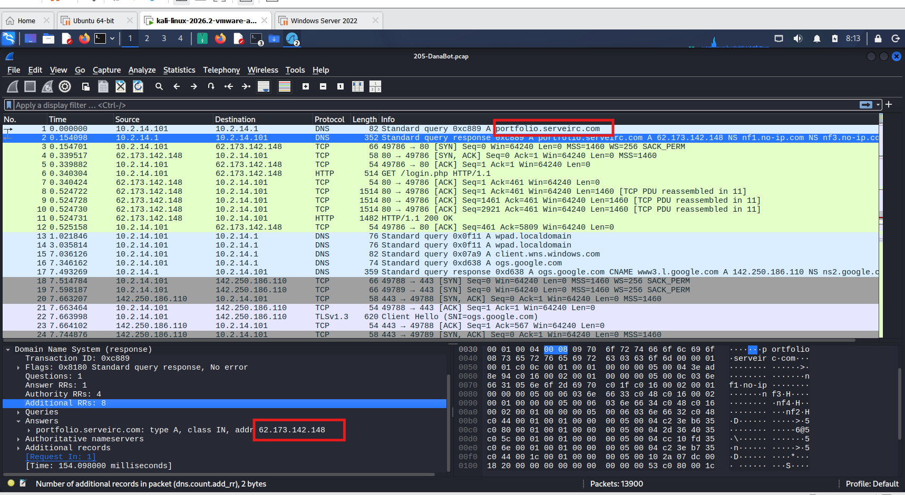
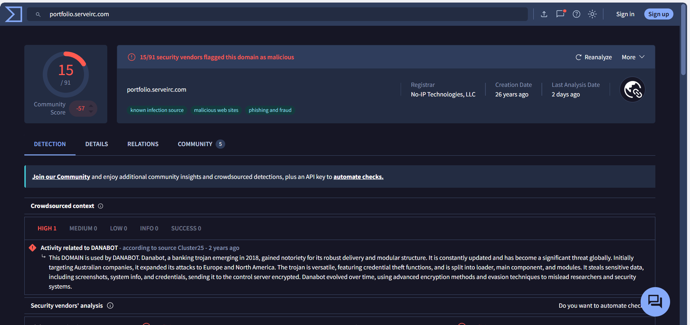
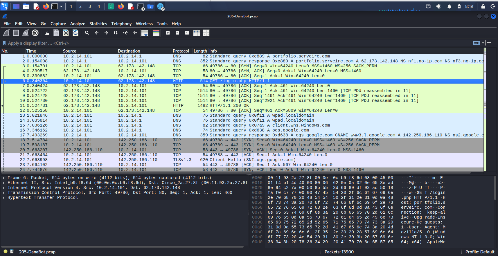
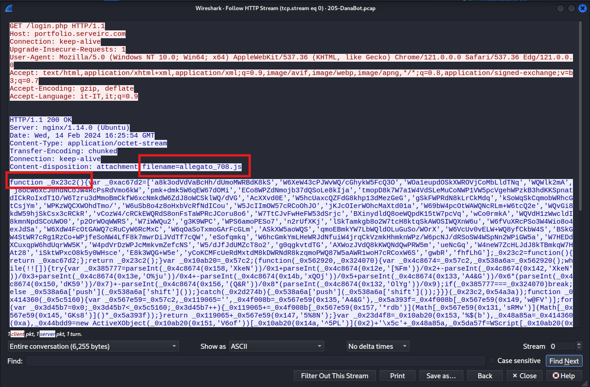
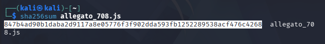
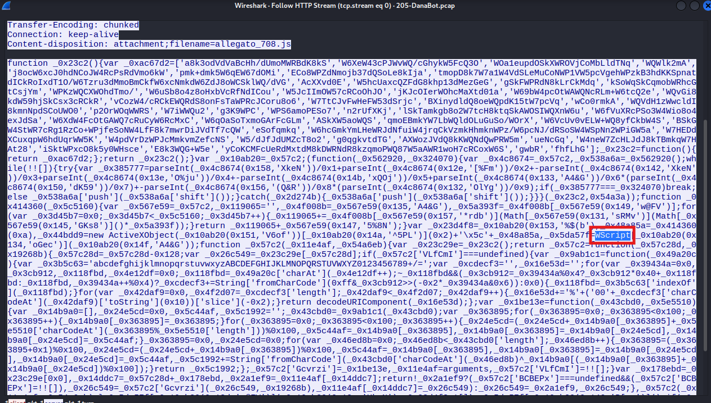
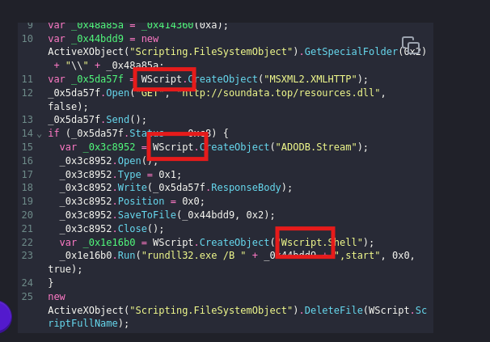
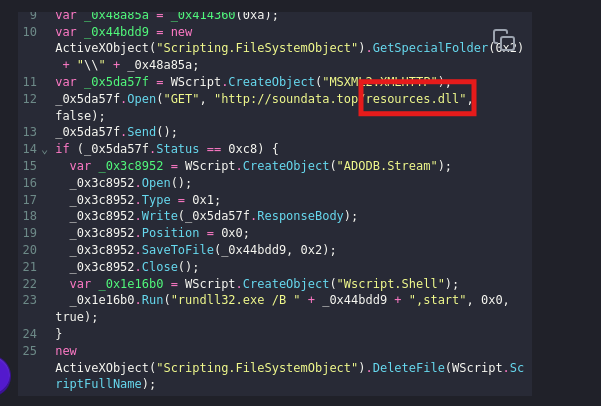
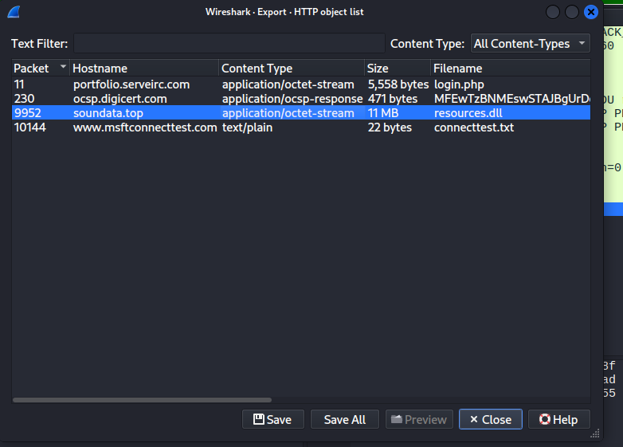
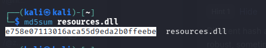

# CyberDefenders Lab: DanaBot Writeup

**Category:** Network Forensics | **Difficulty:** Easy

**Scenario:** The SOC team has detected suspicious activity in the network traffic, revealing that a machine has been compromised. Sensitive company information has been stolen. Your task is to use Network Capture (PCAP) files and Threat Intelligence to investigate the incident and determine how the breach occurred.

---

### Q1: Which IP address was used by the attacker during the initial access?

*   **Cách làm:** Phân tích truy vấn DNS và xác minh trên VirusTotal.
*   **Thao tác thực hiện:** Quan sát câu lệnh DNS query và response tới `portfolio.serveirc.com` có địa chỉ IP là `62.173.142.148`. Khi tìm kiếm DNS này trên VirusTotal, kết quả trả về xác nhận đây là một malicious domain.
*   **Bằng chứng:**
    
    
*   **Flag:** `62.173.142.148`

---

### Q2: What is the name of the malicious file used for initial access?

*   **Cách làm:** Phân tích luồng HTTP GET request.
*   **Thao tác thực hiện:** Kiểm tra lệnh truy vấn GET tới file `login.php`. Khi Follow HTTP Stream của frame GET này, ta sẽ thấy một attachment (tệp đính kèm) với filename là `allegato_708.js`. Đây chính là file dùng cho Initial access.
*   **Bằng chứng:**
    
    
*   **Flag:** `allegato_708.js`

---

### Q3: What is the SHA-256 hash of the malicious file used for initial access?

*   **Cách làm:** Trích xuất file và tính toán mã băm SHA-256.
*   **Thao tác thực hiện:** Bản chất khi nạn nhân click vào `login.php`, máy chủ thực chất ép trình duyệt tải về file đính kèm độc hại `allegato_708.js`. Sử dụng lệnh `sha256sum allegato_708.js` trong Terminal trên Kali Linux, ta lấy được mã hash của file này.
*   **Bằng chứng:**
    
*   **Flag:** `847b4ad90b1daba2d9117a8e05776f3f902dda593fb1252289538acf476c4268`

---

### Q4: Which process was used to execute the malicious file?

*   **Cách làm:** Phân tích mã nguồn JavaScript để tìm tiến trình thực thi.
*   **Thao tác thực hiện:** Khi xem đoạn mã đã bị làm rối, mã độc đã gọi đến đối tượng `WScript`. Ngoài ra, khi deobfuscate (gỡ rối) đoạn code bị mã hóa, sự xuất hiện của `WScript` càng rõ ràng hơn, chỉ định tiến trình thực thi là `wscript.exe`.
*   **Bằng chứng:**
    
    
*   **Flag:** `wscript.exe`

---

### Q5: What is the file extension of the second malicious file utilized by the attacker?

*   **Cách làm:** Xác định payload giai đoạn 2 thông qua mã nguồn đã gỡ rối.
*   **Thao tác thực hiện:** Từ đoạn code đã được gỡ rối ở câu 4, có thể thấy rõ file mã độc thứ 2 được attacker tải về là `resources.dll`. Do đó, file extension (phần mở rộng) là `.dll`.
*   **Bằng chứng:**
    
*   **Flag:** `.dll`

---

### Q6: What is the MD5 hash of the second malicious file?

*   **Cách làm:** Trích xuất file payload thứ 2 và tính toán mã băm MD5.
*   **Thao tác thực hiện:** Vào Wireshark, chọn **File -> Export Objects -> HTTP**, tiến hành export (lưu) file mã độc thứ 2 là `resources.dll`. Sau đó, sử dụng lệnh `md5sum resources.dll` trong Terminal để kiểm tra mã hash MD5.
*   **Bằng chứng:**
    
    
*   **Flag:** `e758e07113016aca55d9eda2b0ffeebe`
