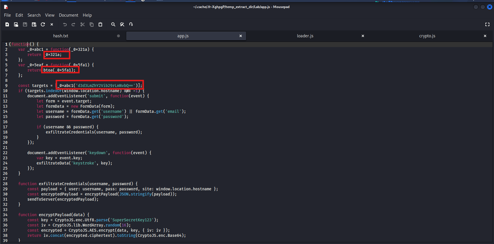
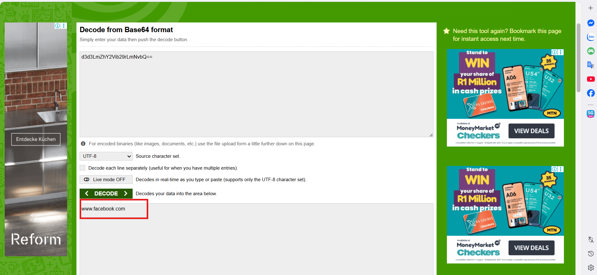
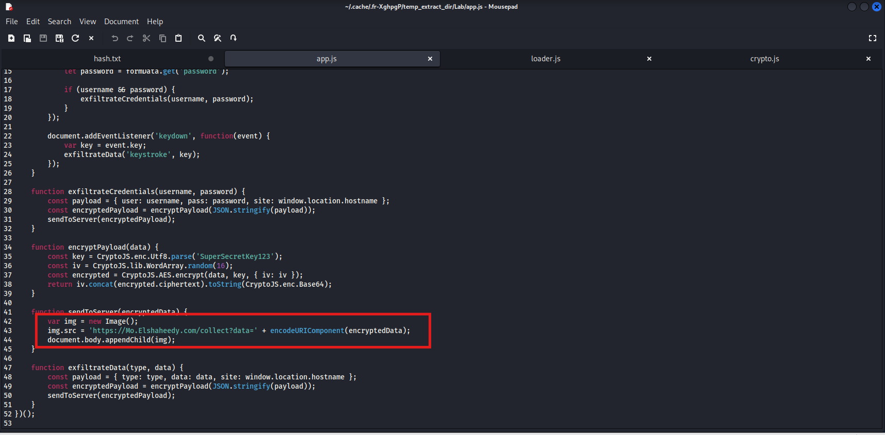
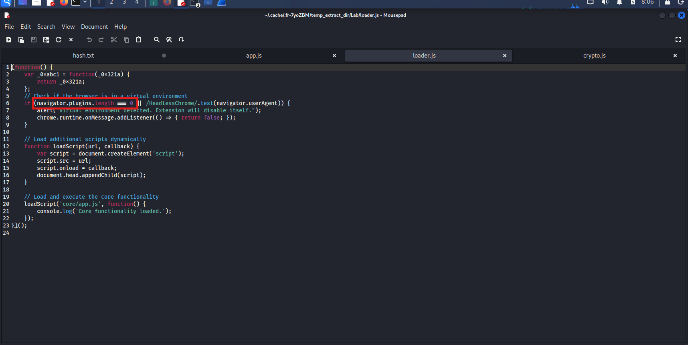
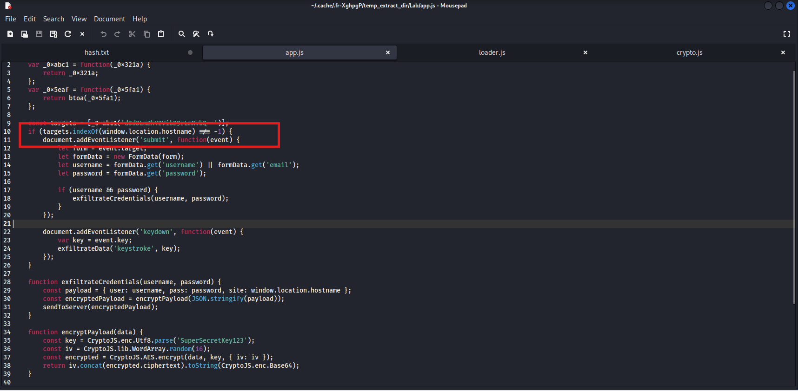
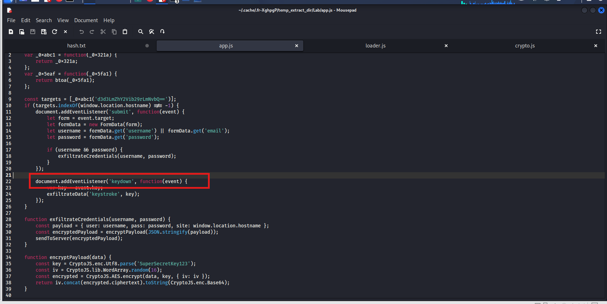
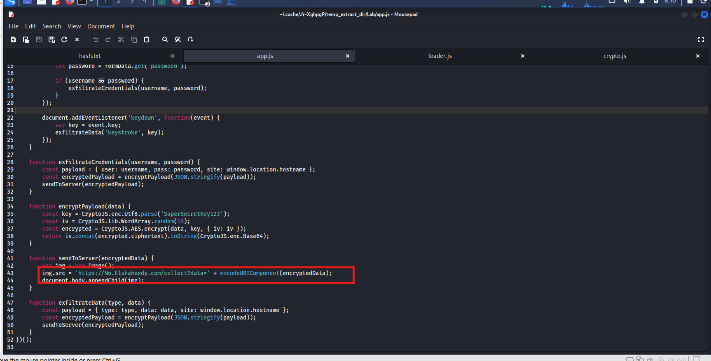
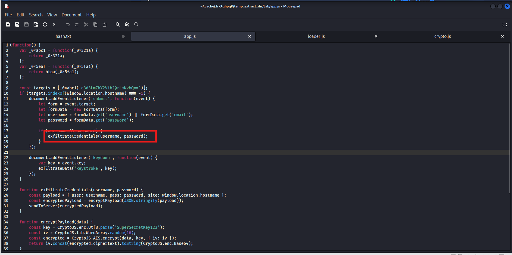
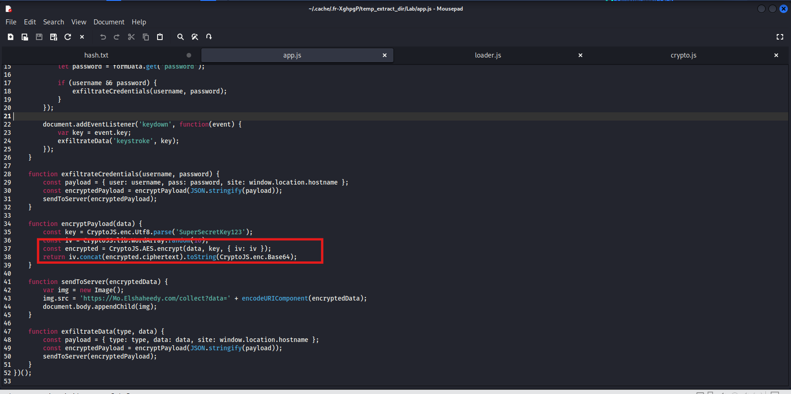
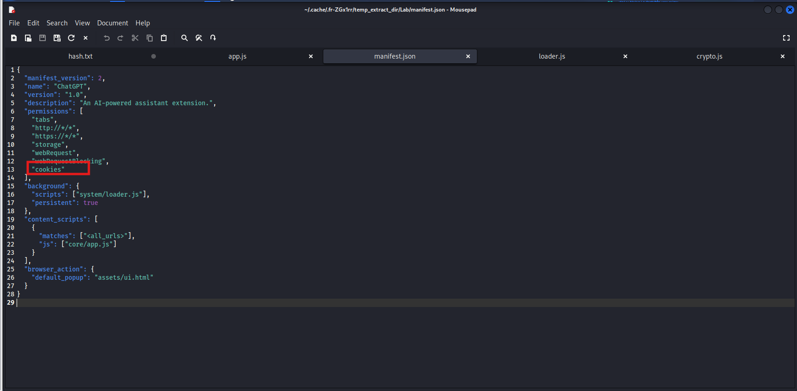

# CyberDefenders Lab: FakeGPT Writeup

**Category:** Malware Analysis | **Difficulty:** Easy

**Scenario:** Analyze a malicious Chrome extension's code and behavior to identify data theft mechanisms, covert exfiltration via `` tags, and anti-analysis techniques.

---

### Q1: Which encoding method does the browser extension use to obscure target URLs, making them more difficult to detect during analysis?

*   **Cách làm:** Tìm kiếm các chuỗi bị làm rối và hàm giải mã URL mục tiêu trong mã nguồn.
*   **Thao tác thực hiện:** Trong file `app.js`, tại dòng khai báo `const targets = [_0xabc1('d3d3LmZhY2Vib29rLmNvbQ==')];`, chuỗi ký tự kết thúc bằng `==` là dấu hiệu kinh điển của mã hóa **Base64**. Ngoài ra, code cũng có định nghĩa hàm `_0x5eaf` sử dụng `btoa()` (hàm mã hóa Base64 tích hợp sẵn của JavaScript).
*   **Bằng chứng:**
    
*   **Flag:** `base64`

---

### Q2: Which website does the extension monitor for data theft, targeting user accounts to steal sensitive information?

*   **Cách làm:** Giải mã chuỗi Base64 vừa tìm được ở Q1 để xác định mục tiêu.
*   **Thao tác thực hiện:** Đem chuỗi `d3d3LmZhY2Vib29rLmNvbQ==` đi decode Base64, ta thu được kết quả là URL của mạng xã hội Facebook.
*   **Bằng chứng:**
    
*   **Flag:** `www.facebook.com`

---

### Q3: Which type of HTML element is utilized by the extension to send stolen data?

*   **Cách làm:** Phân tích hàm gửi dữ liệu ra máy chủ bên ngoài (Data Exfiltration) để xem mã độc dùng phương thức nào.
*   **Thao tác thực hiện:** Trong file `app.js`, hàm `sendToServer(encryptedData)` khởi tạo một đối tượng hình ảnh bằng lệnh `var img = new Image();` sau đó gán dữ liệu vào URL và chèn thẻ `` vào DOM (`document.body.appendChild(img);`). Kỹ thuật này giúp mã độc lén lút gửi request GET ra ngoài mà không bị chính sách CORS chặn lại.
*   **Bằng chứng:**
    
*   **Flag:** ``

---

### Q4: What is the first specific condition in the code that triggers the extension to deactivate itself?

*   **Cách làm:** Tìm kiếm kỹ thuật Anti-Analysis (Chống phân tích/Chạy trong môi trường ảo) của mã độc.
*   **Thao tác thực hiện:** Tại file `loader.js`, ngay những dòng đầu tiên, mã độc sử dụng câu lệnh `if` để kiểm tra môi trường chạy: `if (navigator.plugins.length === 0 || /HeadlessChrome/.test(navigator.userAgent))`. Điều kiện đầu tiên nó kiểm tra là độ dài mảng plugins của trình duyệt phải khác 0 (tránh các trình duyệt ảo).
*   **Bằng chứng:**
    
*   **Flag:** `navigator.plugins.length === 0`

---

### Q5: Which event does the extension capture to track user input submitted through forms?

*   **Cách làm:** Tìm kiếm các Event Listener lắng nghe thao tác của người dùng trên DOM.
*   **Thao tác thực hiện:** Trong `app.js`, mã độc gắn listener vào form để bắt sự kiện khi người dùng bấm gửi dữ liệu: `document.addEventListener('submit', ...)`. Sự kiện này giúp trích xuất username và password.
*   **Bằng chứng:**
    
*   **Flag:** `submit`

---

### Q6: Which API or method does the extension use to capture and monitor user keystrokes?

*   **Cách làm:** Tìm kiếm Event Listener chuyên dùng để ghi nhận thao tác gõ phím (đóng vai trò như một Keylogger).
*   **Thao tác thực hiện:** Tương tự Q5, mã độc cài cắm thêm một sự kiện giám sát bàn phím: `document.addEventListener('keydown', function(event) { ... }`.
*   **Bằng chứng:**
    
*   **Flag:** `keydown`

---

### Q7: What is the domain where the extension transmits the exfiltrated data?

*   **Cách làm:** Trích xuất IoC (Domain/IP của máy chủ C2) từ hàm gửi dữ liệu.
*   **Thao tác thực hiện:** Quay lại hàm `sendToServer` trong `app.js`, chuỗi URL nhận dữ liệu được chỉ định rõ ràng là domain `Mo.Elshaheedy.com`.
*   **Bằng chứng:**
    
*   **Flag:** `Mo.Elshaheedy.com`

---

### Q8: Which function in the code is used to exfiltrate user credentials, including the username and password?

*   **Cách làm:** Xác định tên hàm xử lý việc đánh cắp thông tin đăng nhập.
*   **Thao tác thực hiện:** Bên trong sự kiện `submit`, nếu trích xuất thành công `username` và `password`, mã nguồn độc hại sẽ gọi đến hàm `exfiltrateCredentials(username, password)`.
*   **Bằng chứng:**
    
*   **Flag:** `exfiltrateCredentials(username, password);`

---

### Q9: Which encryption algorithm is applied to secure the data before sending?

*   **Cách làm:** Phân tích thuật toán mã hóa được sử dụng để che giấu dữ liệu bị đánh cắp trên đường truyền mạng.
*   **Thao tác thực hiện:** Trong hàm `encryptPayload(data)` của file `app.js` (và cả file `crypto.js`), mã nguồn sử dụng thư viện CryptoJS với phương thức `CryptoJS.AES.encrypt`. Thuật toán được dùng là Advanced Encryption Standard (AES).
*   **Bằng chứng:**
    
*   **Flag:** `AES`

---

### Q10: What does the extension access to store or manipulate session-related data and authentication information?

*   **Cách làm:** Phân tích bản đồ khai báo quyền (permissions) của tiện ích mở rộng để xác định mục tiêu đánh cắp dữ liệu phiên làm việc.
*   **Thao tác thực hiện:** Kiểm tra file `manifest.json`, tại mảng `"permissions"`, mã độc đã ngang nhiên yêu cầu cấp quyền `"cookies"`. Đây chính là nơi trình duyệt lưu trữ toàn bộ dữ liệu session và token xác thực của người dùng. Bằng việc lấy được quyền này, mã độc có thể dễ dàng đánh cắp phiên đăng nhập (Session Hijacking).
*   **Bằng chứng:**
    
*   **Flag:** `cookies`
