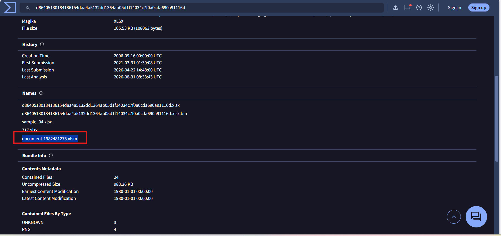
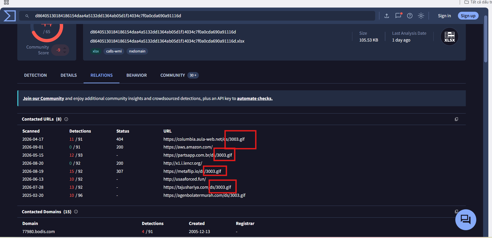
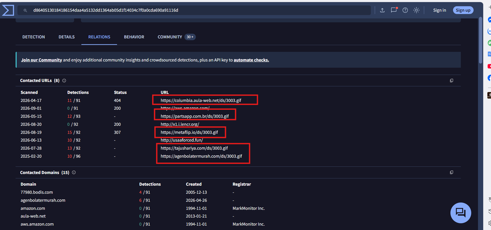

# CyberDefenders Lab: IcedID Writeup

**Category:** Threat Intel | **Difficulty:** Easy | **Tools:** VirusTotal, Malpedia, X (Twitter), Tria.ge, ANY.RUN

**Scenario:** A cyber threat group was identified for initiating widespread phishing campaigns to distribute further malicious payloads. The most frequently encountered payloads were IcedID. You have been given a hash of an IcedID sample to analyze and monitor the activities of this advanced persistent threat (APT) group.

**Hash mẫu được cung cấp:** `191eda0c539d284b29efe556abb05cd75a9077a0`

---

### Q1: What is the name of the file associated with the given hash?
*   **Cách làm:** Tra cứu mã hash mẫu trên VirusTotal để xác định tên file gốc.
*   **Thao tác thực hiện:** Tìm kiếm hash `191eda0c539d284b29efe556abb05cd75a9077a0` trên **VirusTotal**, tại phần thông tin chi tiết, xác định được file độc hại liên quan là `document-1982481273.xlsm`.
*   **Bằng chứng:**
    
*   **Flag:** `document-1982481273.xlsm`

---

### Q2: Can you identify the filename of the GIF file that was deployed?
*   **Cách làm:** Kiểm tra tab **Relations** trên VirusTotal để xác định các file được liên kết/tải về bởi mẫu ban đầu.
*   **Thao tác thực hiện:** Tại tab **Relations** của file `.xlsm`, phát hiện file GIF độc hại được sử dụng trong chuỗi tấn công là `3003.gif`.
*   **Bằng chứng:**
    
*   **Flag:** `3003.gif`

---

### Q3: How many domains does the malware look to download the additional payload file in Q2?
*   **Cách làm:** Tiếp tục kiểm tra tab **Relations** trên VirusTotal, mục Contacted Domains liên quan đến file GIF ở Q2.
*   **Thao tác thực hiện:** Tại tab **Relations**, đếm số lượng domain mà mẫu độc hại cố gắng liên hệ để tải file `3003.gif`, xác định được tổng cộng **5 domain**.
*   **Bằng chứng:**
    
*   **Flag:** `5`

---

### Q4: From the domains mentioned in Q3, a DNS registrar was predominantly used by the threat actor to host their harmful content, enabling the malware's
