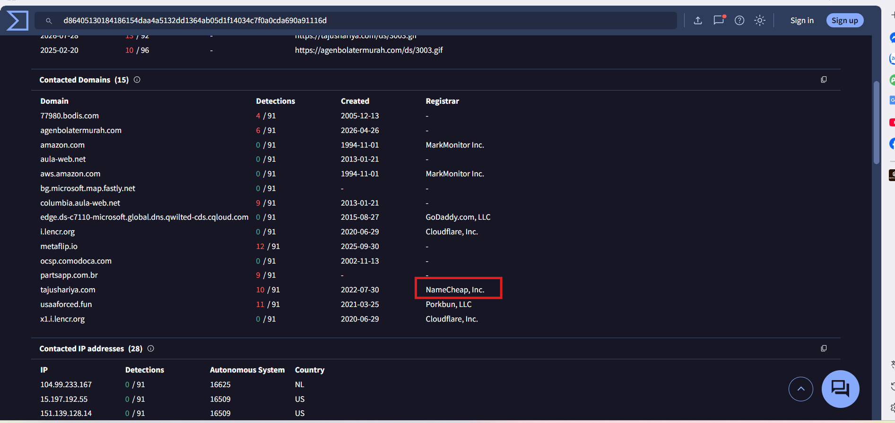
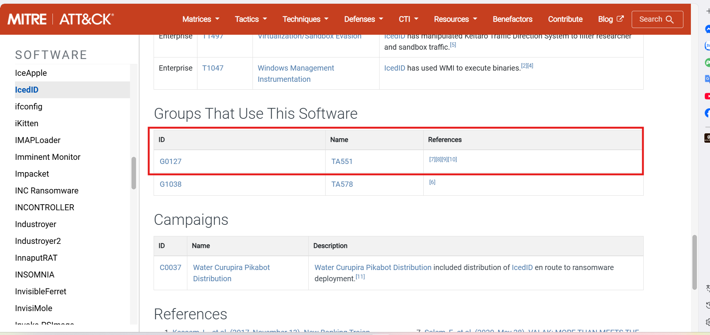
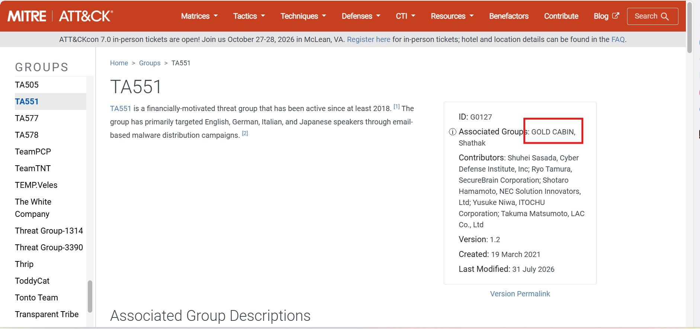
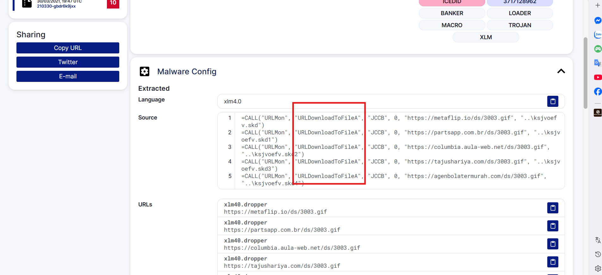

# CyberDefenders Lab: IcedID Writeup

**Category:** Threat Intel | **Difficulty:** Easy | **Tools:** VirusTotal, Malpedia, X (Twitter), Tria.ge, ANY.RUN

**Scenario:** A cyber threat group was identified for initiating widespread phishing campaigns to distribute further malicious payloads. The most frequently encountered payloads were IcedID. You have been given a hash of an IcedID sample to analyze and monitor the activities of this advanced persistent threat (APT) group.

**Provided Sample Hash:** `191eda0c539d284b29efe556abb05cd75a9077a0`

---

### Q1: What is the name of the file associated with the given hash?

* **Approach:** Look up the sample hash on VirusTotal to identify the original filename.
* **Steps Taken:** Search for the hash `191eda0c539d284b29efe556abb05cd75a9077a0` on **VirusTotal**. In the details section, the associated malicious file is identified as `document-1982481273.xlsm`.
* **Evidence:**
    
* **Flag:** `document-1982481273.xlsm`

---

### Q2: Can you identify the filename of the GIF file that was deployed?

* **Approach:** Check the **Relations** tab on VirusTotal to identify files linked to or downloaded by the initial sample.
* **Steps Taken:** Under the **Relations** tab of the `.xlsm` file, a malicious GIF file used in the attack chain is discovered to be `3003.gif`.
* **Evidence:**
    
* **Flag:** `3003.gif`

---

### Q3: How many domains does the malware look to download the additional payload file in Q2?

* **Approach:** Continue inspecting the **Relations** tab on VirusTotal, specifically the Contacted Domains section related to the GIF file in Q2.
* **Steps Taken:** In the **Relations** tab, count the number of domains the malicious sample attempts to contact to download the `3003.gif` file. A total of **5 domains** are identified.
* **Evidence:**
    
* **Flag:** `5`

---

### Q4: From the domains mentioned in Q3, a DNS registrar was predominantly used by the threat actor to host their harmful content, enabling the malware's functionality. Can you specify the Registrar INC?

* **Approach:** Check the registration information (registrar) of the domains identified in Q3.
* **Steps Taken:** Under the **Contacted Domains** section on VirusTotal, check the WHOIS/Registrar information for each domain. The registrar most commonly used to host the malicious content is identified as `NameCheap`.
* **Evidence:**
    
* **Flag:** `NameCheap`

---

### Q5: Could you specify the threat actor linked to the sample provided?

* **Approach:** Look up threat actor information related to the sample on MITRE ATT&CK / VirusTotal Threat Intel.
* **Steps Taken:** On **MITRE ATT&CK**, the sample is identified as being linked to the `TA551` group. Further checking the Associated Group section for `TA551` reveals that an alias for this group is `Gold Cabin`.
* **Evidence:**
    
    
* **Flag:** `Gold Cabin`

---

### Q6: In the Execution phase, what function does the malware employ to fetch extra payloads onto the system?

* **Approach:** Analyze the execution behavior of the sample using a sandbox (e.g., Recorded Future Triage) to identify the called API function.
* **Steps Taken:** In the sandbox report, under the API monitoring/Execution phase section, it is recorded that the malware calls the Windows API function `URLDownloadToFileA` to download additional payloads from malicious domains to the victim's machine. This function allows downloading files directly from the internet, enabling the malware to fetch and execute further malicious components, expanding its operational capabilities and persistence on the infected system. 
    
    The `A` suffix in `URLDownloadToFileA` indicates that the function uses the **ANSI** character set to process strings (conversely, the `W` suffix — e.g., `URLDownloadToFileW` — uses the **Unicode** character set). This difference relates to compatibility: older systems/applications typically use ANSI, while modern systems default to Unicode. In this case, the malicious sample specifically uses the ANSI variant.
* **Evidence:**
    
* **Flag:** `URLDownloadToFileA`
