# CyberDefenders Lab: JetBrains Writeup

**Category:** Network Forensics | **Difficulty:** Easy (Community rating: Medium) | **Tactics:** Initial Access, Execution, Command and Control | **Tools:** Wireshark, NetworkMiner, Brim

**Scenario:** During a recent security incident, an attacker successfully exploited a vulnerability in our web server, allowing them to upload webshells and gain full control over the system. The attacker utilized the compromised web server as a launch point for further malicious activities, including data manipulation.

As part of the investigation, you are provided with a packet capture (PCAP) of the network traffic during the attack to piece together the attack timeline and identify the methods used by the attacker. The goal is to determine the initial entry point, the attacker's tools and techniques, and the compromise's extent.

---

### Q1: What is the attacker's IP address?
*   **Cách làm:** Thống kê traffic theo endpoint trên Wireshark để tìm IP có lưu lượng bất thường.
*   **Thao tác thực hiện:** Vào **Statistics → Conversations/Endpoints**, phát hiện IP `23.158.56.196` chiếm lượng lớn traffic. Áp filter `ip.addr==23.158.56.196`, tại **Protocol Hierarchy** thấy phần lớn traffic là **HTTP**. Tiếp tục lọc `ip.addr==23.158.56.196 and http`, quan sát thấy IP này liên tục gửi hàng loạt request **GET/POST** dồn dập tới 2 dải IP nội bộ trong khoảng thời gian rất ngắn — dấu hiệu điển hình của công cụ tự động dò quét/khai thác (brute-force hoặc automated exploitation tool).
*   **Bằng chứng:**
    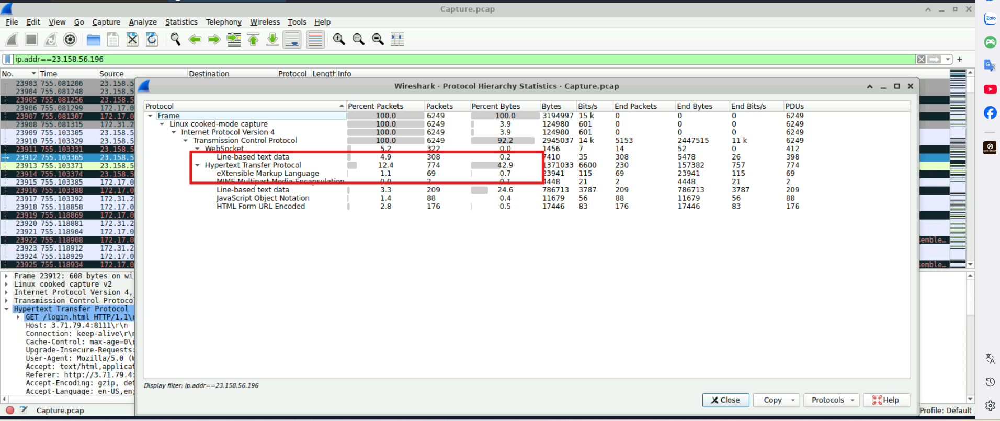
    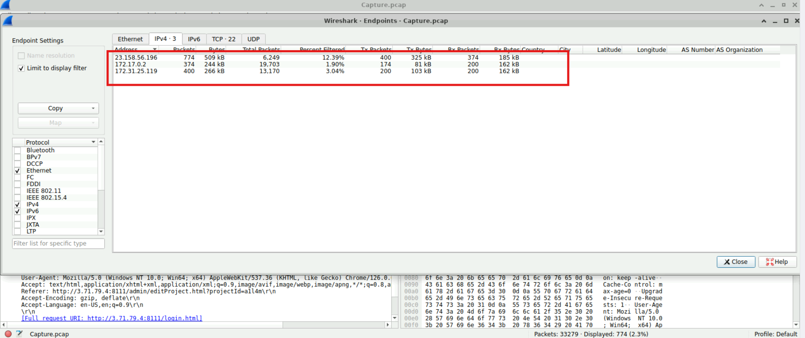
    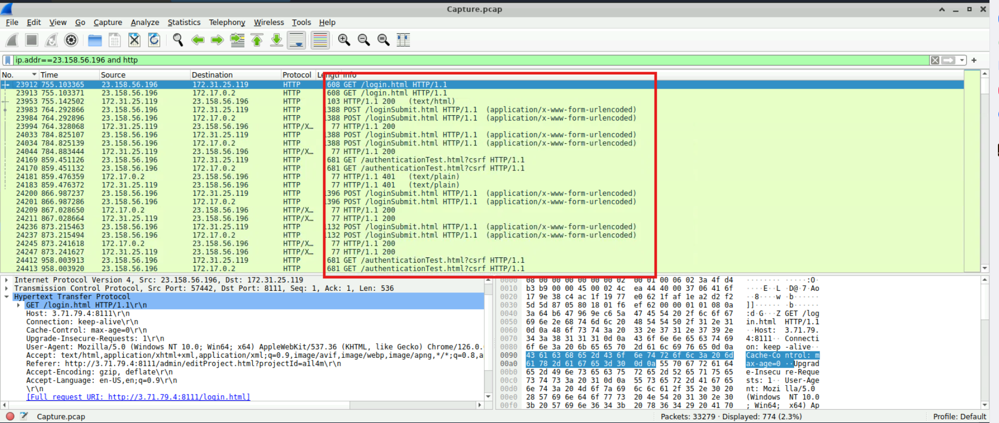
*   **Flag:** `23.158.56.196`

---

### Q2: What version of our web server service is running?
*   **Cách làm:** Theo dõi luồng HTTP Stream để tìm thông tin banner/version của service.
*   **Thao tác thực hiện:** Dùng **Follow HTTP Stream** trên các gói tin trao đổi với server, xác định được service đang chạy là **JetBrains TeamCity**, phiên bản `2023.11.3`.
*   **Bằng chứng:**
    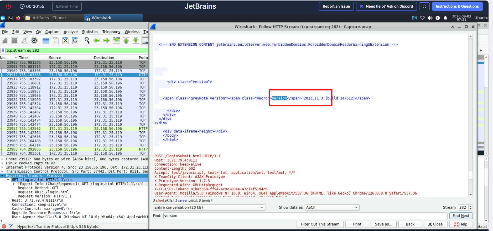
*   **Flag:** `2023.11.3`

---

### Q3: What CVE number corresponds to the vulnerability the attacker exploited?
*   **Cách làm:** Tra cứu CVE tương ứng với phiên bản TeamCity đã xác định ở Q2.
*   **Thao tác thực hiện:** Tìm kiếm CVE liên quan tới TeamCity `2023.11.3`, xác định được **CVE-2024-27198** — có hành vi khớp với traffic trong pcap đang phân tích (liên quan tới Authentication Bypass).

    **Bản chất lỗ hổng:** Cho phép kẻ tấn công vượt qua cơ chế xác thực bằng cách chèn đường dẫn file `.jsp` giả lập (ví dụ `/hax.jsp/...`) để gọi thẳng vào các REST API nội bộ của TeamCity mà không cần đăng nhập. Mục tiêu của attacker là tạo ngay một tài khoản Admin mới (`SYSTEM_ADMIN`) để chiếm quyền kiểm soát toàn diện và duy trì persistence.
*   **Bằng chứng:**
    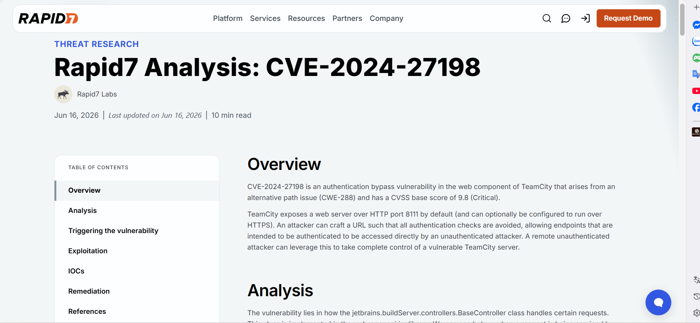
*   **Flag:** `CVE-2024-27198`

---

### Q4: What credentials did the attacker set up when creating a user account?
*   **Cách làm:** Kiểm tra request khai thác lỗ hổng CVE-2024-27198 để xem payload tạo user.
*   **Thao tác thực hiện:** Quan sát URI tại **Frame 24721**: `/hax?jsp=/app/rest/users;.jsp`. Attacker lợi dụng kỹ thuật **Path Manipulation** để đánh lừa bộ lọc xác thực TeamCity — máy chủ tưởng đây là request gọi file tĩnh `.jsp` công khai, nhưng tầng backend lại chuyển tiếp xử lý tới REST API `/app/rest/users`, cho phép thực thi API quản trị (tạo user) hoàn toàn **unauthenticated**.

    Dùng **Follow HTTP Stream**, xác định được username và password attacker đã khởi tạo.
*   **Bằng chứng:**
    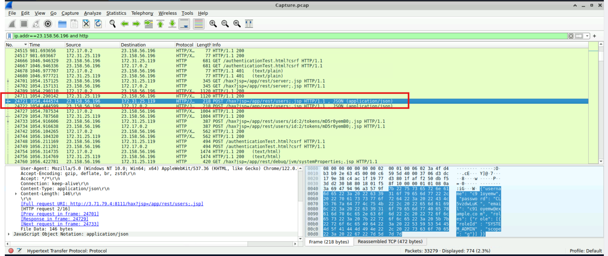
    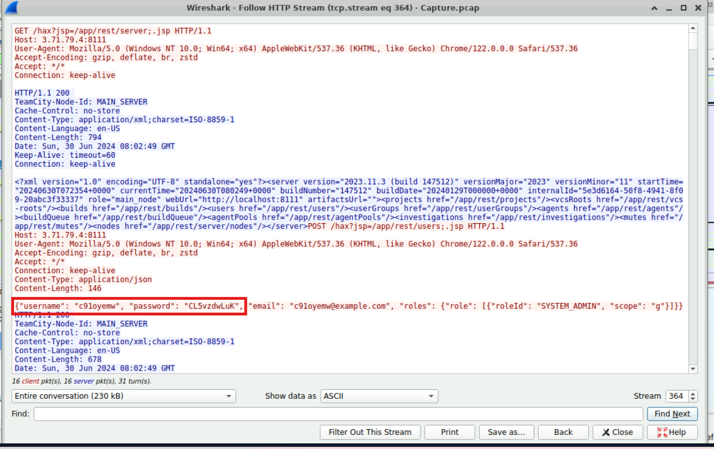
*   **Flag:** `c91oyemw:CL5vzdwLuK`

---

### Q5: What is the name of the webshell file the attacker uploaded?
*   **Cách làm:** Kiểm tra request upload plugin để tìm file webshell được nhúng vào.
*   **Thao tác thực hiện:** Sau khi tạo tài khoản admin (`c9loyemw`), attacker chuyển sang giai đoạn **Persistence** bằng cách lạm dụng tính năng cài plugin của TeamCity để đưa webshell lên máy chủ, tránh bị bộ lọc file upload thông thường chặn — thực hiện qua endpoint `POST /admin/pluginUpload.html`.

    File được tải lên là `NSt8bHTg.zip`, chứa 3 dấu hiệu thiết lập persistence bền vững:
    - **Lưu trữ vĩnh viễn qua cơ chế nạp Plugin:** Khi TeamCity nhận file qua `/admin/pluginUpload.html`, hệ thống tự động giải nén và ghi dữ liệu cố định vào thư mục `<TeamCity_Data>/plugins/` — không mất đi khi restart service (reboot persistence).
    - **Tạo endpoint backdoor cố định:** Cấu trúc nén chứa đường dẫn `buildServerResources/NSt8bHTg.jsp`, khiến TeamCity tự động ánh xạ thành URL công khai `/plugins/NSt8bHTg/NSt8bHTg.jsp` — cho phép truy cập trực tiếp mà không cần khai thác lại CVE-2024-27198.
    - **Điều khiển từ xa theo yêu cầu:** Mã JSP bên trong payload lắng nghe tham số `cmd` qua HTTP request, chuyển tiếp vào `ProcessBuilder` để thực thi lệnh hệ thống (RCE) — hoạt động như 1 webshell thường trực.
*   **Bằng chứng:**
    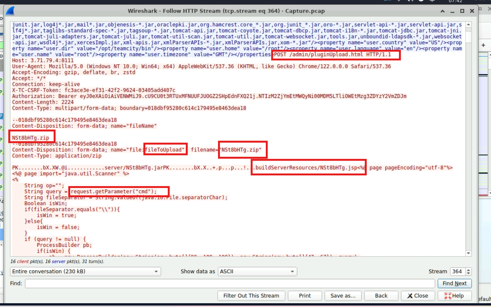
*   **Flag:** `NSt8bHTg.zip`

---

### Q6: When did the attacker execute their first command via the web shell?
*   **Cách làm:** Theo dõi luồng traffic ngay sau khi plugin được kích hoạt để tìm request command đầu tiên gửi tới webshell.
*   **Thao tác thực hiện:** Dùng **Follow HTTP Stream**, quan sát:
    - Server phản hồi `<response>Plugin loaded successfully</response>` — xác nhận plugin độc hại đã được nạp.
    - Ngay sau đó, attacker gửi `POST /plugins/NSt8bHTg/NSt8bHTg.jsp HTTP/1.1` với payload `cmd=ls` — lệnh liệt kê thư mục để kiểm tra quyền thực thi. Server phản hồi danh sách file (bắt đầu bằng `append.bat...`), xác nhận lệnh chạy thành công.
    - Header response ghi nhận: `Date: Sun, 30 Jun 2024 08:03:57 GMT`. Quy đổi theo định dạng yêu cầu (`YYYY-MM-DD HH:MM`, làm tròn phút): `2024-06-30 08:03`.
*   **Bằng chứng:**
    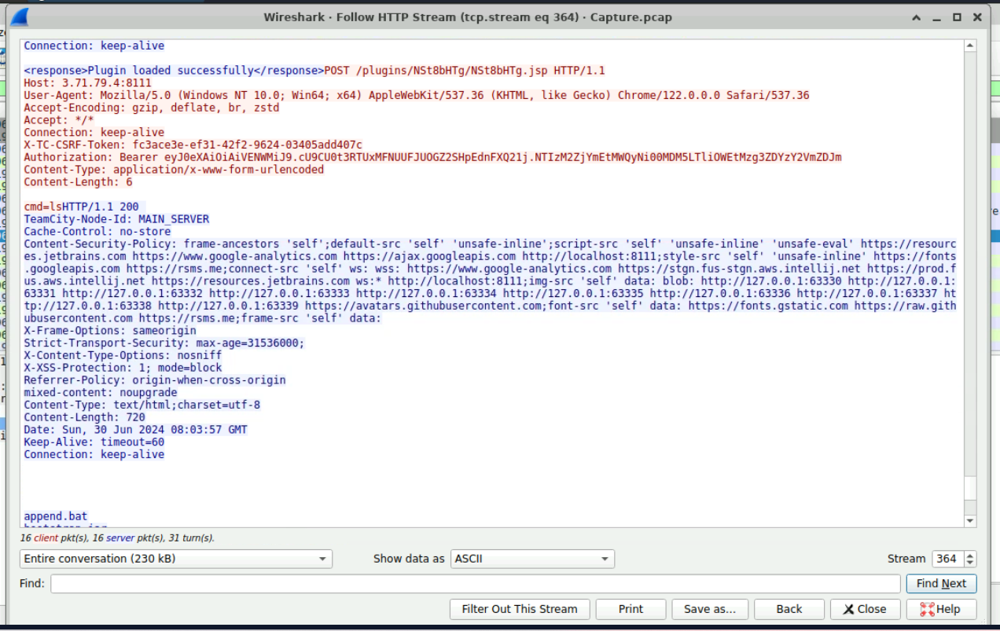
    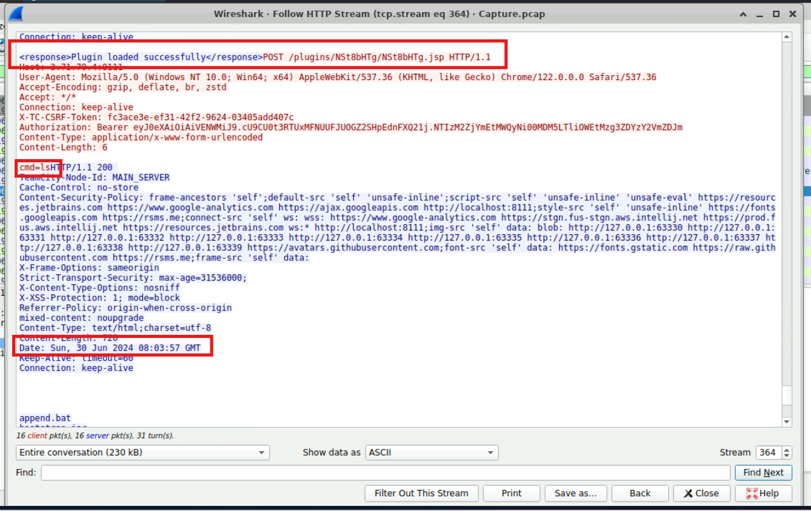
*   **Flag:** `2024-06-30 08:03`

---

### Q7: What new username and password did the attacker write into the tampered credentials file?
*   **Cách làm:** Tìm request qua webshell chứa lệnh ghi đè file credentials.
*   **Thao tác thực hiện:** Tại **TCP Stream 547**, attacker dùng webshell `NSt8bHTg.jsp` (`POST /plugins/NSt8bHTg/NSt8bHTg.jsp`) để gửi lệnh can thiệp dữ liệu. Giải mã chuỗi lệnh (URL-decoded):
    `bash -c 'echo "username:a1l4m,password:youarecompromised" > /tmp/Creds.txt'`
    Lệnh này ghi đè nội dung file `/tmp/Creds.txt` bằng credentials giả do attacker tự đặt.
*   **Bằng chứng:**
    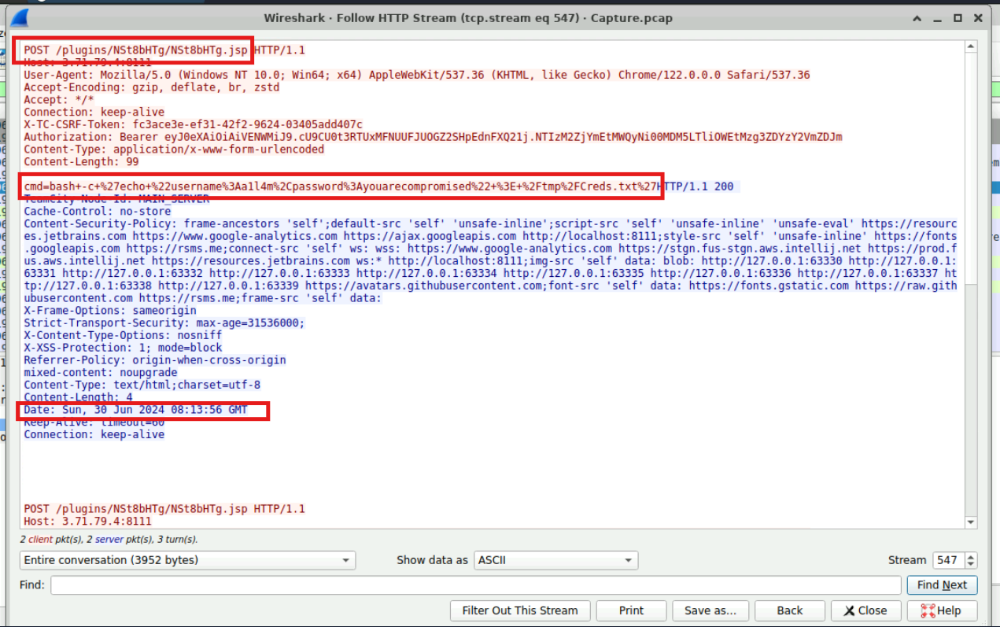
*   **Flag:** `a1l4m:youarecompromised`

---

### Q8: What is the MITRE Technique ID for the attacker's action in Q7?
*   **Cách làm:** Ánh xạ hành vi ghi đè file ở Q7 vào cấu trúc Tactic → Technique → Sub-technique của MITRE ATT&CK.
*   **Thao tác thực hiện:**
    - **Tactic:** Hành động `echo "..." > /tmp/Creds.txt` làm thay đổi nội dung file dữ liệu, nhằm phá hoại tính toàn vẹn (Integrity) → thuộc chiến thuật **Impact** (`TA0040`).
    - **Technique:** Nhóm hành vi can thiệp/sửa đổi nội dung tệp tin thuộc kỹ thuật **Data Manipulation** (`T1565`).
    - **Sub-technique:** T1565 có 3 nhánh: `.001` Stored Data Manipulation (dữ liệu lưu trên đĩa), `.002` Transmitted Data Manipulation (dữ liệu trên đường truyền), `.003` Runtime Data Manipulation (dữ liệu trong RAM/tiến trình). Vì attacker dùng lệnh bash ghi đè trực tiếp lên file trên ổ đĩa (`/tmp/Creds.txt`), kỹ thuật chính xác là **T1565.001**.
*   **Bằng chứng:**
    
*   **Flag:** `T1565.001`

---

### Q9: What command did the attacker use to try to escape from the container?
*   **Cách làm:** Tìm request tiếp theo qua webshell chứa lệnh liên quan Docker, giải mã payload URL-encoded.
*   **Thao tác thực hiện:** Endpoint nhận lệnh vẫn là `POST /plugins/NSt8bHTg/NSt8bHTg.jsp`. Payload thô (URL-encoded):
    `cmd=docker+run+--rm+-it+-v+%2F%3A%2Fhost+ubuntu+chroot+%2Fhost`
    Giải mã ký tự đặc biệt (`+` → space, `%2F` → `/`, `%3A` → `:`), lệnh đầy đủ là:
    `docker run --rm -it -v /:/host ubuntu chroot /host`

    **Cơ chế tấn công (Container Escape via Root Mount & chroot):**
    - `docker run --rm -it`: khởi tạo container mới, tự dọn dẹp sau khi chạy, mở phiên tương tác kèm TTY.
    - `-v /:/host`: **kỹ thuật cốt lõi** — mount toàn bộ thư mục gốc (`/`) của host vào thư mục `/host` bên trong container.
    - `chroot /host`: đổi gốc thư mục ảo của tiến trình sang `/host`, cho phép tương tác trực tiếp lên filesystem thật của host, bỏ qua giới hạn sandbox — nhằm đọc/ghi các file nhạy cảm như `/etc/shadow`, `/root/.ssh/authorized_keys`.

    **Bằng chứng thất bại:** Response có `Content-Length: 4` — không có output nào được trả về. Nguyên nhân: cờ `-it` yêu cầu TTY hợp lệ, nhưng webshell Java thực thi qua `ProcessBuilder` (tiến trình nền non-interactive), khiến Docker báo lỗi thiếu thiết bị nhập và dừng ngay lập tức.
*   **Bằng chứng:**
    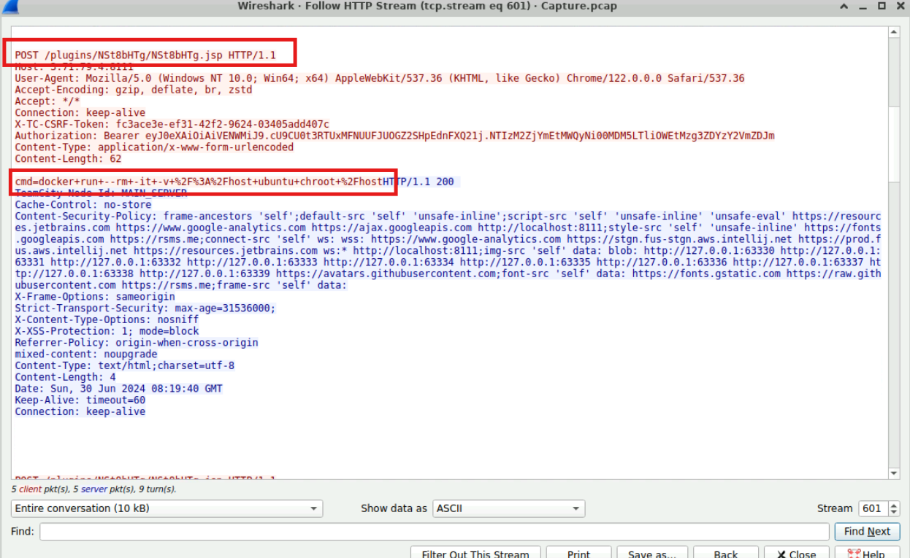
*   **Flag:** `docker run --rm -it -v /:/host ubuntu chroot /host`
