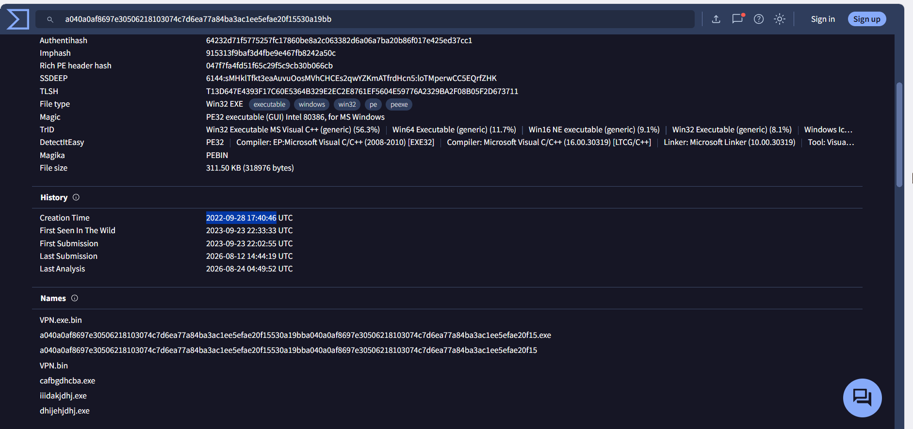
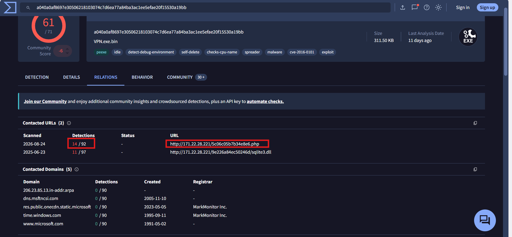
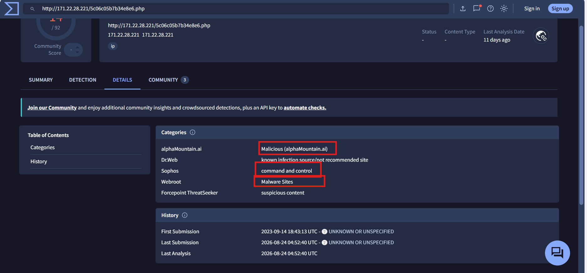
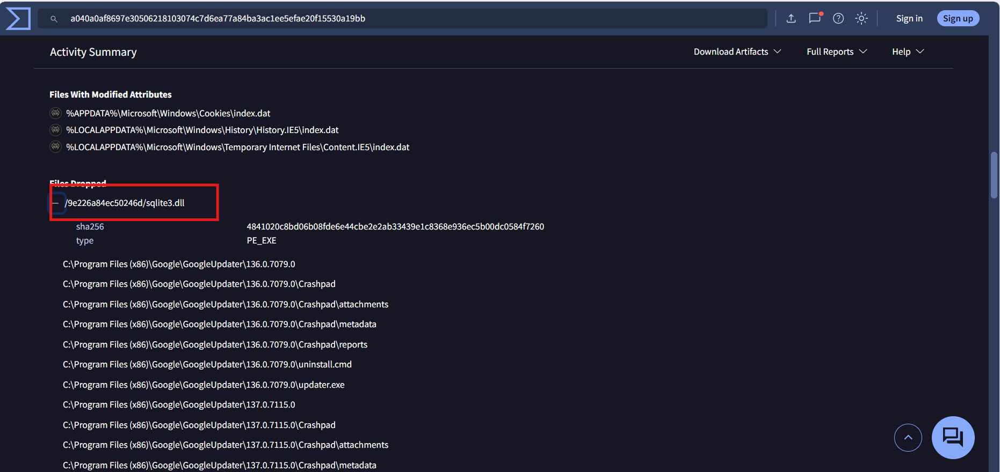
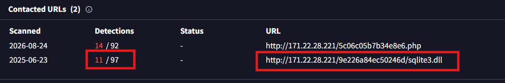
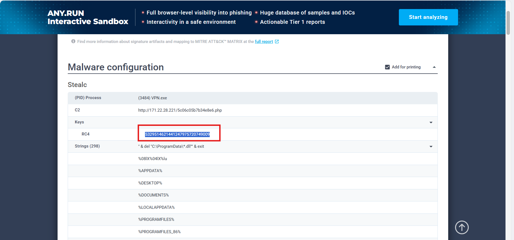
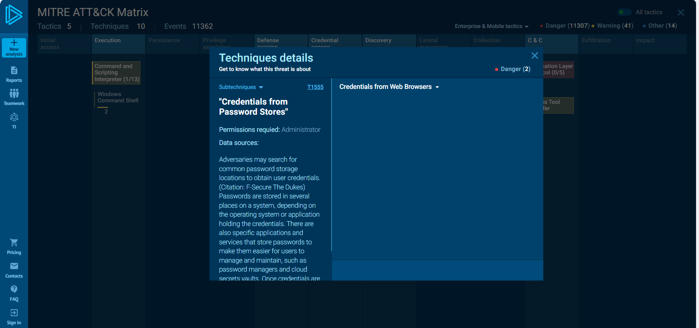
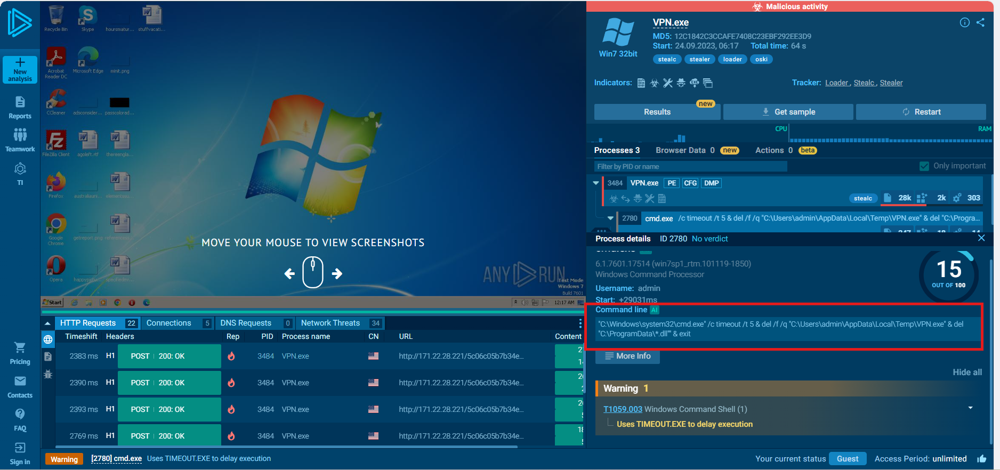
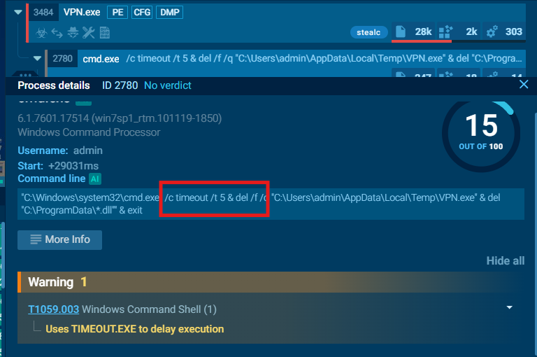

# CyberDefenders Lab: Oski Writeup

**Category:** Threat Intel | **Difficulty:** Easy | **Tools:** VirusTotal, ANY.RUN

**Scenario:** The accountant at the company received an email titled "Urgent New Order" from a client late in the afternoon. When he attempted to access the attached invoice, he discovered it contained false order information. Subsequently, the SIEM solution generated an alert regarding downloading a potentially malicious file. Upon initial investigation, it was found that the PPT file might be responsible for this download. Could you please conduct a detailed examination of this file?

**Hash provided by the challenge:** MD5 `12c1842c3ccafe7408c23ebf292ee3d9`

---

### Q1: What was the time of malware creation?
*   **Approach:** Look up the sample hash on VirusTotal and check the PE file's compile time.
*   **Steps Taken:** Used the MD5 hash `12c1842c3ccafe7408c23ebf292ee3d9` to search on **VirusTotal**. Checked the **Details** tab, and identified the malware's creation time as `2022-09-28 17:40:46`.
*   **Evidence:**
    
*   **Flag:** `2022-09-28 17:40`

---

### Q2: Which C2 server does the malware in the PPT file communicate with?
*   **Approach:** Check the Relations tab on VirusTotal to identify the URL acting as the C2, distinguishing it from other supporting files hosted on the same server.
*   **Steps Taken:** In the **Relations** tab, identified the C2 server the malware communicates with as `http://171.22.28.221/5c06c05b7b34e8e6.php`. This endpoint's `.php` extension is a typical indicator of a C2 panel used for check-in/receiving commands/uploading stolen data, as opposed to another URL on the same host IP, `sqlite3.dll` (which is merely a downloaded supporting library, not a control point). Reviewing the URL details on VirusTotal confirmed it is flagged as a **malicious site**.
*   **Evidence:**
    
    
*   **Flag:** `http://171.22.28.221/5c06c05b7b34e8e6.php`

---

### Q3: What is the first library that the malware requests post-infection?
*   **Approach:** Check the Behavior tab on VirusTotal to see which file is dropped immediately after infection.
*   **Steps Taken:** In the **Behavior** tab, observed the malware dropping a DLL file named `sqlite3.dll`. Cross-checked on VirusTotal, confirming this is indeed the malicious DLL downloaded by the malware.
*   **Evidence:**
    
    
*   **Flag:** `sqlite3.dll`

---

### Q4: What RC4 key is used by the malware to decrypt its base64-encoded string?
*   **Approach:** Check the provided Any.Run report for the config/decryption key already extracted by the sandbox.
*   **Steps Taken:** Reviewed the report on **Any.Run**, and identified the RC4 key the malware uses to decrypt the base64-encoded string as `5329514621441247975720749009`.
*   **Evidence:**
    
*   **Flag:** `5329514621441247975720749009`

---

### Q5: What is the main MITRE technique (not sub-technique) the malware uses to steal the user's password?
*   **Approach:** Check the MITRE ATT&CK section of the Any.Run sandbox report, distinguishing technique T1555 (Credentials from Password Stores) from T1552 (Unsecured Credentials).
*   **Steps Taken:** On the Any.Run report, identified the technique the malware uses to steal the user's password as `T1555` — the sub-technique `T1555.003 (Credentials from Web Browsers)` explicitly notes "Steals credentials from Web Browsers," which accurately reflects reading passwords already stored in the browser. (T1552 is broader — scanning files for any credentials, not specifically targeting the user's password as the question asks.)
*   **Evidence:**
    
*   **Flag:** `T1555`

---

### Q6: Which directory does the malware target for the deletion of all DLL files?
*   **Approach:** Check the malware's child process on Any.Run, reading the command line of the cleanup process.
*   **Steps Taken:** In the Any.Run report, observed the command line of the child process (`cmd.exe`):
    `"C:\Windows\system32\cmd.exe" /c timeout /t 5 & del /f /q "C:\Users\admin\AppData\Local\Temp\VPN.exe" & del "C:\ProgramData\*.dll" & exit`
    The `del "C:\ProgramData\*.dll"` command deletes all `.dll` files (using the `*` wildcard) located in the `C:\ProgramData\` directory — this is exactly where the malware intends to erase traces of the supporting DLLs it previously downloaded.
*   **Evidence:**
    
*   **Flag:** `C:\ProgramData`

---

### Q7: After successfully exfiltrating the user's data, how many seconds does it take for the malware to self-delete?
*   **Approach:** Continue reading the command line from Q6, identifying the delay value before self-deletion.
*   **Steps Taken:** In the same command line from Q6, the `timeout /t 5` command pauses execution for exactly 5 seconds before running the subsequent `del` commands. This is an intentional delay the malware inserts after completing data exfiltration (sending credentials/data back to the C2), to ensure the main `VPN.exe` process has fully closed/released its file handle before being deleted — avoiding a "file in use, cannot delete" error. The `T1059.003 - Windows Command Shell` warning also explicitly notes: *"Uses TIMEOUT.EXE to delay execution"*.
*   **Evidence:**
    
*   **Flag:** `5`
