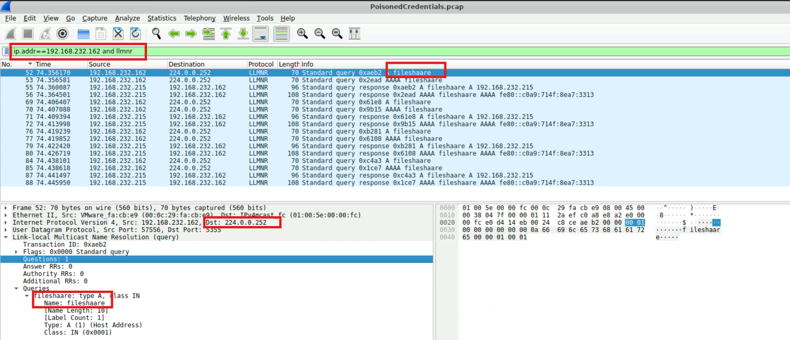
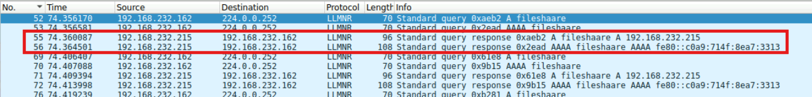
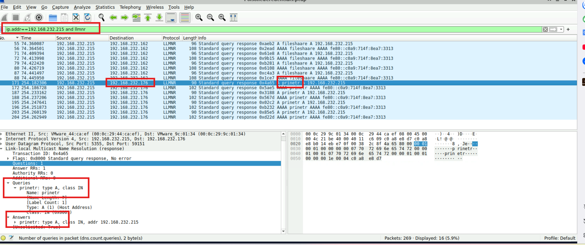
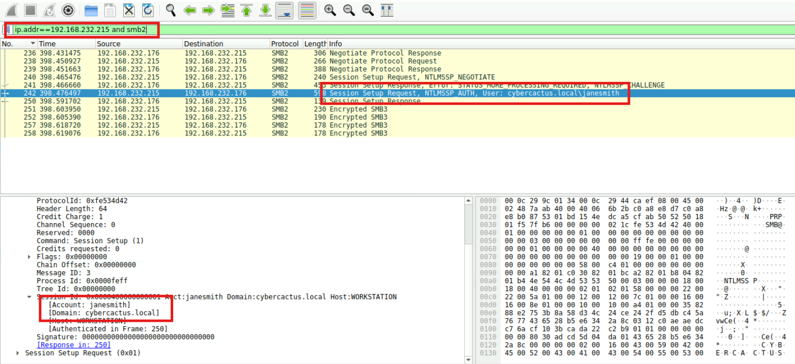
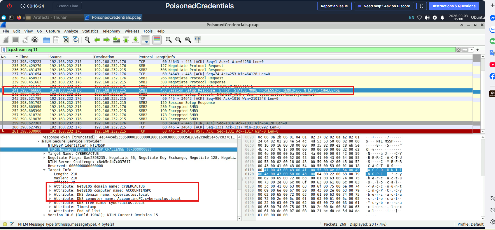

# CyberDefenders Lab: PoisonedCredentials Writeup

**Category:** Network Forensics | **Difficulty:** Easy | **Tactics:** Credential Access, Collection | **Tool:** Wireshark

**Scenario:** Your organization's security team has detected a surge in suspicious network activity. There are concerns that LLMNR (Link-Local Multicast Name Resolution) and NBT-NS (NetBIOS Name Service) poisoning attacks may be occurring within your network. These attacks are known for exploiting these protocols to intercept network traffic and potentially compromise user credentials. Your task is to investigate the network logs and examine captured network traffic.

---

### Q1: Can you identify the specific mistyped query made by the machine with the IP address 192.168.232.162?
*   **Cách làm:** Lọc traffic LLMNR theo IP nạn nhân trên Wireshark để tìm truy vấn tên máy bị gõ sai.
*   **Thao tác thực hiện:** Áp filter `ip.addr==192.168.232.162 and llmnr`. Ngay đầu danh sách kết quả, tại **Frame 52** (và 53), máy `192.168.232.162` gửi gói **Standard Query** tới địa chỉ multicast `224.0.0.252` — đây chính là địa chỉ multicast dành riêng cho LLMNR, xác nhận máy nạn nhân đang phát sóng hỏi toàn mạng. Xem chi tiết Frame 52, ghi nhận bản ghi truy vấn: `fileshaare: type A, class IN`. Nạn nhân thực chất muốn gõ `fileshare` nhưng vô tình gõ thừa 1 chữ `a` thành `fileshaare`.

    Vì LLMNR/NBT-NS **không có cơ chế xác thực**, ai trả lời trước thì máy nạn nhân sẽ tin tưởng tuyệt đối. Kẻ tấn công (chạy công cụ như **Responder**) chỉ mất vài mili-giây để phản hồi giả mạo "Tôi chính là `fileshaare` đây!", khiến nạn nhân lập tức chuyển hướng kết nối sang máy attacker.
*   **Bằng chứng:**
    
*   **Flag:** `fileshaare`

---

### Q2: What is the IP address of the machine acting as the rogue entity?
*   **Cách làm:** Kiểm tra gói LLMNR Response ứng với truy vấn `fileshaare` ở Q1 để xác định IP máy đã trả lời giả mạo.
*   **Thao tác thực hiện:** Theo dõi tiếp luồng traffic sau Frame 52/53, xác định được gói **LLMNR Response** trả lời cho truy vấn `fileshaare` xuất phát từ IP `192.168.232.215` — đây chính là máy rogue (attacker) đã mạo danh trả lời trước khi có ai khác kịp phản hồi.
*   **Bằng chứng:**
    
*   **Flag:** `192.168.232.215`

---

### Q3: What is the IP address of the second machine that received poisoned responses from the rogue machine?
*   **Cách làm:** Lọc toàn bộ traffic LLMNR xuất phát từ IP rogue đã xác định ở Q2, để tìm thêm nạn nhân khác bị đầu độc.
*   **Thao tác thực hiện:** Áp filter `ip.addr==192.168.232.215 and llmnr`. Kết quả cho thấy attacker còn lợi dụng lỗi gõ nhầm tên máy in `prinetr` (đúng ra phải là `printer`) để phản hồi giả mạo tới 1 nạn nhân khác có IP `192.168.232.176`.
*   **Bằng chứng:**
    
*   **Flag:** `192.168.232.176`

---

### Q4: What is the username of the account that the attacker compromised?
*   **Cách làm:** Sau khi nạn nhân tin tưởng kết nối SMB tới máy rogue, kiểm tra gói NTLM Authentication để lấy username.
*   **Thao tác thực hiện:** Sau khi bị đầu độc qua LLMNR/NBT-NS, nạn nhân thứ 2 (`192.168.232.176`) tin rằng máy attacker (`192.168.232.215`) chính là máy in hợp lệ `prinetr`. Áp filter `ip.addr==192.168.232.215 and smb2`, toàn bộ traffic SMB2 thu được đều diễn ra giữa attacker và nạn nhân thứ 2 — xác nhận tài khoản bị lộ đến từ vụ đầu độc truy vấn máy in, không phải vụ `fileshaare` ở Q1.

    Khi Windows cố kết nối tới máy in giả mạo qua SMB, nó kích hoạt cơ chế xác thực **NTLM**, gửi gói `NTLMSSP_AUTH` chứa định danh `cybercactus.local\janesmith` thẳng về máy attacker (**Frame 242**).
*   **Bằng chứng:**
    
*   **Flag:** `janesmith`

---

### Q5: What is the hostname of the machine that the attacker accessed via SMB?
*   **Cách làm:** Kiểm tra cấu trúc `Target Info` trong quá trình thương lượng NTLM để lấy tên máy.
*   **Thao tác thực hiện:** Tại **Frame 241**, trong quá trình thương lượng xác thực NTLM qua SMB2, hệ thống trao đổi cấu trúc `Target Info` (chứa các thuộc tính định danh AV_PAIRS). Mở rộng nhánh **SMB2 → Security Blob → NTLM Secure Service Provider → Target Info**, trường `NetBIOS computer name` hiển thị `ACCOUNTINGPC`, và trường `DNS computer name` hiển thị `AccountingPC.cybercactus.local`.
*   **Bằng chứng:**
    
*   **Flag:** `AccountingPC`
