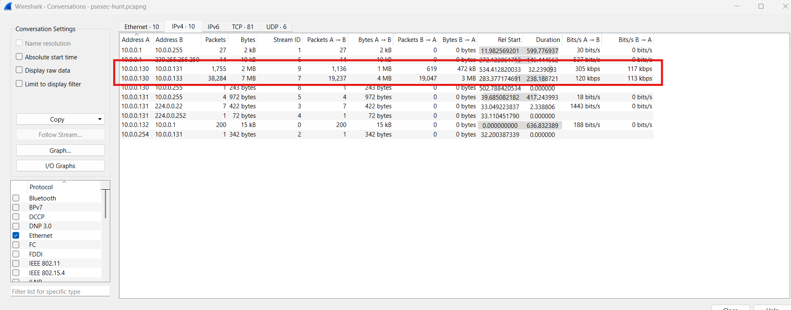
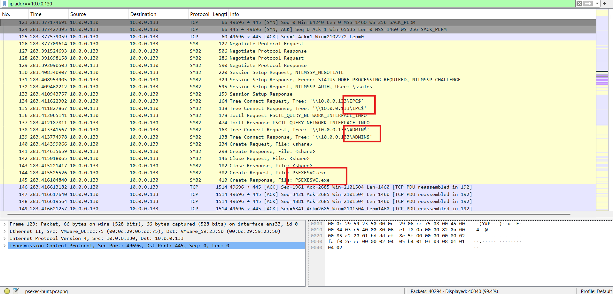
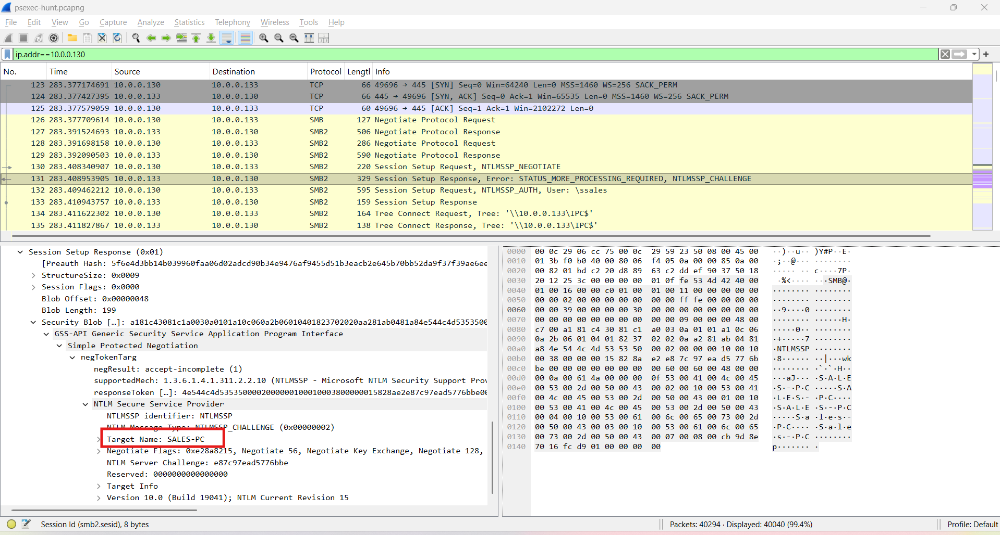
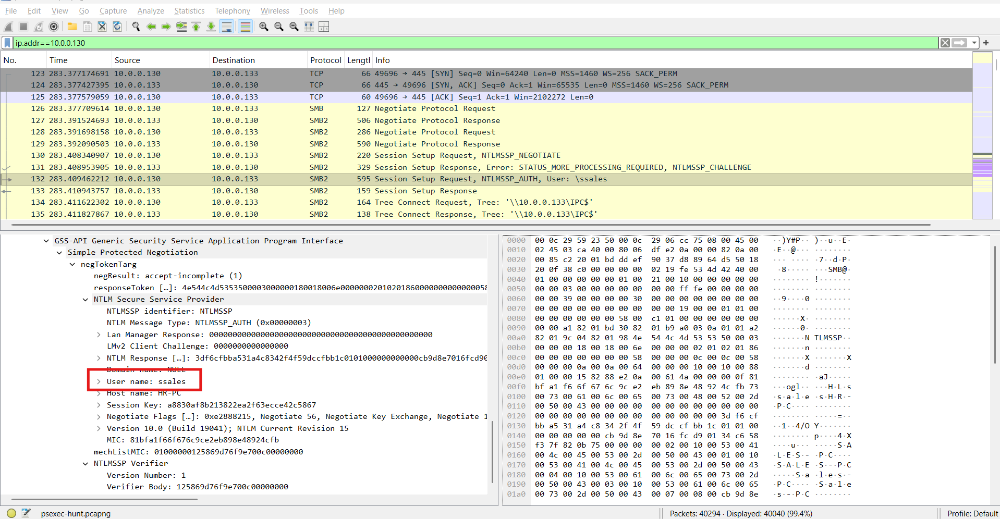
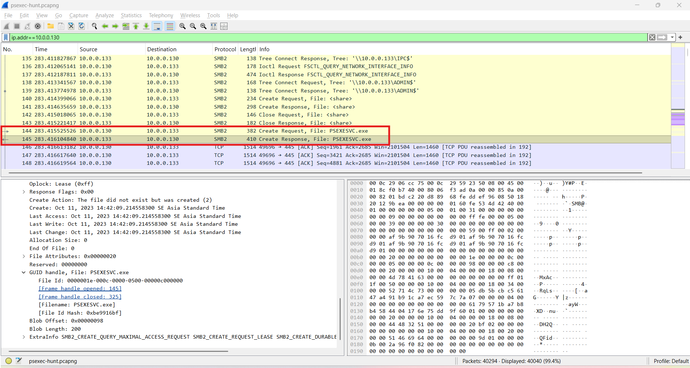
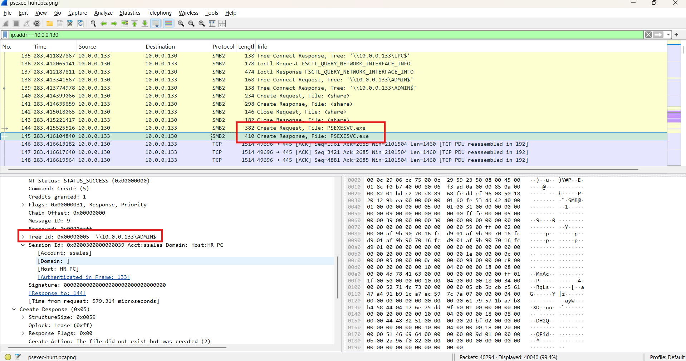
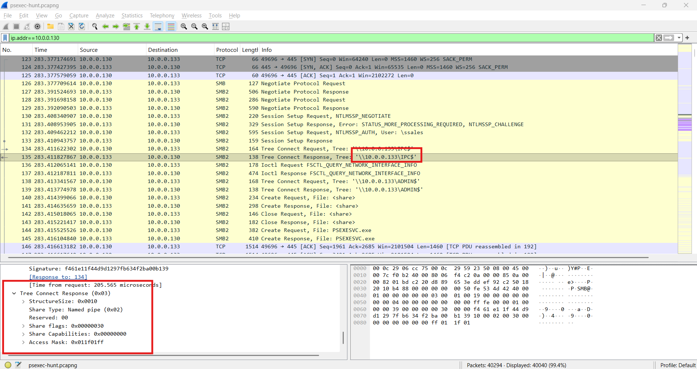
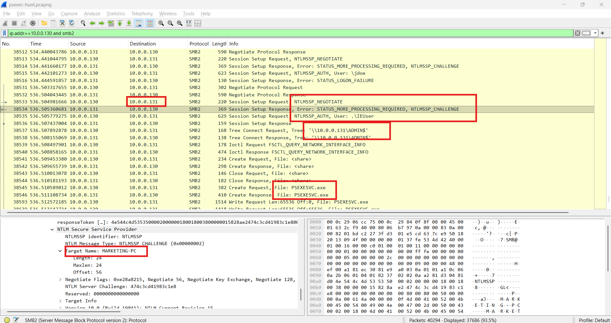

# CyberDefenders Lab: PsExec Hunt Writeup

**Category:** Network Forensics | **Difficulty:** Easy | **Tactics:** Execution, Defense Impairment, Discovery, Lateral Movement | **Tool:** Wireshark

**Scenario:** An alert from the Intrusion Detection System (IDS) flagged suspicious lateral movement activity involving PsExec. This indicates potential unauthorized access and movement across the network. As a SOC Analyst, your task is to investigate the provided PCAP file to trace the attacker's activities. Identify their entry point, the machines targeted, the extent of the breach, and any critical indicators that reveal their tactics and objectives within the compromised environment.

---

### Q1: Can you identify the IP address of the machine from which the attacker initially gained access?

*   **Approach:** Calculate traffic statistics by IP to identify the source of anomalous traffic.
*   **Steps Taken:** In Wireshark, navigate to **Statistics → Conversations**, and discover a large volume of traffic originating from the IP address `10.0.0.130`. Apply the filter `ip.addr==10.0.0.130` to isolate this IP's traffic stream, confirming that this is the attacker's machine — performing **Lateral Movement** to the victim's machine (`10.0.0.133`) using the **PsExec** tool over the SMB protocol (port 445).
*   **Evidence:**
    
    
*   **Flag:** `10.0.0.130`

---

### Q2: Can you determine the machine's hostname to which the attacker first pivoted?

*   **Approach:** Inspect the SMB connection initialization packet from the attacker to determine the target hostname.
*   **Steps Taken:** Observing the packet where the attacker initiates an SMB connection to the victim machine (`10.0.0.133`), under the **Target Name** field, the targeted machine is identified as `SALES-PC`.
*   **Evidence:**
    
*   **Flag:** `SALES-PC`

---

### Q3: What is the username utilized by the attacker for authentication?

*   **Approach:** Examine the SMB authentication packet (Session Setup Request) to identify the used username.
*   **Steps Taken:** At packet number **132**, the username utilized by the attacker during the authentication process is identified as `ssales`.
*   **Evidence:**
    
*   **Flag:** `ssales`

---

### Q4: What's the name of the service executable the attacker set up on the target?

*   **Approach:** Inspect the SMB packets related to creating and executing files on the ADMIN$ share.
*   **Steps Taken:** At packets **144** and **145**, it is determined that the attacker executed the malicious service file `PSEXESVC.exe` on the `ADMIN$` share — this is the default executable file created by PsExec on the target machine to run the remote control service.
*   **Evidence:**
    
*   **Flag:** `PSEXESVC.exe`

---

### Q5: Which network share was used by PsExec to install the service on the target machine?

*   **Approach:** Examine the SMB Tree Connect packet to identify the share accessed by the attacker to install the service.
*   **Steps Taken:** Observing the SMB packets related to copying and installing the executable file, it is identified that the attacker used the `ADMIN$` share to drop and execute the malicious service on the victim machine. This is the default Windows administrative share, allowing PsExec to write files directly into the `%SystemRoot%` directory.
*   **Evidence:**
    
*   **Flag:** `ADMIN$`

---

### Q6: Which network share did PsExec use for communication?

*   **Approach:** Check the Share Type field in the Tree Connect packet to determine the communication mechanism between the two machines.
*   **Steps Taken:** At packet number **135**, it is determined that the attacker used the `IPC$` share for communication between the two processes. The **Share Type: Named Pipe** field indicates this is an Inter-Process Communication (IPC) mechanism, allowing the `psexec.exe` process (on the attacking machine) to send commands directly to the `PSEXESVC.exe` process (on the victim machine) and receive results in real-time.
*   **Evidence:**
    
*   **Flag:** `IPC$`

---

### Q7: What is the hostname of the second machine the attacker targeted to pivot within our network?

*   **Approach:** Continue monitoring the SMB2 traffic flow after the first machine is compromised to detect signs of further lateral movement.
*   **Steps Taken:** After gaining control of the `SALES-PC` machine, the attacker (`10.0.0.130`) proceeds to open an SMB2 connection to a new IP in the network, `10.0.0.131` (starting from packet **38512**). Inspecting packet **38534** (*Session Setup Response — NTLMSSP_CHALLENGE*) returned by the machine `10.0.0.131`, the **Target Name** field displays the name of the next targeted server as `MARKETING-PC`.
*   **Evidence:**
    
*   **Flag:** `MARKETING-PC`
