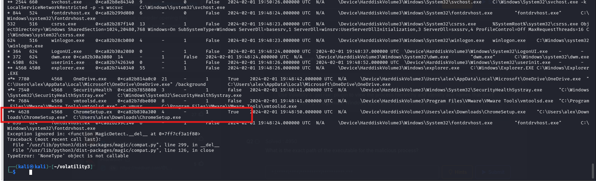
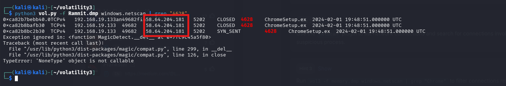
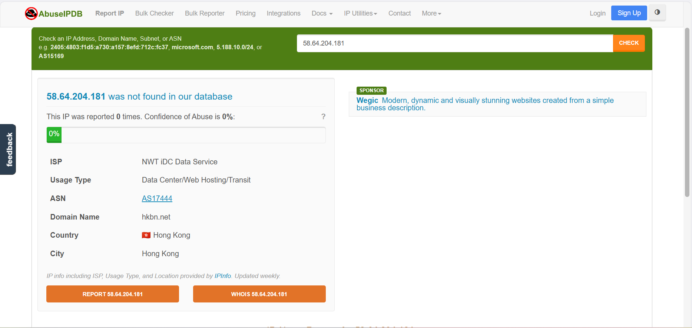
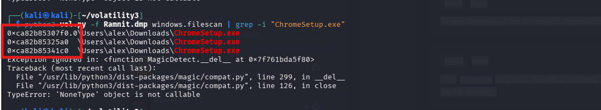
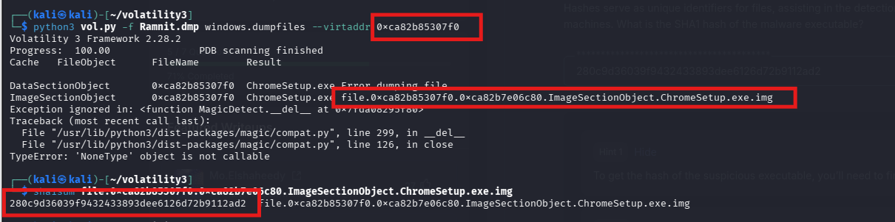
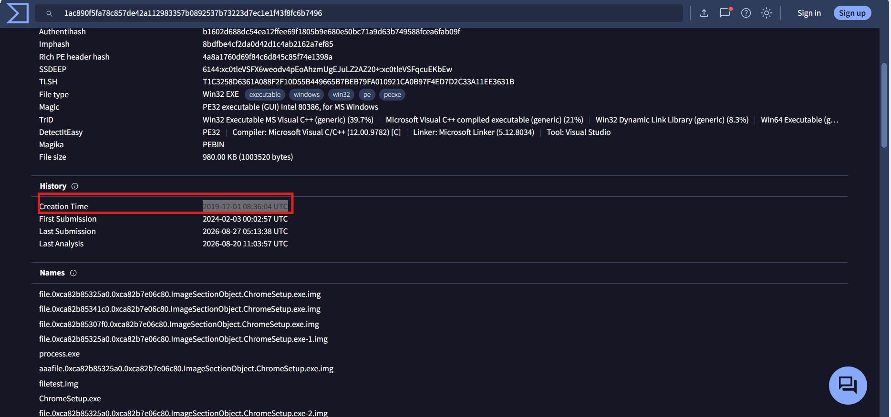
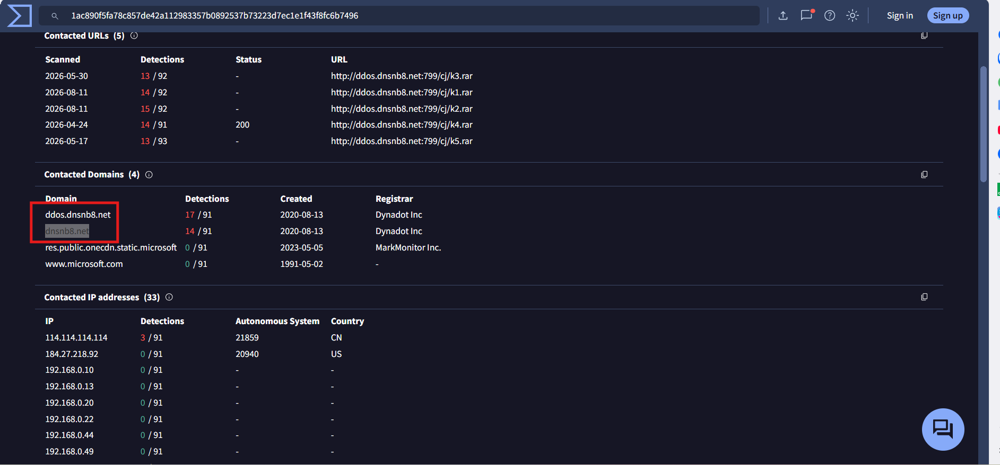

# CyberDefenders Lab: Ramnit Writeup

**Category:** Endpoint Forensics | **Difficulty:** Easy | **Tools:** Volatility 3, VirusTotal

**Scenario:** Our intrusion detection system has alerted us to suspicious behavior on a workstation, pointing to a likely malware intrusion. A memory dump of this system has been taken for analysis. Your task is to analyze this dump, trace the malware’s actions, and report key findings.

---

### Q1: What is the name of the process responsible for the suspicious activity?

*   **Approach:** Analyze the Process Tree structure to detect anomalies in naming or execution location.
*   **Steps Taken:** Use the `windows.pstree` plugin of the Volatility 3 framework to reconstruct the process hierarchy. Reviewing the returned list, the system identifies an anomalous process named `ChromeSetup.exe` (PID: 4628, PPID: 4568) running covertly under the `explorer.exe` system process.
*   **Evidence:**
    
*   **Flag:** `ChromeSetup.exe`

---

### Q2: What is the exact path of the executable for the malicious process?

*   **Approach:** Leverage the output data from the process tree analysis to locate the root directory.
*   **Steps Taken:** From the results table of the `windows.pstree` command, inspect the data column corresponding to the `ChromeSetup.exe` process (PID 4628). The system data indicates that this executable was launched directly from the user's Downloads folder, confirming it is a disguised malicious file.
*   **Evidence:**
    
*   **Flag:** `C:\Users\alex\Downloads\ChromeSetup.exe`

---

### Q3: Identifying network connections is crucial for understanding the malware's communication strategy. What IP address did the malware attempt to connect to?

*   **Approach:** Scan the memory space to extract traces of external network connections.
*   **Steps Taken:** Use the `windows.netscan` plugin combined with a filtering tool (grep) to search for all network artifacts related to PID 4628. The retrieved results show that the malicious process made connections (in CLOSED and SYN_SENT states) to a server with the public IP address `58.64.204.181`.
*   **Evidence:**
    
*   **Flag:** `58.64.204.181`

---

### Q4: To determine the specific geographical origin of the attack, Which city is associated with the IP address the malware communicated with?

*   **Approach:** Apply Open Source Intelligence (OSINT) to extract geographical location (Geolocation) information.
*   **Steps Taken:** Use the C2 server IP address `58.64.204.181` obtained in Question 3 to query the AbuseIPDB platform. The returned metadata confirms this IP address belongs to a network registered in the Hong Kong region.
*   **Evidence:**
    
*   **Flag:** `Hong Kong`

---

### Q5: Hashes serve as unique identifiers for files, assisting in the detection of similar threats across different machines. What is the SHA1 hash of the malware executable?

*   **Approach:** Scan the file data structures in memory, extract the executable file, and calculate its identifying hash.
*   **Steps Taken:** Proceed to use the `windows.filescan` plugin to locate the physical address of the malicious process in RAM. After identifying the address `0xca82b85307f0`, use the `windows.dumpfiles` plugin to dump the file into the analysis environment.
*   **Evidence:**
    *   Identifying the offset and dumping the file using `windows.dumpfiles`:
        
    *   Calculating the SHA1 hash of the dumped file using the `sha1sum` command:
        
*   **Flag:** `280c9d36039f9432433893dee6126d72b9112ad2`

---

### Q6: Examining the malware's development timeline can provide insights into its deployment. What is the compilation timestamp for the malware?

*   **Approach:** Leverage the VirusTotal intelligence platform to analyze the file's Header structure.
*   **Steps Taken:** Use the SHA-1 hash collected in Question 5 to perform a query on the VirusTotal platform. Under the **Details** tab, the **History** section records the system timestamp (Creation Time / Compilation Time) as `2019-12-01 08:36:04 UTC`. Proceed to standardize the data according to the requested format.
*   **Evidence:**
    
*   **Flag:** `2019-12-01 08:36`

---

### Q7: Identifying the domains associated with this malware is crucial for blocking future malicious communications. Can you provide the domain connected to the malware?

*   **Approach:** Analyze the network relationship graph to map domains related to the malicious infrastructure.
*   **Steps Taken:** Based on the comprehensive report on VirusTotal, navigate to the **Relations** tab. In the *Contacted Domains* section, the system logs a malicious domain directly linked to this malware as `dnsnb8.net`. 
*   **Evidence:**
    
*   **Flag:** `dnsnb8.net`
