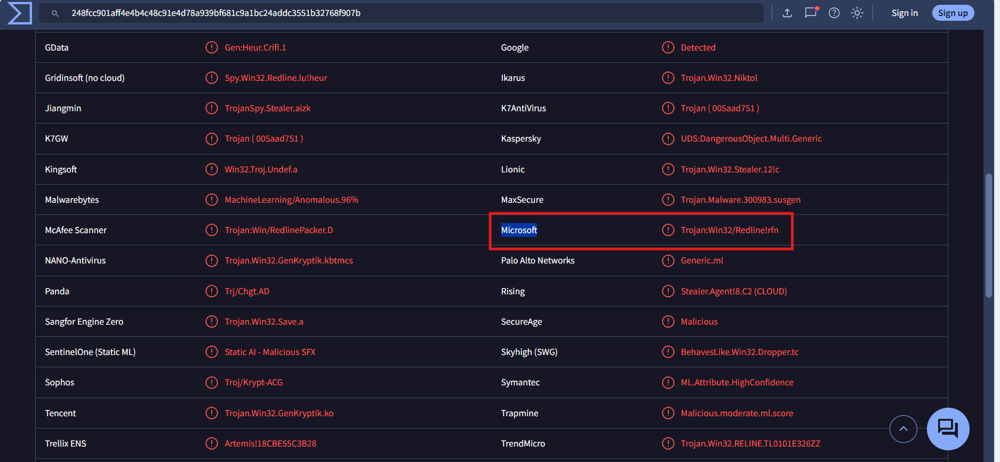
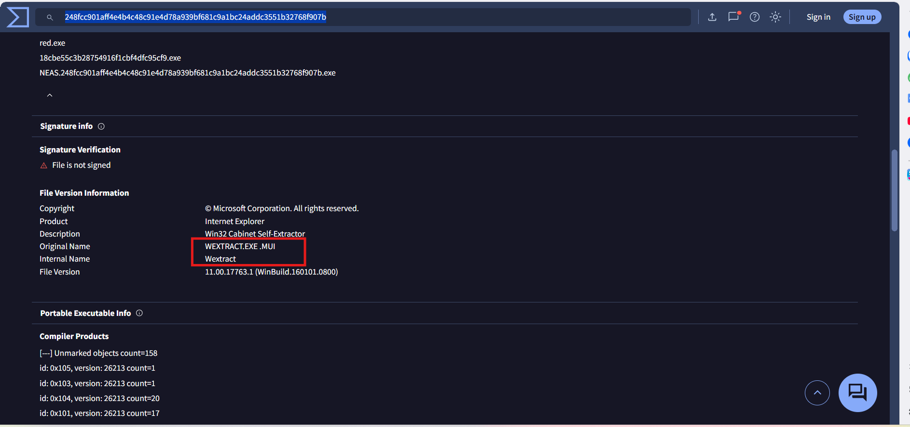
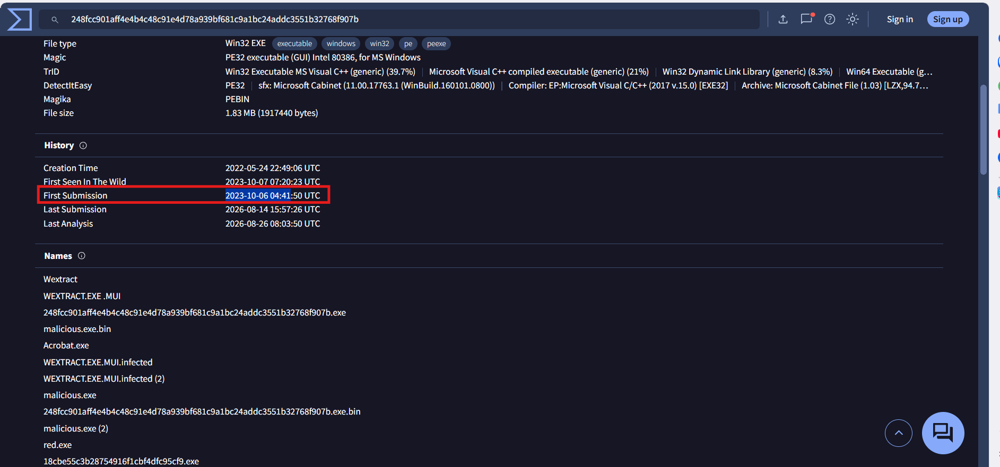
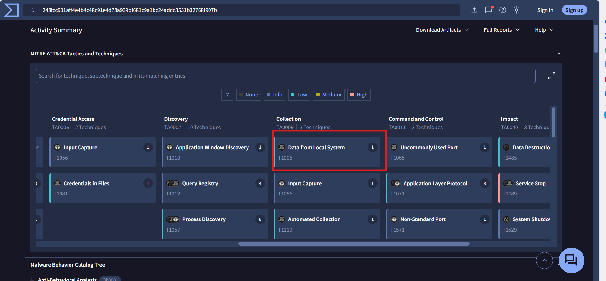
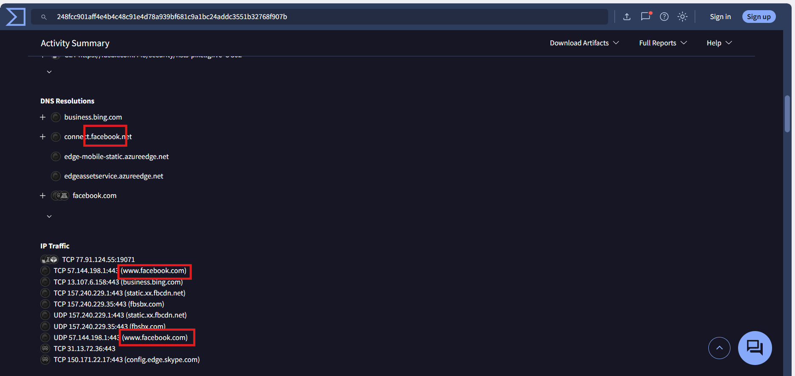
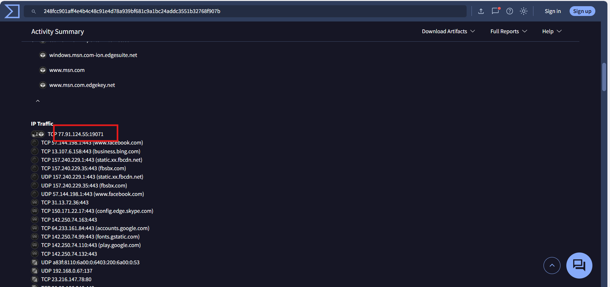
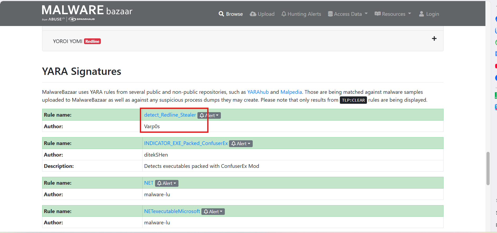
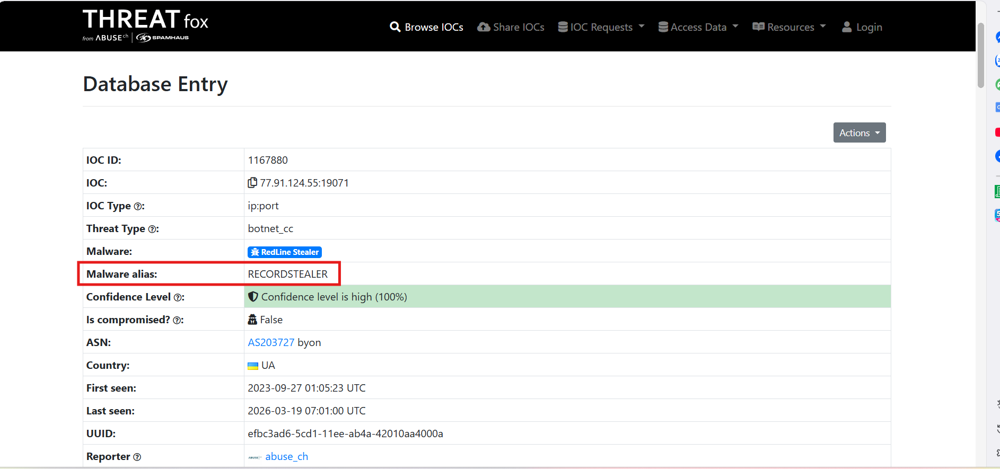
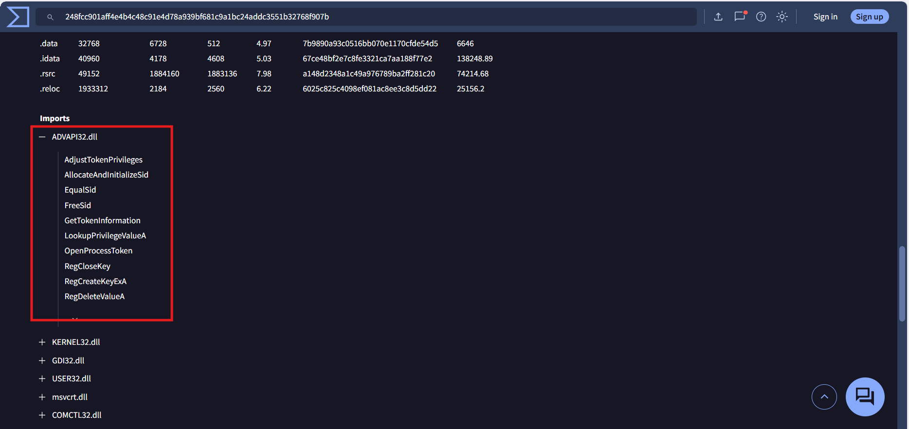

# CyberDefenders Lab: Red Stealer Writeup

**Category:** Threat Intel | **Difficulty:** Easy | **Tools:** VirusTotal, MalwareBazaar, ThreatFox

**Scenario:** You are part of the Threat Intelligence team in the SOC (Security Operations Center). An executable file has been discovered on a colleague's computer, and it's suspected to be linked to a Command and Control (C2) server, indicating a potential malware infection. Your task is to investigate this executable by analyzing its hash.

*Note: The SHA-256 hash provided in the lab file is `248FCC901AFF4E4B4C48C91E4D78A939BF681C9A1BC24ADDC3551B32768F907B`.*

---

### Q1: Categorizing malware enables a quicker and clearer understanding of its unique behaviors and attack vectors. What category has Microsoft identified for that malware in VirusTotal?

*   **Approach:** Use the VirusTotal (VT) threat intelligence platform to cross-reference detection results from security systems.
*   **Steps Taken:** Perform a Hash query on VirusTotal. Under the **Detection** tab, check the list of analysis results from antivirus engines. Microsoft's detection engine identifies this file as `Trojan:Win32/Redline!`. According to the standard format, the classification prefix of the file is Trojan.
*   **Evidence:**
    
*   **Flag:** `Trojan`

---

### Q2: Clearly identifying the name of the malware file improves communication among the SOC team. What is the file name associated with this malware?

*   **Approach:** Analyze the metadata to extract the original name of the file.
*   **Steps Taken:** Navigate to the **Details** tab on VirusTotal. In the *Basic Properties* or *Names* section, the system records the file named `Wextract.exe`. Abusing the name of a legitimate extraction utility belonging to the Windows operating system (WEXTRACT) is a common masquerading technique to evade detection by monitoring systems. As per the system's requirement, the file extension (.exe) is omitted.
*   **Evidence:**
    
*   **Flag:** `Wextract`

---

### Q3: Knowing the exact timestamp of when the malware was first observed can help prioritize response actions. What is the UTC timestamp of the malware's first submission to VirusTotal?

*   **Approach:** Extract system history information to determine the earliest detection timestamp.
*   **Steps Taken:** Under the **Details** tab, locate the *History* section. The **First Submission** indicator records the time the file was first received by the VirusTotal system for analysis as `2023-10-06 04:41:50`. Proceed to reformat the time string according to the `YYYY-MM-DD HH:MM` standard.
*   **Evidence:**
    
*   **Flag:** `2023-10-06 04:41`

---

### Q4: Understanding the techniques used by malware helps in strategic security planning. What is the MITRE ATT&CK technique ID for the malware collecting data from the local system prior to exfiltration?

*   **Approach:** Map the malicious behavior to the standard MITRE ATT&CK Framework.
*   **Steps Taken:** Switch to the **Behavior** tab on VirusTotal and reference the *MITRE ATT&CK Tactics and Techniques* section. Under the **Collection** tactic, the report data indicates that the malware applies the technique to collect data from the local system to extract browser information and configurations before proceeding to exfiltrate data. The corresponding technique ID is `T1005`.
*   **Evidence:**
    
*   **Flag:** `T1005`

---

### Q5: Following execution, the malware performs a connectivity check by resolving a well-known social-media domain before contacting its C2. Which single domain does it resolve for this check?

*   **Approach:** Analyze the DNS Resolutions flow in the dynamic analysis environment (Sandbox).
*   **Steps Taken:** Under the **Behavior** tab, check the *Network Communication* (or *DNS Resolutions*) section. The network report records the malware performing a resolution query for a legitimate social media domain. This is a Connectivity Check technique aimed at evading isolated analysis environments. The domain used for this process is `facebook.com`.
*   **Evidence:**
    
*   **Flag:** `facebook.com`

---

### Q6: Once the malicious IP addresses are identified, network security devices such as firewalls can be configured to block traffic to and from these addresses. Can you provide the IP address and destination port the malware communicates with?

*   **Approach:** Analyze the network traffic (IP Traffic) to identify the Command and Control (C2) server.
*   **Steps Taken:** Proceed to review the *IP Traffic* section under the **Behavior** tab. Most IP addresses are linked to legitimate hostnames. An anomaly is recorded in the connection directed to the IP address `77.91.124.55` over port `19071`. Using a direct IP without DNS coupled with a non-standard communication port is a fundamental characteristic of C2 infrastructure.
*   **Evidence:**
    
*   **Flag:** `77.91.124.55:19071`

---

### Q7: YARA rules are designed to identify specific malware patterns and behaviors. Using MalwareBazaar, what's the name of the YARA rule created by "Varp0s" that detects the identified malware?

*   **Approach:** Leverage the MalwareBazaar database to identify detection rules (YARA Rules) from the threat intelligence community.
*   **Steps Taken:** Access the `bazaar.abuse.ch` system and perform a search using the Hash. In the report details, the **YARA Signatures** section records a rule set built by the security researcher "Varp0s" to identify this malware variant. The rule is named `detect_Redline_Stealer`.
*   **Evidence:**
    
*   **Flag:** `detect_Redline_Stealer`

---

### Q8: Understanding which malware families are targeting the organization helps in strategic security planning for the future. Can you provide the different malware alias associated with the malicious IP address according to ThreatFox?

*   **Approach:** Integrate the ThreatFox platform to cross-reference the aliases belonging to the malware family linked to the C2 server IP.
*   **Steps Taken:** Access `threatfox.abuse.ch` and perform a query using the syntax `ioc:77.91.124.55` (the C2 IP address identified in Question 6). The returned result in the **Malware Alias** field confirms that the RedLine Stealer malware family is also classified under the secondary alias `RECORDSTEALER`.
*   **Evidence:**
    
*   **Flag:** `RECORDSTEALER`

---

### Q9: By identifying the malware's imported DLLs, we can configure security tools to monitor for the loading or unusual usage of these specific DLLs. Can you provide the DLL utilized by the malware for privilege escalation?

*   **Approach:** Analyze the Import Address Table (IAT) to identify the Dynamic Link Libraries (DLLs) supporting privilege escalation operations.
*   **Steps Taken:** Access the **Details** tab on VirusTotal and locate the *Imports* section. The static analysis results show that the malware loads several system libraries, including `ADVAPI32.dll`. This is a core library responsible for handling APIs related to security management, registry, and system privileges, providing the foundation for the malware to execute Privilege Escalation techniques.
*   **Evidence:**
    
*   **Flag:** `ADVAPI32.dll`
