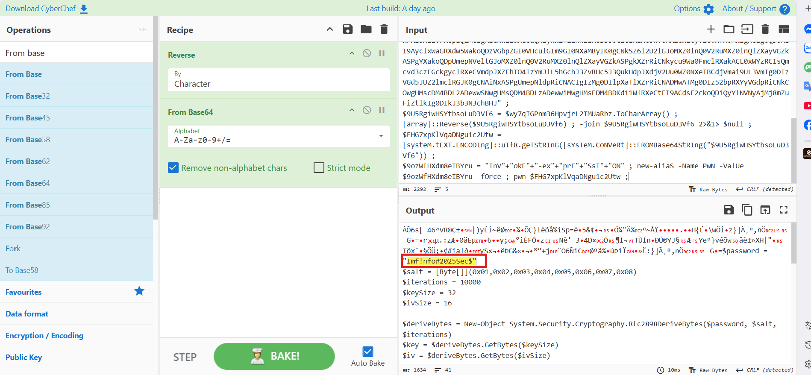
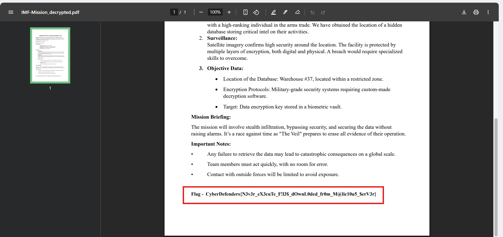

# CyberDefenders Lab: Silent Breach Writeup

**Category:** Endpoint Forensics | **Difficulty:** Medium | **Tactic:** Execution | **Tools:** FTK Imager, Text Editor, SQLite Viewer, Strings, CyberChef

**Scenario:** The IMF is hit by a cyber attack compromising sensitive data. Luther sends Ethan to retrieve crucial information from a compromised server. Despite warnings, Ethan downloads the intel, which later becomes unreadable. To recover it, he creates a forensic image and asks Benji for help in decoding the files.

---

### Q1: What is the MD5 hash of the potentially malicious EXE file the user downloaded?

*   **Approach:** Browse the forensic image using FTK Imager to find the suspicious executable in the Downloads folder, then extract its hash to cross-reference with VirusTotal.
*   **Steps Taken:** Open the forensic image in **FTK Imager**. Navigate to the `Downloads` directory, where a suspicious executable named `IMF-Info.pdf.exe` is discovered — utilizing a **double extension** (`.pdf.exe`) to trick the victim into thinking it's a PDF file. Use FTK Imager's export hash feature to obtain the MD5 hash of this file.
*   **Evidence:**
    
    
*   **Flag:** `336a7cf476ebc7548c93507339196abb`

---

### Q2: What is the URL from which the file was downloaded?

*   **Approach:** Extract the browser's `History` database (SQLite) to check the table storing download information.
*   **Steps Taken:** In FTK Imager, it is discovered that the victim has both **Google Chrome** and **Microsoft Edge** installed. Proceed to export Microsoft Edge's `History` file, open it with **SQLite Viewer**, and identify the full URL path from which the malicious file was downloaded.
*   **Evidence:**
    
    
    
*   **Flag:** `http://192.168.16.128:8000/IMF-Info.pdf.exe`

---

### Q3: What application did the user use to download this file?

*   **Approach:** Based on the analysis results from Q2, identify the corresponding browser.
*   **Steps Taken:** The download record containing the malicious file URL was found in the `History` database within the data directory of **Microsoft Edge**, confirming this is the application the victim used to download the file.
*   **Evidence:**
    
*   **Flag:** `Microsoft Edge`

---

### Q4: By examining Windows Mail artifacts, we found an email address mentioning three IP addresses of servers that are at risk or compromised. What are the IP addresses?

*   **Approach:** Locate the file storing Windows Mail email data, extract readable strings, and filter for IPv4 formats using regex.
*   **Steps Taken:** Windows Mail operates as a UWP app under the `microsoft.windowscommunicationsapps` package. The database file `HxStore.hxd` — which stores email content, headers, and metadata in binary format — is found at the path `Users\ethan\AppData\Local\Packages\microsoft.windowscommunicationsapps_8wekyb3d8bbwe\LocalState\HxStore.hxd`. Export this file using FTK Imager, then on a **Terminal (Kali Linux)**, combine the `strings` command with regex to filter out readable IPv4 address strings from the binary file: `strings HxStore.hxd | grep -E "\b([0-9]{1,3}\.){3}[0-9]{1,3}\b"`. The result returns the email content containing warnings about the affected servers, along with the 3 corresponding IP addresses.
*   **Evidence:**
    
    
*   **Flag:** `145.67.29.88,212.33.10.112,192.168.16.128`

---

### Q5: By examining the malicious executable, we found that it uses an obfuscated PowerShell script to decrypt specific files. What predefined password does the script use for encryption?

*   **Approach:** Extract strings from the malicious executable using `strings`, then decode the discovered Base64 segment using CyberChef.
*   **Steps Taken:** Export the file `IMF-Info.pdf.exe` from FTK Imager to the analysis environment. Run the command `strings IMF-Info.pdf.exe > strings_output.txt` to save all text strings to a text file. Opening this file reveals a PowerShell script heavily obfuscated using a `Reverse` string technique combined with **Base64** encoding. Copy that string segment, put it into **CyberChef** with the recipe `Reverse` (Character) → `From Base64` to decode it, obtaining the predefined password used for encryption.
*   **Evidence:**
    
    
    
*   **Flag:** `Imf!nfo#2025Sec$`

---

### Q6: After identifying how the script works, decrypt the files and submit the secret string.

*   **Approach:** Extract the encrypted `.enc` files, analyze the AES encryption mechanism in the original script, then write a reverse (decryption) script to recover the files.
*   **Steps Taken:** Export the two encrypted files `IMF-Secret.enc` and `IMF-Mission.enc` from the `ethan` user's Desktop directory (`C:\Users\ethan\Desktop\`) using FTK Imager. Analyze the decrypted malicious PowerShell script from Q5 and determine that the encryption mechanism uses **AES-CBC (256-bit key, 16-byte IV)**, combined with the `Rfc2898DeriveBytes` key derivation function (10,000 iterations), using the recovered password `Imf!nfo#2025Sec$` and a static salt (`0x01` to `0x08`). 
    
    Since this is a symmetric algorithm, we only need to reverse the original script — replace `$aes.CreateEncryptor()` with `$aes.CreateDecryptor()`, and point the input to the `.enc` files instead of `.pdf` — to recover the original content. Running this customized decryption script on the two exported `.enc` files generates two `_decrypted.pdf` files containing the original content. Open the decrypted file to find the secret string.
*   **Decryption Script (abridged from original encryption script):**
```powershell
    $password = "Imf!nfo#2025Sec$"
    $salt = [Byte[]](0x01,0x02,0x03,0x04,0x05,0x06,0x07,0x08)$iterations = 10000
    $keySize = 32$ivSize = 16
    $deriveBytes = New-Object System.Security.Cryptography.Rfc2898DeriveBytes($password, $salt,$iterations)
    $key =$deriveBytes.GetBytes($keySize)$iv = $deriveBytes.GetBytes($ivSize)

    $inputFiles = @("IMF-Secret.enc", "IMF-Mission.enc")
    foreach ($inputFile in $inputFiles) {$outputFile = $inputFile -replace '\.enc$', '_decrypted.pdf'
        $aes = [System.Security.Cryptography.Aes]::Create()$aes.Key = $key$aes.IV = $iv$aes.Mode = [System.Security.Cryptography.CipherMode]::CBC
        $aes.Padding = [System.Security.Cryptography.PaddingMode]::PKCS7$decryptor = $aes.CreateDecryptor()$cipherBytes = [System.IO.File]::ReadAllBytes($inputFile)$outStream = New-Object System.IO.FileStream($outputFile, [System.IO.FileMode]::Create)$cryptoStream = New-Object System.Security.Cryptography.CryptoStream($outStream,$decryptor, [System.Security.Cryptography.CryptoStreamMode]::Write)
        $cryptoStream.Write($cipherBytes, 0, $cipherBytes.Length)$cryptoStream.FlushFinalBlock()
        $cryptoStream.Close()$outStream.Close()
    }
```
*   **Evidence:**
    
    
    
*   **Flag:** `CyberDefenders{N3v3r_eX3cuTe_F!l3$_dOwnL0ded_fr0m_M@lic10u5_$erV3r}`
