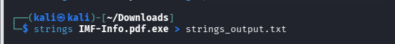
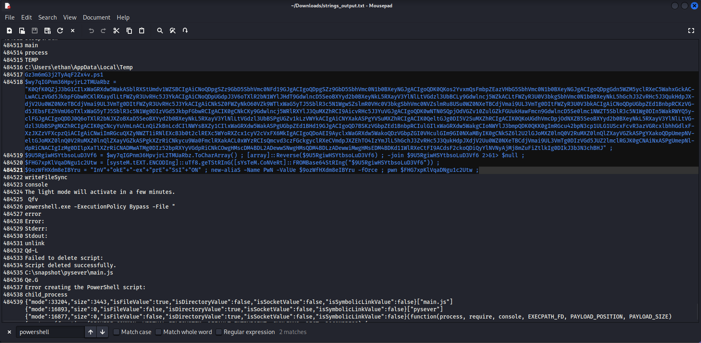
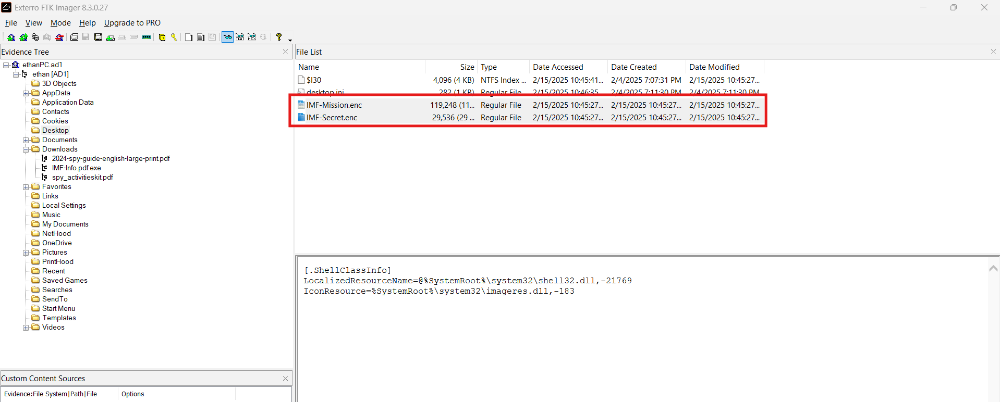
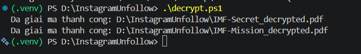

# CyberDefenders Lab: Silent Breach Writeup

**Category:** Endpoint Forensics | **Difficulty:** Medium | **Tactic:** Execution | **Tools:** FTK Imager, Text Editor, SQLite Viewer, Strings, CyberChef

**Scenario:** The IMF is hit by a cyber attack compromising sensitive data. Luther sends Ethan to retrieve crucial information from a compromised server. Despite warnings, Ethan downloads the intel, which later becomes unreadable. To recover it, he creates a forensic image and asks Benji for help in decoding the files.

---

### Q1: What is the MD5 hash of the potentially malicious EXE file the user downloaded?
*   **Cách làm:** Mount forensic image bằng FTK Imager, duyệt qua Evidence Tree để tìm file thực thi đáng ngờ trong thư mục Downloads, sau đó tính hash và tra cứu trên VirusTotal.
*   **Thao tác thực hiện:** Mở forensic image trong **FTK Imager**, điều hướng tới thư mục `Downloads` trong profile người dùng — đây là vị trí phổ biến nơi các file tải về từ internet (bao gồm cả payload độc hại) thường được lưu. Phát hiện 1 file thực thi có tên đáng ngờ, sử dụng **double extension** (đuôi file kép, ví dụ `.pdf.exe`) — kỹ thuật ngụy trang phổ biến để đánh lừa người dùng tưởng đây là file PDF thông thường. Dùng chức năng export hash của FTK Imager để lấy MD5 của file, sau đó tra cứu hash này trên **VirusTotal**, kết quả xác nhận file bị nhiều hãng bảo mật gắn cờ là mã độc.
*   **Bằng chứng:**
    
    
*   **Flag:** `<điền MD5 hash từ FTK Imager của bạn>`

---

### Q2: What is the URL from which the file was downloaded?
*   **Cách làm:** Trích xuất database lịch sử trình duyệt (SQLite) từ forensic image, kiểm tra bảng `downloads` để xác định nguồn tải file.
*   **Thao tác thực hiện:** Kiểm tra thư mục dữ liệu ứng dụng trong profile người dùng, phát hiện máy có cài cả **Google Chrome** và **Microsoft Edge**. Dùng **FTK Imager** export file database `History` (định dạng SQLite) của từng trình duyệt. Mở file bằng **SQLite Viewer**, tập trung vào bảng `downloads` — bảng lưu URL nguồn tải, đường dẫn lưu file cục bộ, và timestamp. Đối chiếu timestamp và đường dẫn file với file thực thi độc hại đã xác định ở Q1, tìm ra bản ghi tương ứng cho thấy file được tải từ URL `http://192.168.16.128:8000/IMF-Info.pdf.exe`.
*   **Bằng chứng:**
    
*   **Flag:** `http://192.168.16.128:8000/IMF-Info.pdf.exe`

---

### Q3: What application did the user use to download this file?
*   **Cách làm:** Dựa trên kết quả phân tích ở Q2, xác định database `History` chứa bản ghi download nằm ở thư mục profile của trình duyệt nào.
*   **Thao tác thực hiện:** Bản ghi download khớp với file độc hại được tìm thấy trong database `History` thuộc thư mục dữ liệu của **Microsoft Edge**, xác nhận đây là trình duyệt nạn nhân đã dùng để tải file.
*   **Bằng chứng:**
    
*   **Flag:** `Microsoft Edge`

---

### Q4: By examining Windows Mail artifacts, we found an email address mentioning three IP addresses of servers that are at risk or compromised. What are the IP addresses?
*   **Cách làm:** Dựng lại timeline hoạt động bằng registry key **UserAssist** (qua RegRipper) để xác định thời điểm Windows Mail được sử dụng, sau đó trích xuất và phân tích file `HxStore.hxd` chứa nội dung email.
*   **Thao tác thực hiện:** Export file `NTUSER.dat` từ forensic image, chạy **RegRipper** với plugin `UserAssist` để lấy danh sách chương trình đã thực thi kèm thời điểm — xác nhận Windows Mail đã được người dùng truy cập trong khung thời gian xảy ra sự cố. Tiếp tục export file `HxStore.hxd` (file lưu nội dung email của Windows Mail, định dạng độc quyền dạng binary) bằng FTK Imager. Chạy lệnh `strings` trên file này để trích xuất các chuỗi ký tự đọc được, sau đó áp dụng **regex pattern** khớp định dạng địa chỉ IPv4 để lọc nhanh các IP xuất hiện trong nội dung email. Kết quả tìm được 3 địa chỉ IP được đề cập trong email là các server đang gặp rủi ro/bị xâm nhập.
*   **Bằng chứng:**
    
    
*   **Flag:** `<điền 3 IP đã lọc được>`

---

### Q5: By examining the malicious executable, we found that it uses an obfuscated PowerShell script to decrypt specific files. What predefined password does the script use for encryption?
*   **Cách làm:** Trích xuất chuỗi ký tự (strings) từ file thực thi độc hại để tìm đoạn PowerShell script bị nhúng, sau đó deobfuscate để đọc được password mã hoá.
*   **Thao tác thực hiện:** Export file thực thi độc hại từ forensic image bằng FTK Imager, chạy `strings` để trích các chuỗi ký tự đọc được, lọc theo từ khoá liên quan PowerShell (`powershell`, `ps1`, cmdlet...). Phát hiện 1 đoạn PowerShell script bị làm rối nhiều lớp (base64 encoding, string concatenation, biến thế...) — kỹ thuật phổ biến để né tránh detection dựa trên signature và gây khó khăn cho việc reverse engineering. Trích script ra file riêng, chỉnh sửa để thêm các lệnh in giá trị trung gian (console output) và chạy trong môi trường cô lập nhằm gỡ rối từng lớp. Kết quả cho thấy script có chức năng mã hoá file, sử dụng password định sẵn (hardcoded) là `Imf!nfo#2025Sec$`.
*   **Bằng chứng:**
    
    
*   **Flag:** `Imf!nfo#2025Sec$`

---

### Q6: After identifying how the script works, decrypt the files and submit the secret string.
*   **Cách làm:** Chỉnh sửa lại PowerShell script (đảo chiều từ encrypt sang decrypt) sử dụng thuật toán **AES** với password đã xác định ở Q5 để giải mã file.
*   **Thao tác thực hiện:** Vì script gốc dùng **AES** (thuật toán mã hoá đối xứng — cùng 1 key dùng để mã hoá lẫn giải mã), nên hoàn toàn có thể đảo ngược quá trình nếu biết đúng password. Export các file đã bị mã hoá từ forensic image bằng FTK Imager. Chỉnh sửa script ở Q5 để thực hiện thao tác **decrypt** thay vì encrypt, giữ nguyên key/thuật toán đã dùng ban đầu. Chạy script đã chỉnh sửa trên các file mã hoá vừa export, script đọc từng file, áp dụng phép giải mã AES, ghi kết quả ra file mới với đuôi file gốc được khôi phục. Mở file đã giải mã, thu được secret string.
*   **Bằng chứng:**
    
    
*   **Flag:** `<điền secret string sau khi giải mã>`
