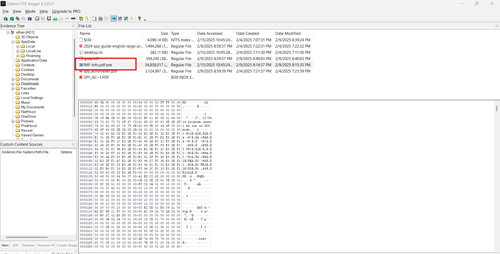
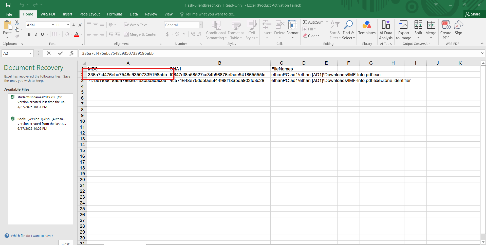
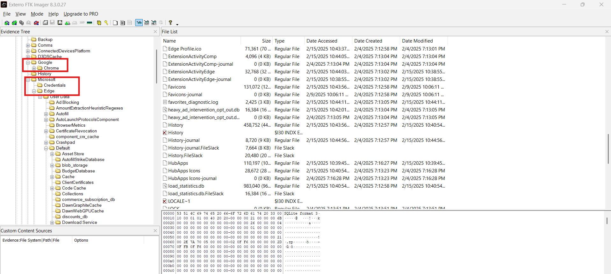
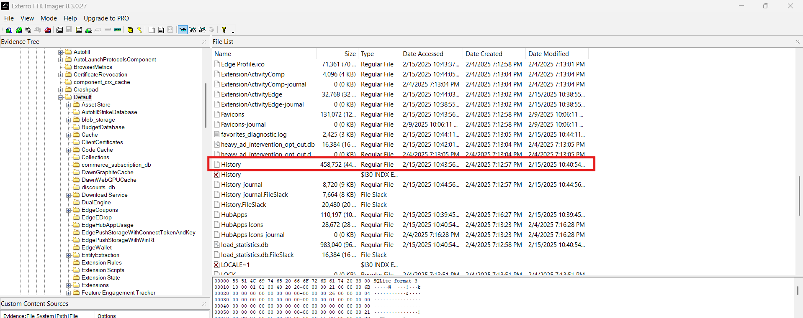
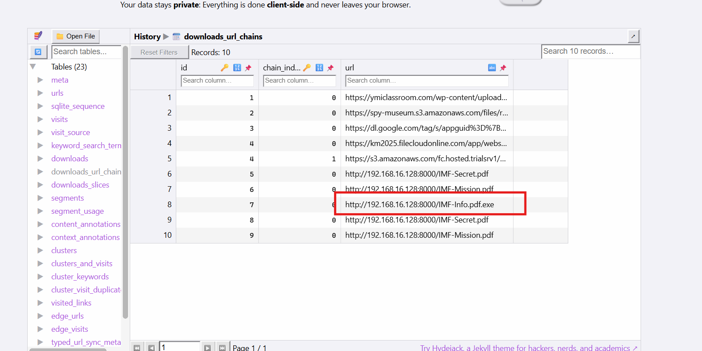
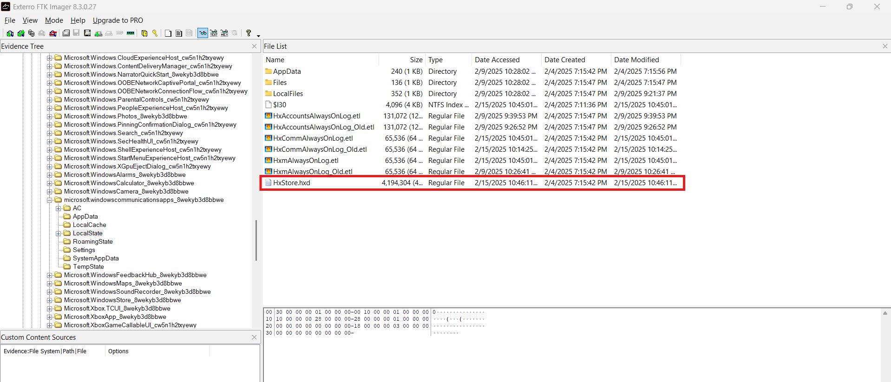
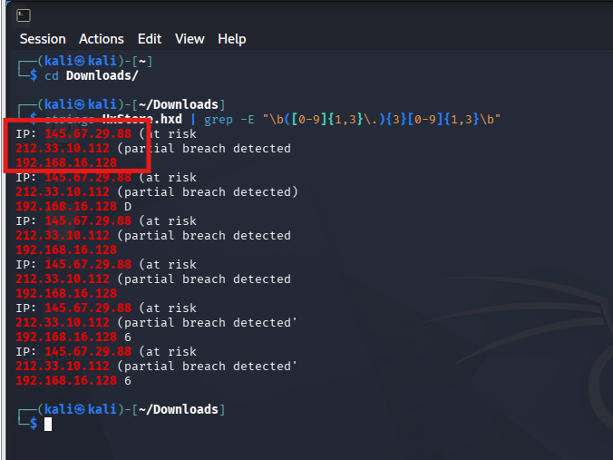

# CyberDefenders Lab: Silent Breach Writeup

**Category:** Endpoint Forensics | **Difficulty:** Medium | **Tactic:** Execution | **Tools:** FTK Imager, Text Editor, SQLite Viewer, Strings, CyberChef

**Scenario:** The IMF is hit by a cyber attack compromising sensitive data. Luther sends Ethan to retrieve crucial information from a compromised server. Despite warnings, Ethan downloads the intel, which later becomes unreadable. To recover it, he creates a forensic image and asks Benji for help in decoding the files.

---

### Q1: What is the MD5 hash of the potentially malicious EXE file the user downloaded?
*   **Cách làm:** Duyệt forensic image bằng FTK Imager để tìm file thực thi đáng ngờ trong thư mục Downloads, sau đó trích xuất hash để đối chiếu với VirusTotal.
*   **Thao tác thực hiện:** Mở forensic image trong **FTK Imager**, tại thư mục `Downloads`, phát hiện 1 file thực thi đáng ngờ tên `IMF-Info.pdf.exe` — sử dụng **double extension** (`.pdf.exe`) để đánh lừa nạn nhân tưởng đây là file PDF. Dùng chức năng export hash của FTK Imager, thu được mã hash MD5 của file này.
*   **Bằng chứng:**
    
    
*   **Flag:** `336a7cf476ebc7548c93507339196abb`

---

### Q2: What is the URL from which the file was downloaded?
*   **Cách làm:** Trích xuất database `History` (SQLite) của trình duyệt để kiểm tra bảng lưu thông tin download.
*   **Thao tác thực hiện:** Trong FTK Imager, phát hiện nạn nhân có cài cả **Google Chrome** và **Microsoft Edge**. Tiến hành export file `History` của Microsoft Edge, mở bằng **SQLite Viewer**, xác định được đường dẫn đầy đủ của file độc hại đã được tải về.
*   **Bằng chứng:**
    
    
    
*   **Flag:** `http://192.168.16.128:8000/IMF-Info.pdf.exe`

---

### Q3: What application did the user use to download this file?
*   **Cách làm:** Dựa trên kết quả phân tích ở Q2 để xác định trình duyệt tương ứng.
*   **Thao tác thực hiện:** Bản ghi download chứa URL tải file độc hại được tìm thấy trong database `History` thuộc thư mục dữ liệu của **Microsoft Edge**, xác nhận đây là ứng dụng nạn nhân đã dùng để tải file về.
*   **Bằng chứng:**
    
*   **Flag:** `Microsoft Edge`

---

### Q4: By examining Windows Mail artifacts, we found an email address mentioning three IP addresses of servers that are at risk or compromised. What are the IP addresses?
*   **Cách làm:** Xác định vị trí file lưu dữ liệu email của Windows Mail, trích xuất chuỗi ký tự đọc được và lọc theo định dạng IPv4 bằng regex.
*   **Thao tác thực hiện:** Windows Mail hoạt động dưới dạng ứng dụng UWP thuộc gói `microsoft.windowscommunicationsapps`. File cơ sở dữ liệu `HxStore.hxd` — lưu nội dung email, header và metadata ở dạng nhị phân — được tìm thấy tại đường dẫn: Users\ethan\AppData\Local\Packages\microsoft.windowscommunicationsapps_8wekyb3d8bbwe\LocalState\HxStore.hxd
*       Export file này bằng FTK Imager, sau đó trên **Terminal (Kali Linux)**, kết hợp `strings` với regex để lọc các chuỗi ký tự dạng địa chỉ IPv4 đọc được từ file binary:
```bash
    strings HxStore.hxd | grep -E "\b([0-9]{1,3}\.){3}[0-9]{1,3}\b"
```
    Kết quả trả về nội dung email chứa cảnh báo về các server bị ảnh hưởng, kèm theo 3 địa chỉ IP tương ứng.
*   **Bằng chứng:**
    
    
*   **Flag:** `145.67.29.88,212.33.10.112,192.168.16.128`
