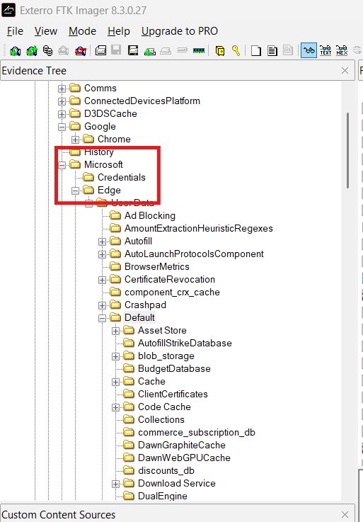

# CyberDefenders Lab: Silent Breach Writeup

**Category:** Endpoint Forensics | **Difficulty:** Medium | **Tactic:** Execution | **Tools:** FTK Imager, Text Editor, SQLite Viewer, Strings, CyberChef

**Scenario:** The IMF is hit by a cyber attack compromising sensitive data. Luther sends Ethan to retrieve crucial information from a compromised server. Despite warnings, Ethan downloads the intel, which later becomes unreadable. To recover it, he creates a forensic image and asks Benji for help in decoding the files.

---

### Q1: What is the MD5 hash of the potentially malicious EXE file the user downloaded?
*   **Cách làm:** 
*   **Thao tác thực hiện:** 
*   **Bằng chứng:**
    
*   **Flag:** ``

---

### Q2: What is the URL from which the file was downloaded?
*   **Cách làm:** 
*   **Thao tác thực hiện:** 
*   **Bằng chứng:**
    
*   **Flag:** ``

---

### Q3: What application did the user use to download this file?
*   **Cách làm:** 
*   **Thao tác thực hiện:** 
*   **Bằng chứng:**
    
*   **Flag:** ``

---

### Q4: By examining Windows Mail artifacts, we found an email address mentioning three IP addresses of servers that are at risk or compromised. What are the IP addresses?
*   **Cách làm:** 
*   **Thao tác thực hiện:** 
*   **Bằng chứng:**
    
*   **Flag:** ``

---

### Q5: By examining the malicious executable, we found that it uses an obfuscated PowerShell script to decrypt specific files. What predefined password does the script use for encryption?
*   **Cách làm:** 
*   **Thao tác thực hiện:** 
*   **Bằng chứng:**
    
*   **Flag:** ``

---

### Q6: After identifying how the script works, decrypt the files and submit the secret string.
*   **Cách làm:** 
*   **Thao tác thực hiện:** 
*   **Bằng chứng:**
    
*   **Flag:** ``
