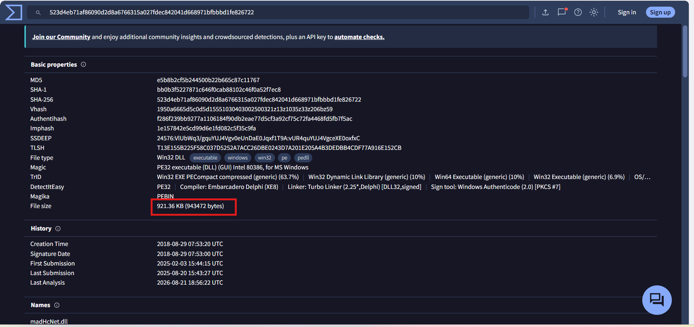
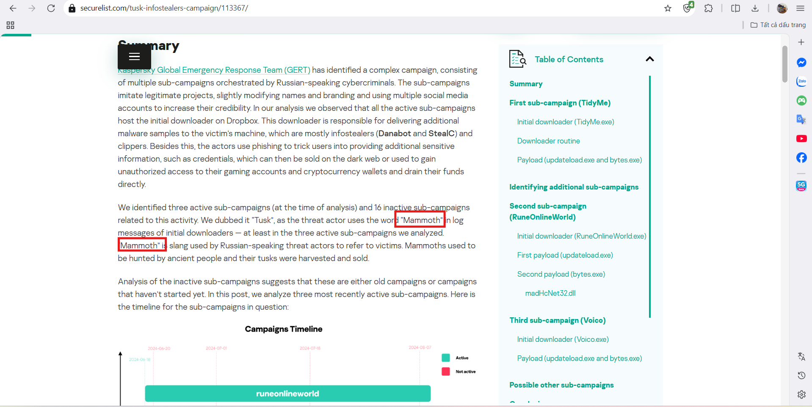
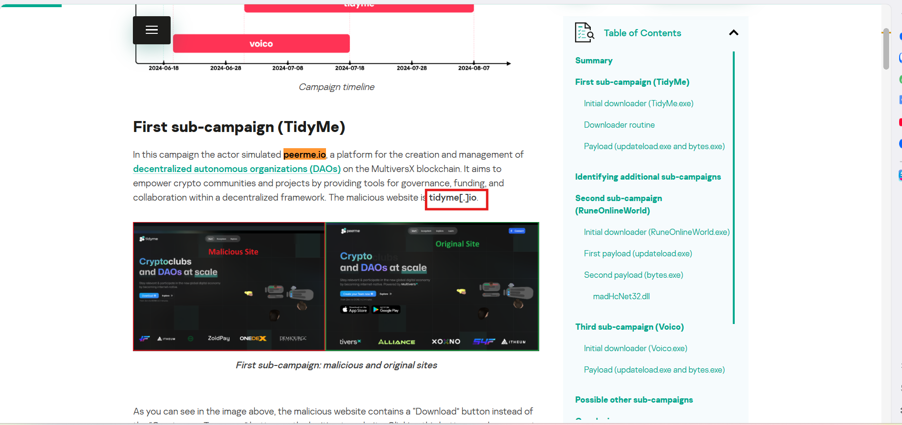
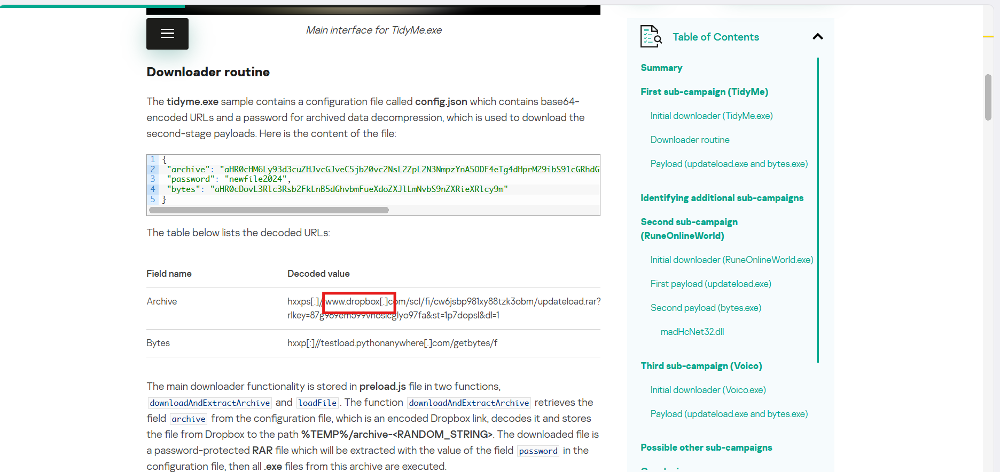
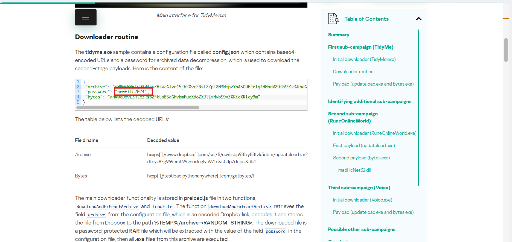
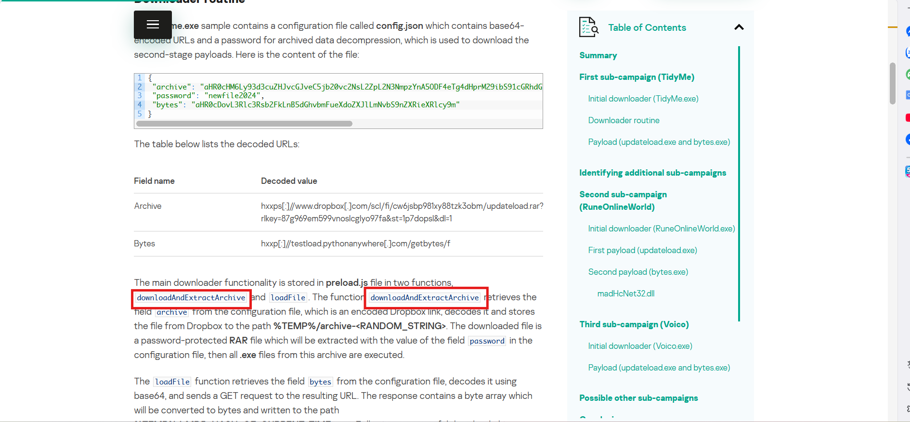
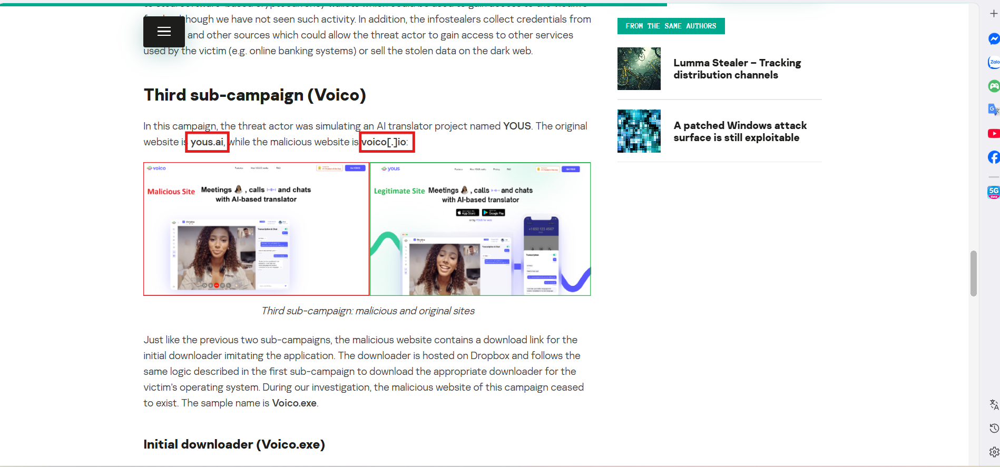
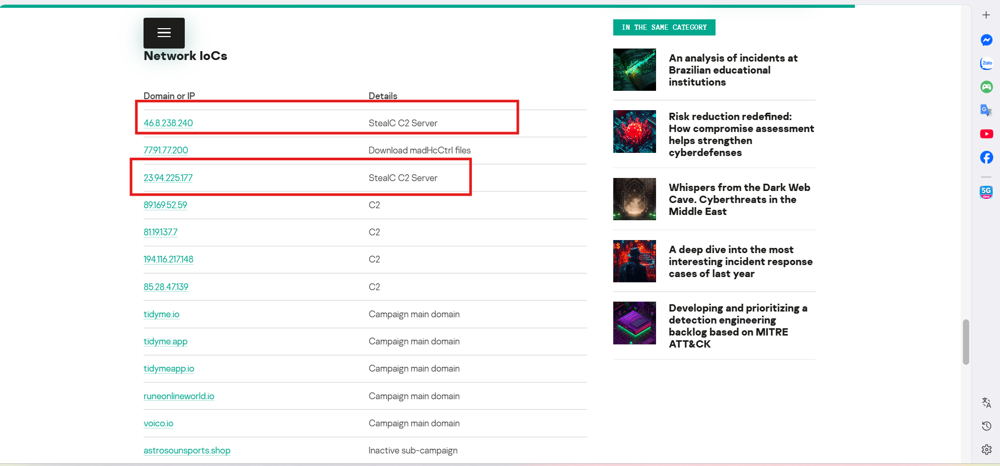
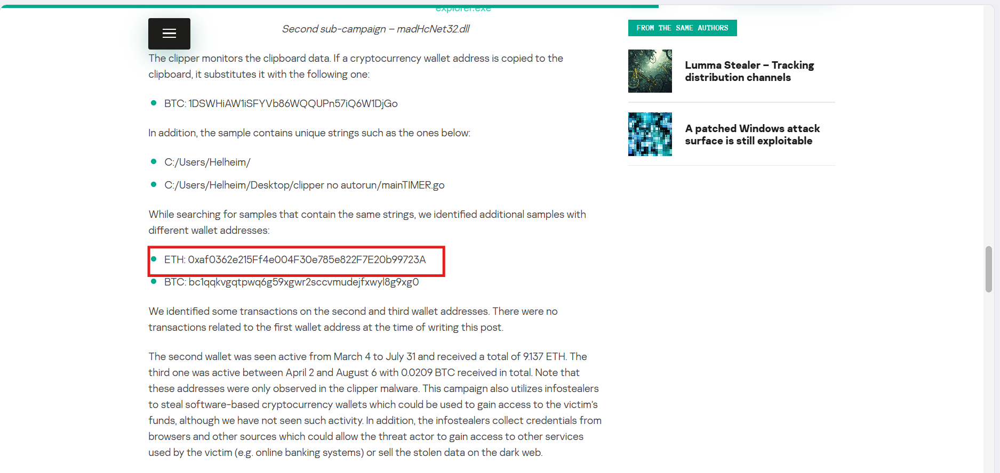

# CyberDefenders Lab: Tusk Infostealer Writeup

**Category:** Threat Intel | **Difficulty:** Easy

**Scenario:** A blockchain development company detected unusual activity when an employee was redirected to an unfamiliar website while accessing a DAO management platform. Soon after, multiple cryptocurrency wallets linked to the organization were drained. Investigators suspect a malicious tool was used to steal credentials and exfiltrate funds. Your task is to analyze the provided intelligence to uncover the attack methods, identify indicators of compromise, and track the threat actor's infrastructure.

---

### Q1: In KB, what is the size of the malicious file?

*   **Cách làm:** Khai thác thông tin siêu dữ liệu (metadata) của file mẫu (sample) thông qua mã băm trên VirusTotal.
*   **Thao tác thực hiện:** Tính toán mã băm MD5 của file độc hại tải về (`E5B8B2CF5B244500B22B665C87C11767`). Tìm kiếm mã băm này trên VirusTotal, chuyển sang tab Details và kiểm tra mục Basic Properties để lấy dung lượng file (File size).
*   **Bằng chứng:**
    
*   **Flag:** `921.36`

---

### Q2: What word do the threat actors use in log messages to describe their victims, based on the name of an ancient hunted creature?

*   **Cách làm:** Phân tích tài liệu tình báo (Threat Intel report) từ Kaspersky để tìm hiểu thuật ngữ lóng (slang) của nhóm tấn công.
*   **Thao tác thực hiện:** Tìm kiếm thông tin về chiến dịch "Tusk" trong báo cáo. Bài phân tích chỉ rõ kẻ tấn công sử dụng từ "Mammoth" trong các log message để chỉ nạn nhân (ám chỉ những người dễ bị lừa, giống như voi ma mút bị người tiền sử săn bắt).
*   **Bằng chứng:**
    
*   **Flag:** `Mammoth`

---

### Q3: The threat actor set up a malicious website to mimic a platform designed for creating and managing decentralized autonomous organizations (DAOs) on the MultiversX blockchain (peerme.io). What is the name of the malicious website the attacker created to simulate this platform?

*   **Cách làm:** Tìm kiếm kỹ thuật giả mạo tên miền (Typosquatting) nhắm vào nền tảng MultiversX DAO.
*   **Thao tác thực hiện:** Rà soát phần "First sub-campaign (TidyMe)" trong báo cáo. Báo cáo ghi nhận kẻ tấn công mô phỏng nền tảng `peerme.io` bằng cách tạo ra một website độc hại có giao diện tương tự và sử dụng tên miền lừa đảo là `tidyme.io`.
*   **Bằng chứng:**
    
*   **Flag:** `tidyme.io`

---

### Q4: Which cloud storage service did the campaign operators use to host malware samples for both macOS and Windows OS versions?

*   **Cách làm:** Xác định dịch vụ lưu trữ đám mây hợp pháp bị lạm dụng để phân phối mã độc (Payload hosting).
*   **Thao tác thực hiện:** Đọc phần phân tích "Downloader routine". Các URL được giải mã từ file cấu hình cho thấy mã độc lưu trữ payload trên dịch vụ Dropbox.
*   **Bằng chứng:**
    
*   **Flag:** `dropbox`

---

### Q5: The malicious executable contains a configuration file that includes base64-encoded URLs and a password used for archived data decompression, enabling the download of second-stage payloads. What is the password for decompression found in this configuration file?

*   **Cách làm:** Phân tích nội dung file cấu hình (`config.json`) của mã độc để trích xuất khóa giải mã/giải nén.
*   **Thao tác thực hiện:** Trong phần "Downloader routine", kiểm tra nội dung file `config.json`. File này chứa các URL Base64 và một trường "password" được gán giá trị `newfile2024`. Mật khẩu này được dùng để giải nén file RAR chứa payload giai đoạn 2.
*   **Bằng chứng:**
    
*   **Flag:** `newfile2024`

---

### Q6: What is the name of the function responsible for retrieving the field archive from the configuration file?

*   **Cách làm:** Dịch ngược logic hoạt động của file thực thi để tìm hàm xử lý tải và giải nén.
*   **Thao tác thực hiện:** Đọc phân tích mã nguồn của file `preload.js`. Hàm chịu trách nhiệm lấy trường `archive` từ file cấu hình, tải từ Dropbox và giải nén được đặt tên là `downloadAndExtractArchive`.
*   **Bằng chứng:**
    
*   **Flag:** `downloadAndExtractArchive`

---

### Q7: In the third sub-campaign carried out by the operators, the attacker mimicked an AI translator project. What is the name of the legitimate translator, and what is the name of the malicious translator created by the attackers?

*   **Cách làm:** Trích xuất IoC từ chiến dịch tấn công thứ 3 nhắm vào dự án AI Translator.
*   **Thao tác thực hiện:** Tìm phần "Third sub-campaign (Voico)" trong báo cáo. Kẻ tấn công giả mạo dự án hợp pháp có tên miền `yous.ai` bằng cách dựng lên website lừa đảo `voico.io`.
*   **Bằng chứng:**
    
*   **Flag:** `yous.ai,voico.io`

---

### Q8: The downloader is tasked with delivering additional malware samples to the victim’s machine, primarily infostealers like StealC and Danabot. What are the IP addresses of the StealC C2 servers used in the campaign?

*   **Cách làm:** Thu thập IoC liên quan đến hạ tầng máy chủ điều khiển (C2 Infrastructure) của mã độc StealC.
*   **Thao tác thực hiện:** Kéo xuống bảng "Network IoCs" ở cuối báo cáo, lọc các địa chỉ IP được gán chi tiết là "StealC C2 Server". Có 2 địa chỉ khớp là `46.8.238.240` và `23.94.225.177`.
*   **Bằng chứng:**
    
*   **Flag:** `46.8.238.240,23.94.225.177`

---

### Q9: What is the address of the Ethereum cryptocurrency wallet used in this campaign?

*   **Cách làm:** Xác định ví tiền điện tử của kẻ tấn công được nhúng trong mã độc (thường dùng cho kỹ thuật Clipper - thay thế địa chỉ ví trong bộ nhớ tạm).
*   **Thao tác thực hiện:** Đọc phần phân tích về "clipper". Báo cáo cung cấp địa chỉ ví ETH là `0xaf0362e215Ff4e004F30e785e822F7E20b99723A`.
*   **Bằng chứng:**
    
*   **Flag:** `0xaf0362e215Ff4e004F30e785e822F7E20b99723A`
