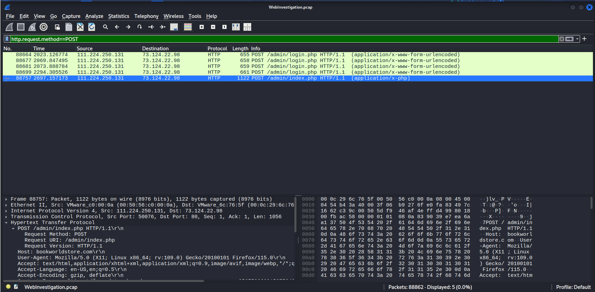
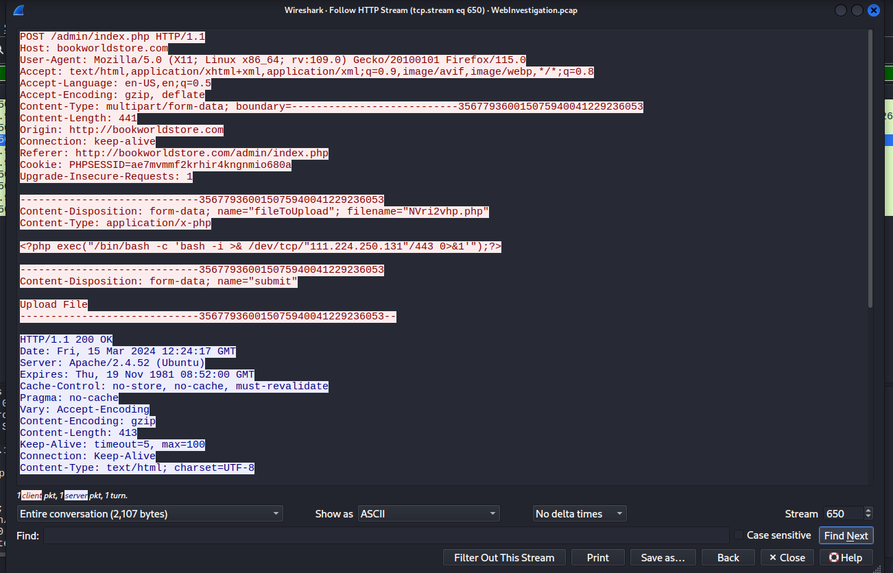

# CyberDefenders Lab: Web Investigation Writeup

**Category:** Network Forensics | **Difficulty:** Easy | **Tools:** Wireshark

**Scenario:** You are a cybersecurity analyst working in the Security Operations Center (SOC) of BookWorld, an expansive online bookstore. Recently, an automated alert is triggered by an unusual spike in database queries and server resource usage, indicating potential malicious activity. Your objectives include identifying the attack vector, assessing the scope of any potential data breach, and determining if the attacker gained further access to internal systems.

---

### Q1: By knowing the attacker's IP, we can analyze all logs and actions related to that IP and determine the extent of the attack, the duration of the attack, and the techniques used. Can you provide the attacker's IP?

*   **Cách làm:** Phân tích lưu lượng mạng (Traffic Analysis) để phát hiện sự bất thường về băng thông và xác định IP khả nghi.
*   **Thao tác thực hiện:** Kẻ tấn công thường tạo ra lượng kết nối cực lớn khi rà quét hoặc khai thác hệ thống. Truy cập `Wireshark -> Statistics -> Conversations`, ta nhận thấy sự chênh lệch lưu lượng áp đảo giữa IP ngoại mạng `111.224.250.131` và máy chủ đích `73.124.22.98`. Dùng bộ lọc `ip.src==111.224.250.131 and ip.dst==73.124.22.98`, ta dễ dàng quan sát thấy IP này liên tục gửi các request GET mang dấu hiệu rà quét lỗ hổng SQL Injection.
*   **Bằng chứng:**
    
    
*   **Flag:** `111.224.250.131`

---

### Q2: If the geographical origin of an IP address is known to be from a region that has no business or expected traffic with our network, this can be an indicator of a targeted attack. Can you determine the origin city of the attacker?

*   **Cách làm:** Ứng dụng tình báo nguồn mở (OSINT) để tra cứu định vị địa lý (Geolocation) nhằm đánh giá rủi ro của IP nguồn.
*   **Thao tác thực hiện:** Tiến hành tra cứu IP `111.224.250.131` trên nền tảng AbuseIPDB, kết quả trả về vị trí tại thành phố Shijiazhuang, Trung Quốc. Đối với một hệ thống nhà sách trực tuyến (BookWorld) không có tệp khách hàng hay chi nhánh tại khu vực này, đây là một Dấu hiệu Thỏa hiệp (IOC) có độ tin cậy cao, khẳng định đây là hành vi tấn công có chủ đích.
*   **Bằng chứng:**
    
*   **Flag:** `Shijiazhuang`

---

### Q3: Identifying the exploited script allows security teams to understand exactly which vulnerability was used in the attack. This knowledge is critical for finding the appropriate patch or workaround to close the security gap and prevent future exploitation. Can you provide the vulnerable PHP script name?

*   **Cách làm:** Truy vết mục tiêu (Target Path) của các luồng request độc hại để xác định điểm yếu của ứng dụng web.
*   **Thao tác thực hiện:** Phân tích kỹ các gói tin GET bị đánh chặn, ta thấy kẻ tấn công liên tục nhồi nhét các payload chứa từ khóa SQL (như `UNION`, `SELECT`) vào các truy vấn gửi đến tệp tin `search.php`. Điều này cho thấy `search.php` chính là script bị lỗi thiếu kiểm tra đầu vào (Input Validation), tạo lỗ hổng trực tiếp cho mã độc SQL Injection khai thác.
*   **Bằng chứng:**
    
*   **Flag:** `search.php`

---

### Q4: Establishing the timeline of an attack, starting from the initial exploitation attempt, what is the complete request URI of the first SQLi attempt by the attacker?

*   **Cách làm:** Xây dựng dòng thời gian sự cố (Timeline Analysis) để xác định thời điểm khởi phát và payload thăm dò đầu tiên.
*   **Thao tác thực hiện:** Sắp xếp các gói tin nhắm vào `search.php` theo trình tự thời gian, ta tìm được request đầu tiên khởi phát chuỗi tấn công. Trích xuất URI và tiến hành giải mã (URL Decode), ta thu được chuỗi `/search.php?search=book and 1=1; -- -`. Đây là phép thử logic kinh điển (`1=1` luôn đúng) để hacker xác nhận máy chủ có thực thi các truy vấn chèn thêm hay không.
*   **Bằng chứng:**
    
*   **Flag:** `/search.php?search=book and 1=1; -- -`

---

### Q5: Can you provide the complete request URI that was used to read the web server's available databases?

*   **Cách làm:** Phân tích hành vi leo thang (Database Enumeration) thông qua kỹ thuật gộp truy vấn (UNION SELECT).
*   **Thao tác thực hiện:** Khi đã xác nhận có lỗ hổng, hacker sẽ tìm cách lập bản đồ cơ sở dữ liệu. Dùng bộ lọc `ip.src==111.224.250.131 and http and frame contains "schema"`, ta bắt được một gói tin khả nghi (frame 1520) chứa lệnh gọi đến `INFORMATION_SCHEMA.SCHEMATA`. Giải mã URL này, ta thấy rõ ý đồ dùng hàm `JSON_ARRAYAGG` để ép máy chủ gộp và trả về danh sách toàn bộ các Database đang có chỉ trong một lần truy vấn duy nhất.
*   **Bằng chứng:**
    
    
*   **Flag:** `/search.php?search=book' UNION ALL SELECT NULL,CONCAT(0x7178766271,JSON_ARRAYAGG(CONCAT_WS(0x7a76676a636b,schema_name)),0x7176706a71) FROM INFORMATION_SCHEMA.SCHEMATA-- -`

---

### Q6: Assessing the impact of the breach and data access is crucial, including the potential harm to the organization's reputation. What's the table name containing the website users data?

*   **Cách làm:** Phân tích gói tin phản hồi (HTTP Response) để đánh giá mức độ rò rỉ dữ liệu (Data Exfiltration).
*   **Thao tác thực hiện:** Sau khi có danh sách Database, kẻ tấn công tiếp tục truy xuất để tìm tên các bảng dữ liệu. Bám theo luồng kết nối (Follow HTTP Stream) tại frame 1548, ta đọc được nội dung máy chủ trả về cho kẻ tấn công là một mảng JSON chứa 3 bảng: `["admin", "books", "customers"]`. Rõ ràng, bảng `customers` chính là mục tiêu chứa dữ liệu người dùng nhạy cảm.
*   **Bằng chứng:**
    
*   **Flag:** `customers`

---

### Q7: The website directories hidden from the public could serve as an unauthorized access point or contain sensitive functionalities not intended for public access. Can you provide the name of the directory discovered by the attacker?

*   **Cách làm:** Phân tích sự thay đổi phương thức giao tiếp (từ GET sang POST) để phát hiện hành vi xâm nhập sâu hơn.
*   **Thao tác thực hiện:** Khi chuyển bộ lọc sang `http.request.method == "POST"`, ta nhận thấy mục tiêu của hacker thay đổi hoàn toàn. Thay vì khai thác SQLi trên `search.php`, chúng đang gửi dữ liệu form đăng nhập đến các tệp `login.php` và `index.php`. Đường dẫn của các tệp này tố cáo kẻ tấn công đã rà quét và tìm ra được thư mục quản trị ẩn của hệ thống là `/admin/`.
*   **Bằng chứng:**
    
*   **Flag:** `/admin/`

---

### Q8: Knowing which credentials were used allows us to determine the extent of account compromise. What are the credentials used by the attacker for logging in?

*   **Cách làm:** Trích xuất thông tin xác thực (Credentials) bị lộ lọt từ nội dung (Body) của luồng POST request.
*   **Thao tác thực hiện:** Định vị gói tin POST nhắm vào `/admin/login.php` (tại frame 88699), sử dụng tính năng Follow TCP Stream để phân tích toàn bộ phiên kết nối. Ở phần cuối của Request Body, ta phát hiện thông tin đăng nhập bị gửi đi dưới dạng cleartext: `username=admin&passwordfld=admin123%21`. Việc máy chủ phản hồi bằng mã HTTP 302 Found xác nhận tài khoản này đã đăng nhập thành công.
*   **Bằng chứng:**
    
*   **Flag:** `admin:admin123!`

---

### Q9: We need to determine if the attacker gained further access or control of our web server. What's the name of the malicious script uploaded by the attacker?

*   **Cách làm:** Giám sát hành vi hậu khai thác (Post-Exploitation) nhằm phát hiện mã độc (Web Shell/Backdoor) bị tải lên máy chủ.
*   **Thao tác thực hiện:** Tiếp tục phân tích luồng POST ở frame 88757 nhắm vào `/admin/index.php`. Sự xuất hiện của header `Content-Type: multipart/form-data` tố cáo hành vi tải tệp tin lên hệ thống. Follow HTTP Stream chỉ ra rằng kẻ tấn công đã lợi dụng quyền admin vừa chiếm được để tải lên một tệp tin thực thi nhằm tạo kết nối Reverse Shell về máy chủ của chúng. Tên tệp tin mã độc này được khai báo rõ là `NVri2vhp.php`.
*   **Bằng chứng:**
    
    
*   **Flag:** `NVri2vhp.php`
