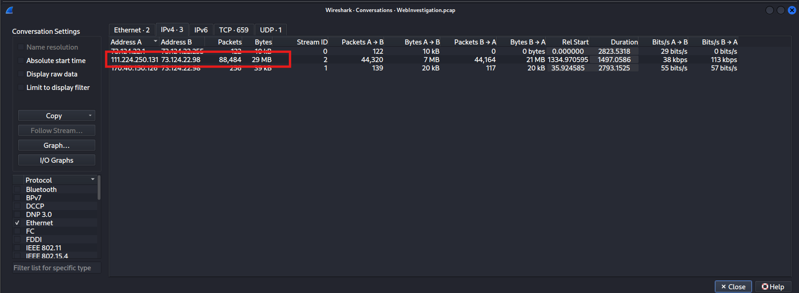
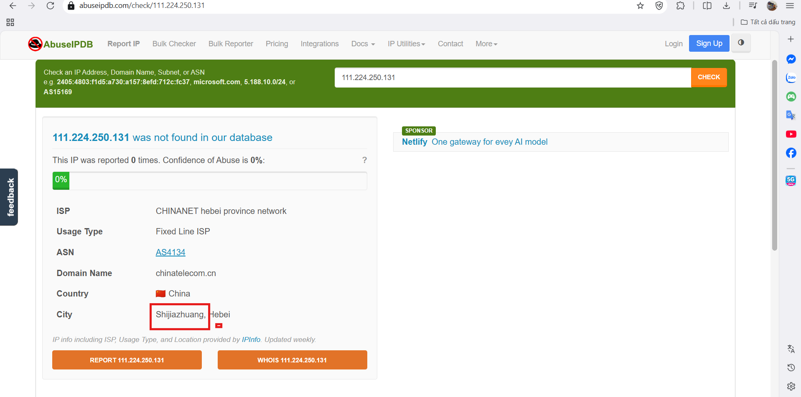
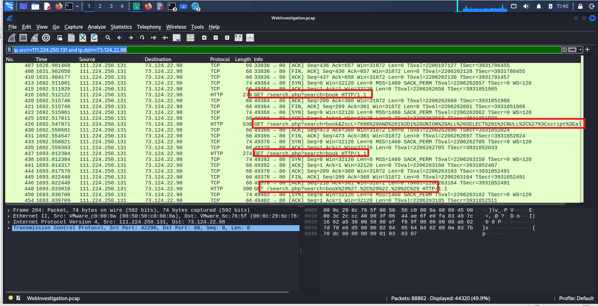
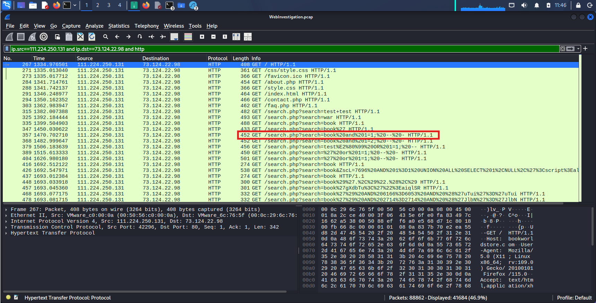
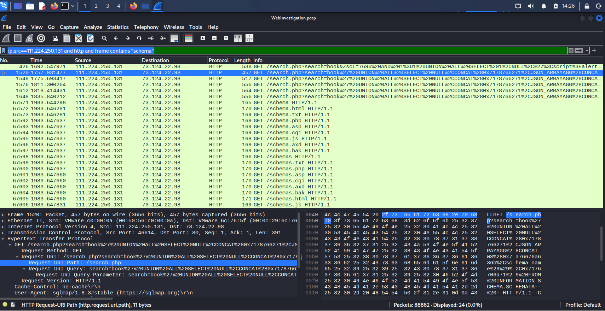
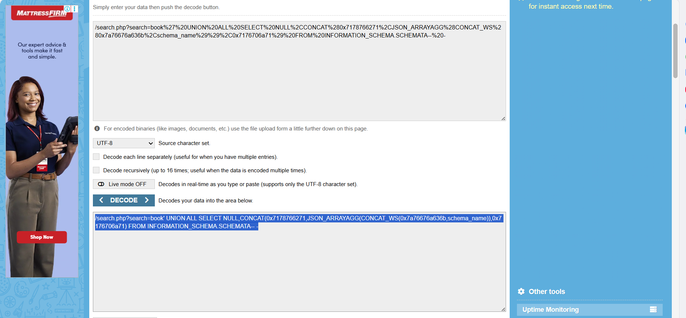
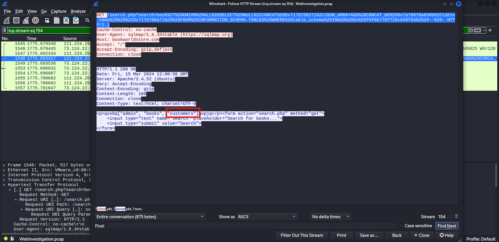
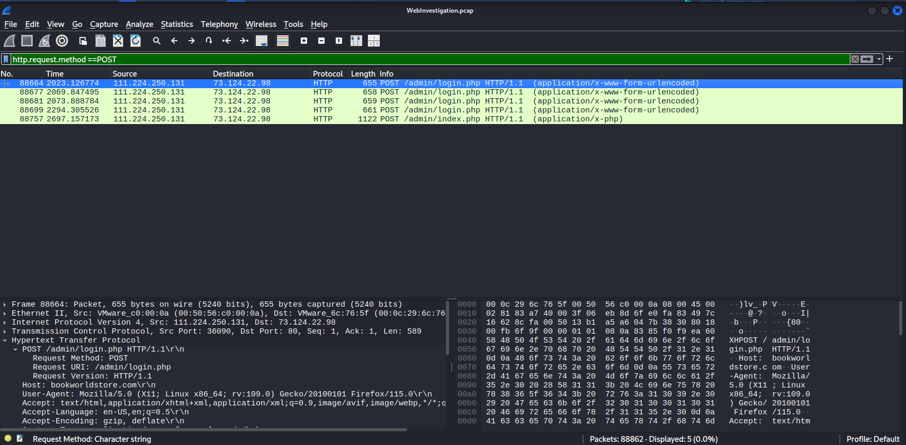
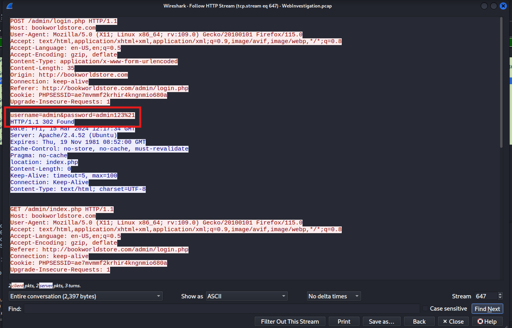

# CyberDefenders Lab: Web Investigation Writeup

**Category:** Network Forensics | **Difficulty:** Easy | **Tools:** Wireshark

**Scenario:** You are a cybersecurity analyst working in the Security Operations Center (SOC) of BookWorld, an expansive online bookstore. Recently, an automated alert is triggered by an unusual spike in database queries and server resource usage, indicating potential malicious activity. Your objectives include identifying the attack vector, assessing the scope of any potential data breach, and determining if the attacker gained further access to internal systems.

---

### Q1: By knowing the attacker's IP, we can analyze all logs and actions related to that IP and determine the extent of the attack, the duration of the attack, and the techniques used. Can you provide the attacker's IP?

*   **Cách làm:** Phân tích lưu lượng giao tiếp (Conversations) để xác định IP có dấu hiệu gửi lượng request bất thường.
*   **Thao tác thực hiện:** Đầu tiên để xác định IP của attacker, chúng ta vào `Wireshark -> Statistics -> Conversations`. Chúng ta có thể thấy có 1 lượng traffic rất lớn giữa 2 địa chỉ IP là `111.224.250.131` và `73.124.22.98`. Ở ô filter của Wireshark, chúng ta nhập filter: `ip.src==111.224.250.131 and ip.dst==73.124.22.98`. Kết quả cho thấy máy có ip là `111.224.250.131` đang gửi rất nhiều truy vấn tới `73.124.22.98`, có rất nhiều request GET tới `search.php` và có dấu hiệu của tấn công SQL Injection.
*   **Bằng chứng:**
    
    
*   **Flag:** `111.224.250.131`

---

### Q2: If the geographical origin of an IP address is known to be from a region that has no business or expected traffic with our network, this can be an indicator of a targeted attack. Can you determine the origin city of the attacker?

*   **Cách làm:** Tra cứu định vị địa lý (Geolocation) của IP công cộng.
*   **Thao tác thực hiện:** Chúng ta đã biết địa chỉ IP của attacker là `111.224.250.131`, sử dụng AbuseIP cho kết quả địa chỉ IP này tới từ Shijiazhuang. Do hệ thống BookWorld không có hoạt động kinh doanh tại khu vực này, đây là dấu hiệu rõ ràng của một cuộc tấn công có chủ đích.
*   **Bằng chứng:**
    
*   **Flag:** `Shijiazhuang`

---

### Q3: Identifying the exploited script allows security teams to understand exactly which vulnerability was used in the attack. This knowledge is critical for finding the appropriate patch or workaround to close the security gap and prevent future exploitation. Can you provide the vulnerable PHP script name?

*   **Cách làm:** Phân tích mục tiêu của các truy vấn mang payload độc hại.
*   **Thao tác thực hiện:** Dựa vào hình ảnh các gói tin đã lọc ở Q1, ta có thể thấy các câu lệnh tấn công SQL Injection đang lợi dụng lỗ hổng trên script `search.php` để thực hiện tấn công.
*   **Bằng chứng:**
    
*   **Flag:** `search.php`

---

### Q4: Establishing the timeline of an attack, starting from the initial exploitation attempt, what is the complete request URI of the first SQLi attempt by the attacker?

*   **Cách làm:** Truy vết dòng thời gian để tìm truy vấn thăm dò đầu tiên.
*   **Thao tác thực hiện:** Dựa vào thời gian của cuộc tấn công bắt đầu từ khai thác đầu tiên, chúng ta xác định được request tấn công đầu tiên của attacker là: `GET /search.php?search=book%20and%201=1;%20--%20-`. Khi giải mã (decode) ta được đường dẫn đầy đủ là: `/search.php?search=book and 1=1; -- -`.
*   **Bằng chứng:**
    
*   **Flag:** `/search.php?search=book and 1=1; -- -`

---

### Q5: Can you provide the complete request URI that was used to read the web server's available databases?

*   **Cách làm:** Lọc các truy vấn liên quan đến cấu trúc cơ sở dữ liệu và giải mã Payload.
*   **Thao tác thực hiện:** Sử dụng filter: `ip.src==111.224.250.131 and http and frame contains "schema"` để tìm những truy vấn liên quan tới database. Ta phát hiện 1 request nghi ngờ là frame số 1520. Khi copy request và đem đi decode ta thu về được URL chứa chuỗi `UNION ALL SELECT NULL,CONCAT... FROM INFORMATION_SCHEMA.SCHEMATA`. Đây chính là request để đọc các database của web server.
*   **Bằng chứng:**
    
    
*   **Flag:** `/search.php?search=book' UNION ALL SELECT NULL,CONCAT(0x7178766271,JSON_ARRAYAGG(CONCAT_WS(0x7a76676a636b,schema_name)),0x7176706a71) FROM INFORMATION_SCHEMA.SCHEMATA-- -`

---

### Q6: Assessing the impact of the breach and data access is crucial, including the potential harm to the organization's reputation. What's the table name containing the website users data?

*   **Cách làm:** Phân tích luồng dữ liệu trả về (HTTP Response) để xác định bảng dữ liệu bị rò rỉ.
*   **Thao tác thực hiện:** Khi hacker bắt đầu trích xuất dữ liệu, máy chủ sẽ trả về các thông tin nhạy cảm. Tìm kiếm các gói tin `HTTP/1.1 200 OK` (hoặc dùng tính năng Follow HTTP Stream các lệnh SQLi). Ta sẽ thấy máy chủ trả về các cột chứa Tên, Email, Số điện thoại từ một bảng có tên bắt đầu bằng chữ `c`. Bảng này chính là `customers`.
*   **Bằng chứng:**
    
*   **Flag:** `customers`

---

### Q7: The website directories hidden from the public could serve as an unauthorized access point or contain sensitive functionalities not intended for public access. Can you provide the name of the directory discovered by the attacker?

*   **Cách làm:** Lọc các gói tin mang phương thức POST để tìm hành vi truy cập các phân vùng ẩn.
*   **Thao tác thực hiện:** Nhập filter `http.request.method == "POST"`. Nhìn vào cột Info, ta sẽ thấy ngay kẻ tấn công không còn nhắm vào `search.php` nữa mà đang gửi dữ liệu thẳng vào các đường dẫn `login.php` và `index.php` nằm trong thư mục quản trị `/admin/`.
*   **Bằng chứng:**
    
*   **Flag:** `/admin/`

---

### Q8: Knowing which credentials were used allows us to determine the extent of account compromise. What are the credentials used by the attacker for logging in?

*   **Cách làm:** Trích xuất thông tin tài khoản và mật khẩu từ nội dung của HTTP POST request.
*   **Thao tác thực hiện:** Chuột phải vào gói tin POST nhắm đến `/admin/login.php` ở Câu 7, chọn **Follow -> TCP Stream** (hoặc HTTP Stream). Nhìn vào phần text hiện ra, ta sẽ thấy tài khoản và mật khẩu bị lộ dưới dạng cleartext trong request body. Cụ thể là tham số `username=admin&passwordfld=admin123%21`. Tham số `%21` giải mã ra là dấu `!`.
*   **Bằng chứng:**
    
*   **Flag:** `admin:admin123!`

---

### Q9: We need to determine if the attacker gained further access or control of our web server. What's the name of the malicious script uploaded by the attacker?

*   **Cách làm:** Kiểm tra hành vi tải tệp tin (File Upload) sau khi hacker đã lấy được quyền quản trị.
*   **Thao tác thực hiện:** Vẫn trong danh sách các gói tin POST, tìm gói tin gửi đến `/admin/index.php` có chứa header dùng để upload file (`multipart/form-data`). Bấm vào xem chi tiết, ta phát hiện kẻ tấn công đã up lên một file chứa đoạn mã reverse shell. Tên của file mã độc đó nằm trong thuộc tính `filename="Nvri2vhp.php"`.
*   **Bằng chứng:**
    
*   **Flag:** `Nvri2vhp.php`
