# CyberDefenders Lab: XLMrat Writeup

**Scenario:** A compromised machine has been flagged due to suspicious network traffic. Your task is to analyze the PCAP file to determine the attack method, identify any malicious payloads, and trace the timeline of events. Focus on how the attacker gained access, what tools or techniques were used, and how the malware operated post-compromise.

---

### Q1: The attacker successfully executed a command to download the first stage of the malware. What is the URL from which the first malware stage was installed?

*   **Cách làm:** Mở file pcap bằng Wireshark, lọc giao thức HTTP để tìm các file được tải về.
*   **Thao tác thực hiện:** 
    *   Ở ô filter gõ `http` ta sẽ thấy có 2 file được tải: `xlm.txt` và `mdm.jpg`.
    *   Ở frame số 4 ta sẽ click chuột phải -> **Follow HTTP Stream**.
*   **Phân tích file `xlm.txt`:**
    *   **Bản chất file:** Đây là một script VBScript đóng vai trò là Stager/Dropper.
    *   **Kỹ thuật làm rối (Obfuscation):** Kẻ tấn công phân tách mã độc thành một mảng gồm 88 phần tử chuỗi (`LZeWX(0)` đến `LZeWX(87)`) rồi dùng vòng lặp `For...Next` để ghép lại thành biến `OodjR`. Kỹ thuật này giúp tránh né các hệ thống Antivirus/IDS quét chữ ký chuỗi tĩnh.
    *   **Kỹ thuật thực thi (Execution & Defense Evasion):** Script khởi tạo đối tượng `WScript.Shell` để thực thi ngầm tiến trình PowerShell thông qua `cmd.exe` với hàng loạt tham số lẩn tránh:
        *   `-NOP` (NoProfile): Không load profile người dùng để tăng tốc thực thi.
        *   `-WIND HIDDeN` (WindowStyle Hidden): Ẩn cửa sổ dòng lệnh để nạn nhân không phát hiện.
        *   `-eXeC BYPASS` (ExecutionPolicy Bypass): Vượt qua chính sách hạn chế thực thi script của PowerShell trên Windows.
        *   `-NONI` (NonInteractive): Chạy chế độ không tương tác.
*   **Mối liên hệ giữa `xlm.txt` và `mdm.jpg` (Chứng minh chuỗi lây nhiễm):**
    Dựa vào danh sách các gói tin khi lọc với giao thức HTTP, ta có thể thấy rõ trình tự thời gian của cuộc tấn công:
    1.  **Bước 1 (Frame 4):** Máy nạn nhân kết nối đến `45.126.209.4:222` để tải về đoạn script `xlm.txt`.
    2.  **Bước 2 (Thực thi):** Vòng lặp `For...Next` trong `xlm.txt` hoàn thành việc giải mã chuỗi `OodjR` và kích hoạt lệnh PowerShell ngầm. Chuỗi lệnh sau khi giải mã chứa yêu cầu kết nối đến URL tải payload.
    3.  **Bước 3 (Frame 12):** Chỉ khoảng 1 giây sau, một yêu cầu HTTP GET mới xuất hiện tại Frame 12, tải file `mdm.jpg` từ chính IP và Port của máy chủ điều khiển `45.126.209.4:222`.
*   **Kết luận:** File `mdm.jpg` chính là payload giai đoạn 1 (First Stage) được gọi về thông qua script mồi nhử `xlm.txt`. Do đó, URL chính xác tải malware là: `http://45.126.209.4:222/mdm.jpg`.
*   **Bằng chứng:**
    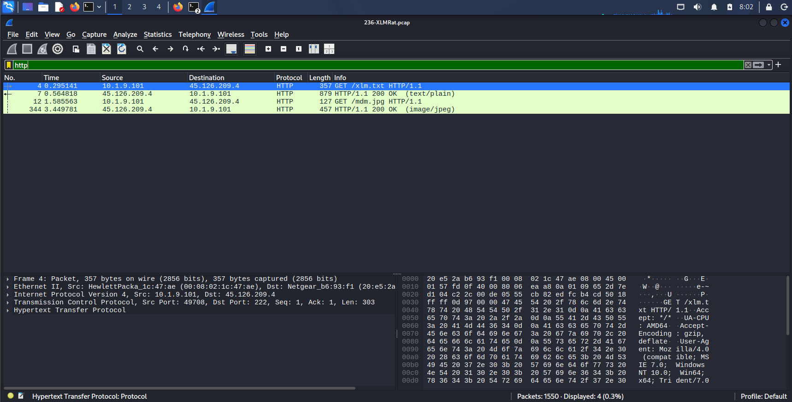
    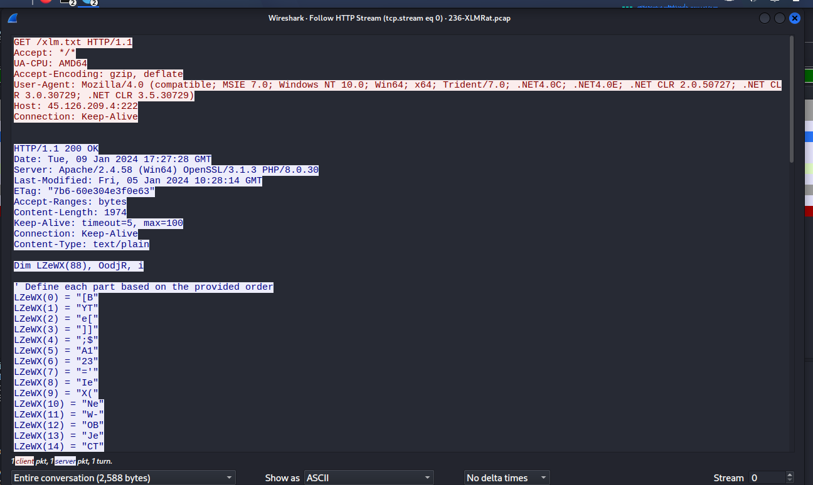
    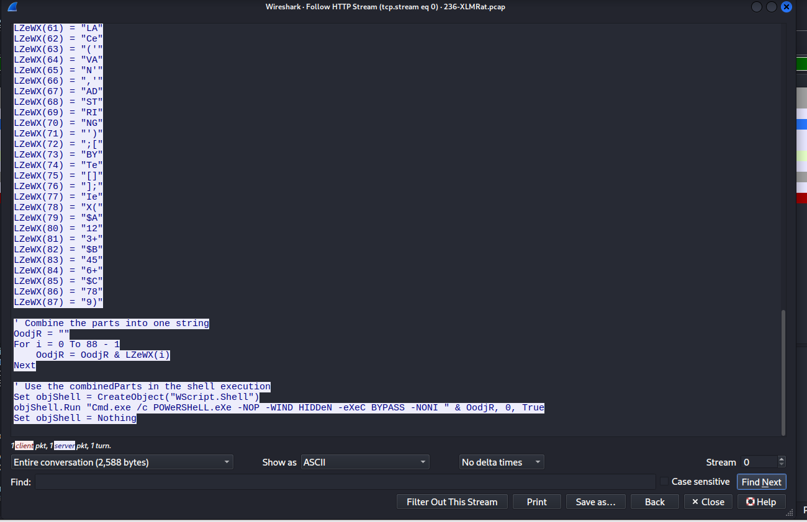
*   **Flag:** `http://45.126.209.4:222/mdm.jpg`

---

### Q2: Which hosting provider owns the associated IP address?

*   **Cách làm:** Sử dụng các công cụ OSINT để tra cứu thông tin định danh (ISP/ASN) của địa chỉ IP độc hại `45.126.209.4` đã bóc tách được ở Q1.
*   **Thao tác thực hiện:** Truy cập cơ sở dữ liệu của `abuseipdb.com` và nhập IP vào thanh tìm kiếm để kiểm tra thông tin nhà cung cấp dịch vụ lưu trữ (Hosting Provider).
*   **Bằng chứng:** Kết quả trả về cho thấy ISP quản lý IP này là **ReliableSite.Net LLC**.
    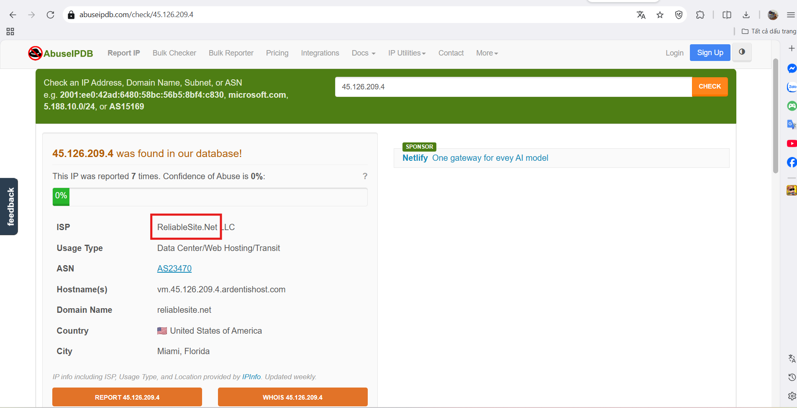
*   **Flag:** `ReliableSite.Net`

---

### Q3: By analyzing the malicious scripts, two payloads were identified: a loader and a secondary executable. What is the SHA256 of the malware executable?

*   **Cách làm:** Khi phân tích HTTP Stream của file `mdm.jpg`, ta nhận thấy đây không phải là một file hình ảnh mà thực chất là một script PowerShell đóng vai trò là Loader (trình tải thứ 2). Bên trong script này chứa 2 biến mã hóa hệ thập lục phân (Hex): `$hexString_bbb` và `$hexString_pe`.
    *   `$hexString_pe`: Là một module injector (tiêm mã) bằng .NET.
    *   `$hexString_bbb`: Bắt đầu bằng chuỗi `4D_5A_90...` (Tương đương với giá trị MZ trong mã ASCII). Đây chính là chữ ký (signature) đặc trưng của một file thực thi PE (Portable Executable) trên Windows. Kẻ tấn công đã băm nhỏ file mã độc `.exe` thành chuỗi Hex và giấu trong biến này để thực hiện kỹ thuật tiêm mã ngầm (Process Hollowing) vào tiến trình hợp lệ `RegSvcs.exe`.
    Do đó, để lấy mã băm của malware, ta cần trích xuất và giải mã biến `$hexString_bbb`.
*   **Thao tác thực hiện:**
    1.  Trên giao diện Follow HTTP Stream của `mdm.jpg`, copy toàn bộ chuỗi ký tự bên trong biến `$hexString_bbb` (bỏ cặp dấu ngoặc kép).
    2.  Sử dụng công cụ CyberChef để giải mã và tính toán hash với công thức (Recipe) như sau:
        *   **Find / Replace:** Find `_` (dấu gạch dưới), phần Replace để trống nhằm nối liền chuỗi Hex.
        *   **From Hex:** Chuyển đổi chuỗi Hex liền mạch trở lại định dạng nhị phân nguyên thủy (Binary) của file `.exe`.
        *   **SHA2:** Đặt Size là 256 để tính toán mã băm SHA256 trực tiếp từ file nhị phân vừa khôi phục.
*   **Bằng chứng:**
    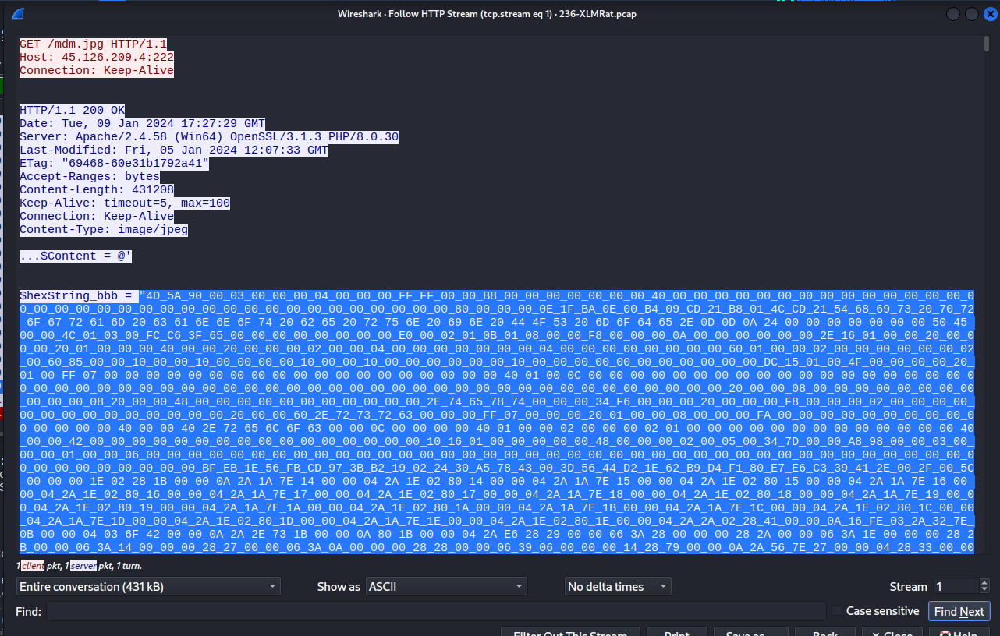
    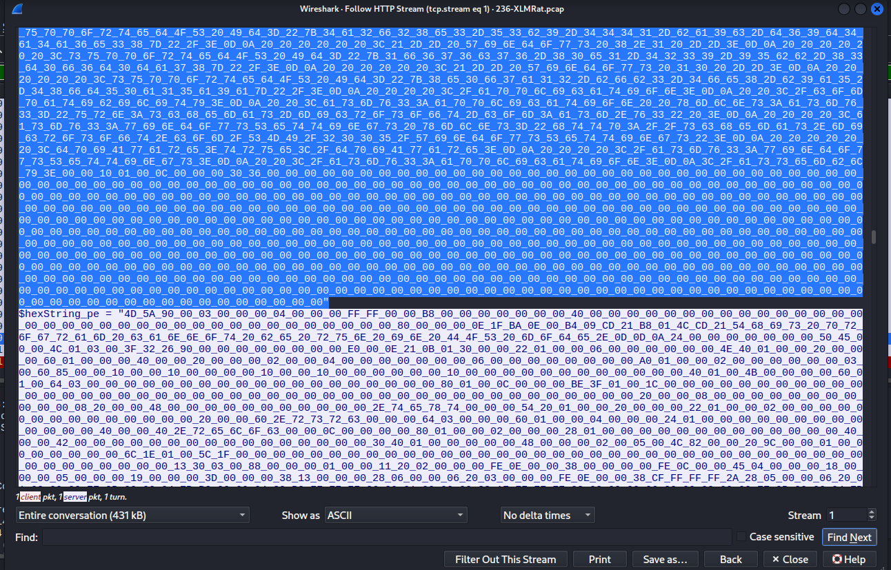
    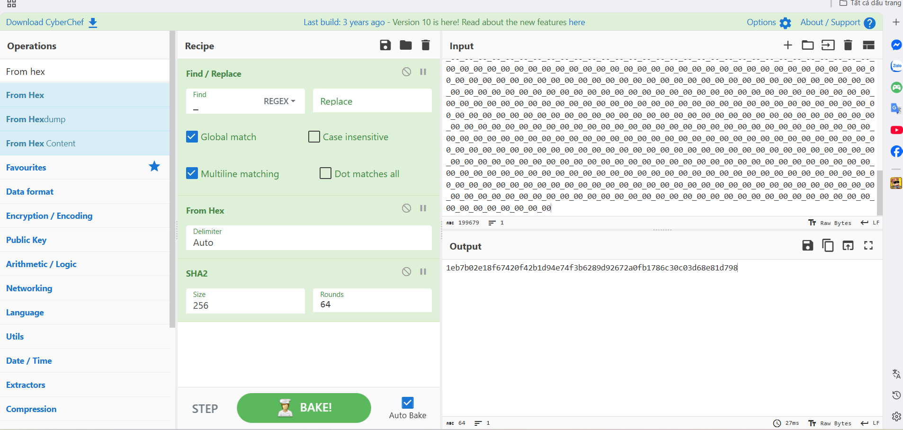
*   **Flag:** `1eb7b02e18f67420f42b1d94e74f3b6289d92672a0fb1786c30c03d68e81d798`

---

### Q4: What is the malware family label based on Alibaba?

*   **Cách làm:** Sử dụng mã băm SHA256 vừa tìm được để tra cứu thông tin nhận diện trên nền tảng phân tích mã độc VirusTotal.
*   **Thao tác thực hiện:** Truy cập VirusTotal, dán mã băm `1eb7b02e18f67420f42b1d94e74f3b6289d92672a0fb1786c30c03d68e81d798` vào thanh tìm kiếm. Tại tab Detection, kiểm tra kết quả nhận diện của engine Alibaba.
*   **Bằng chứng:** Kết quả quét cho thấy Alibaba nhận diện tệp tin này thuộc họ `Backdoor:MSIL/AsyncRat.a2786761`.
    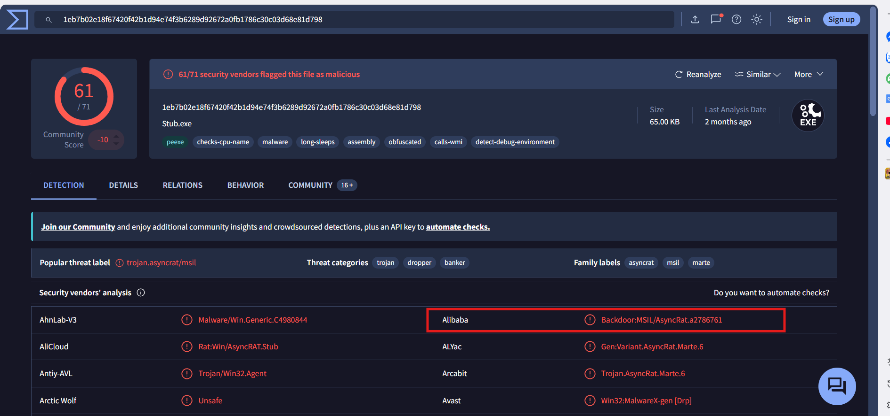
*   **Flag:** `AsyncRat`

---

### Q5: What is the PE header compile (Creation Time) timestamp of the malware?

*   **Cách làm:** Khai thác siêu dữ liệu (metadata) của file PE đã được VirusTotal phân tích để tìm thời điểm mã độc này được biên dịch (Compile/Creation Time).
*   **Thao tác thực hiện:** Vẫn tại trang kết quả của VirusTotal, chuyển sang tab Details. Cuộn xuống phần History để xem trường Creation Time.
*   **Bằng chứng:** Thời gian biên dịch được ghi nhận là `2023-10-30 15:08:44 UTC`.
    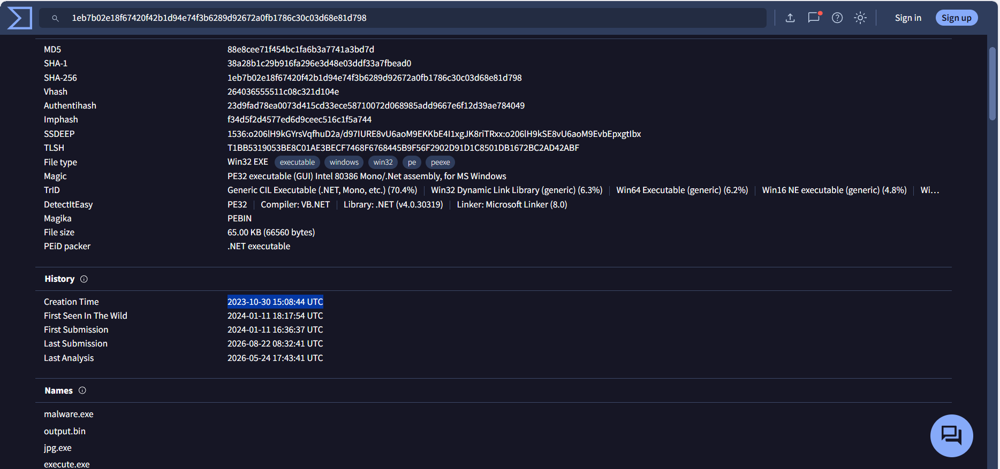
*   **Flag:** `2023-10-30 15:08`

---

### Q6: Which LOLBin is leveraged for stealthy process execution in this script? Provide the full path.

*   **Cách làm:** LOLBin (Living-off-the-Land Binary) là các công cụ, file thực thi hợp lệ có sẵn trên Windows (như `powershell.exe`, `certutil.exe`...) bị hacker lợi dụng để thực thi mã độc. Mục đích của hacker ở đây là lấy file mã độc thật nhét vào bên trong một tiến trình hợp lệ của Windows để nó tàng hình. Kẻ tấn công thường sử dụng các kỹ thuật che giấu chuỗi (String Obfuscation) để giấu đường dẫn đến tiến trình này.
*   **Thao tác thực hiện:** Trở lại phân tích mã nguồn PowerShell (đoạn mã ở phần cuối của luồng HTTP Stream 1 từ file `mdm.jpg`), ta quan sát kỹ các dòng gán biến khai báo đường dẫn. Script sử dụng hàm `-replace '#', ''` để loại bỏ tất cả các ký tự `#` rác. Dịch ngược chuỗi này theo cách thủ công, ta sẽ có được đường dẫn hoàn chỉnh.
    *   **Gỡ rối biến `$NA`:** `'C:\W#######indow############s\Mi####cr'` xóa hết `#` đi, ta được đoạn đầu: `C:\Windows\Micr`
    *   **Gỡ rối biến `$AC`:** Lấy biến `$NA` ở trên ghép nối tiếp với đoạn `'osof#####t.NET\Fra###mework\v4.0.303###19\R##egSvc#####s.exe'` (cũng xóa hết `#`): Ghép lại ta được đường dẫn hoàn chỉnh.
*   **Bằng chứng:**
    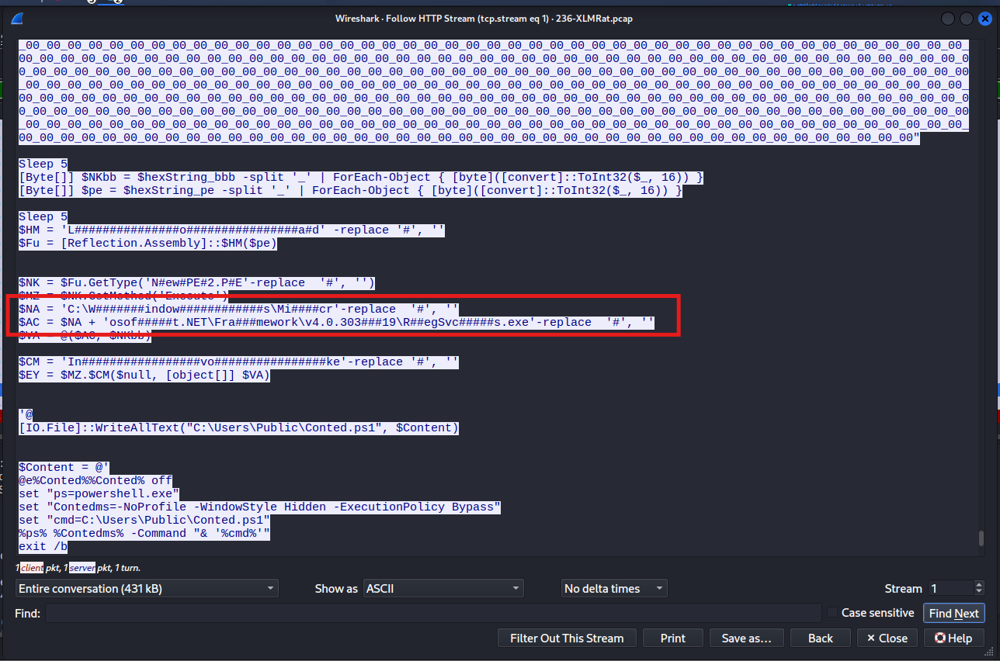
*   **Flag:** `C:\Windows\Microsoft.NET\Framework\v4.0.30319\RegSvcs.exe`

---

### Q7: The script is designed to drop several files. List the names of the files dropped by the script.

*   **Cách làm:** Trong các cuộc tấn công, mã độc thường tự động "drop" (thả) các file phụ trợ xuống ổ cứng của nạn nhân nhằm thiết lập cơ chế duy trì quyền truy cập (Persistence) hoặc thực thi các chuỗi lệnh phức tạp. Cần tìm kiếm các lệnh ghi file (ví dụ: `WriteAllText`, `Out-File`) bên trong mã nguồn để xác định tên các file này.
*   **Thao tác thực hiện:** Tiếp tục phân tích đoạn cuối của luồng HTTP Stream 1 (từ file `mdm.jpg`), ta phát hiện mã độc sử dụng phương thức `[IO.File]::WriteAllText` để lần lượt tạo và ghi nội dung vào 3 tệp tin tại thư mục `C:\Users\Public\`. Các tệp này bao gồm:
    1.  `Conted.ps1`: Chứa lệnh kích hoạt PowerShell với các tham số ẩn.
    2.  `Conted.bat`: Chứa lệnh thực thi kịch bản VBScript.
    3.  `Conted.vbs`: Chứa mã VBScript để chạy file batch một cách hoàn toàn vô hình (visibility = 0).
*   **Bằng chứng:**
    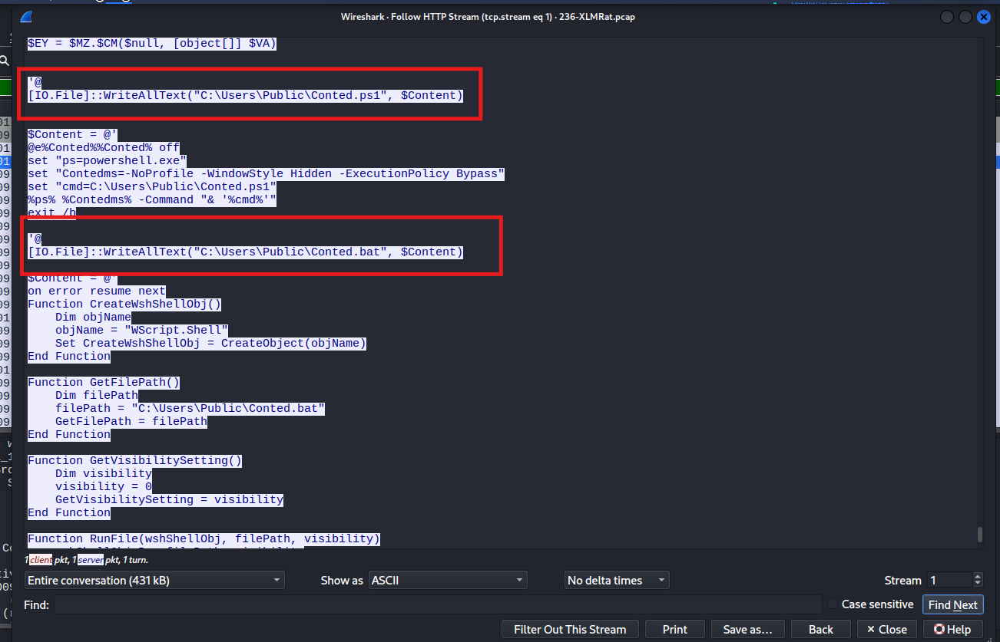
    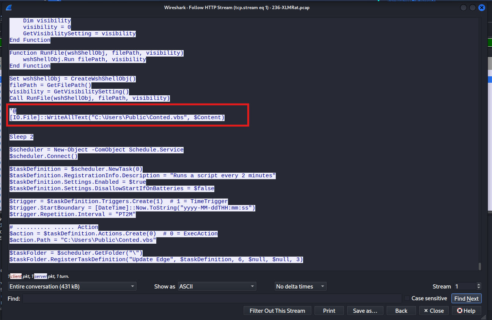
*   **Flag:** `Conted.ps1,Conted.bat,Conted.vbs`
