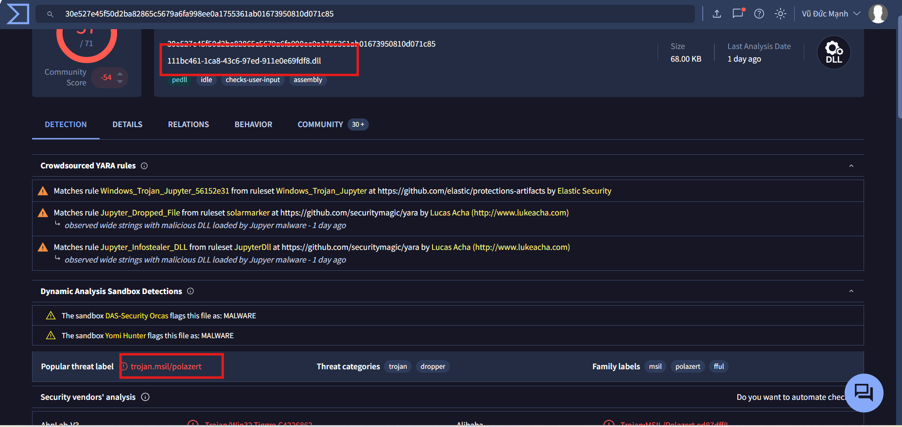
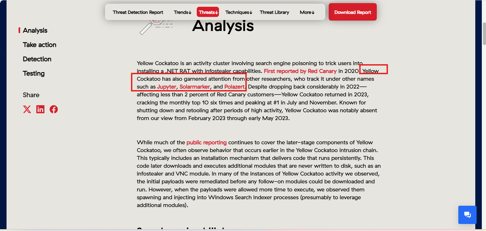
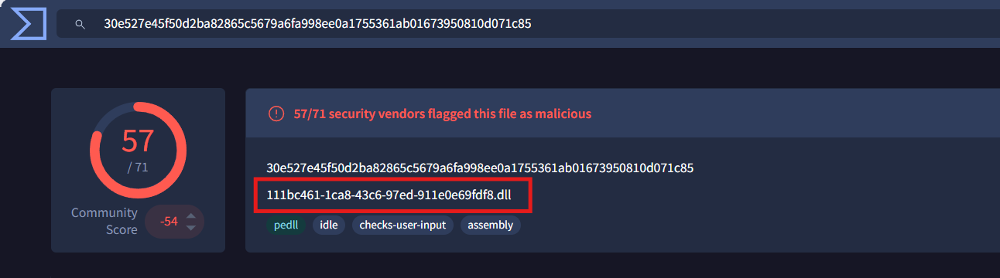
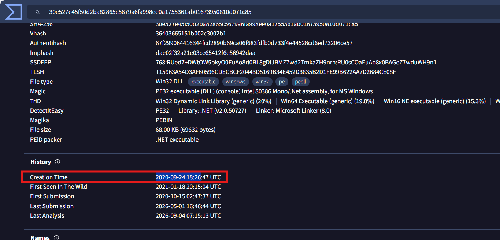
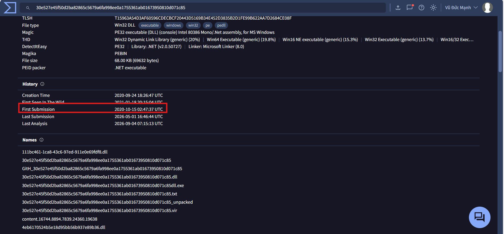
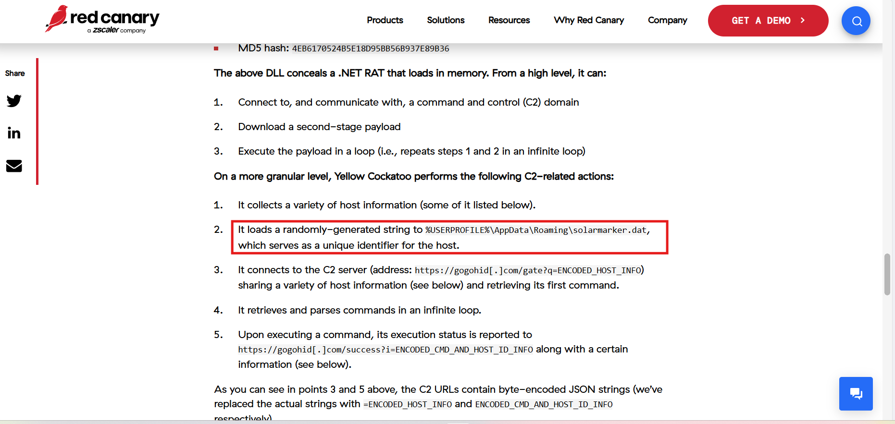
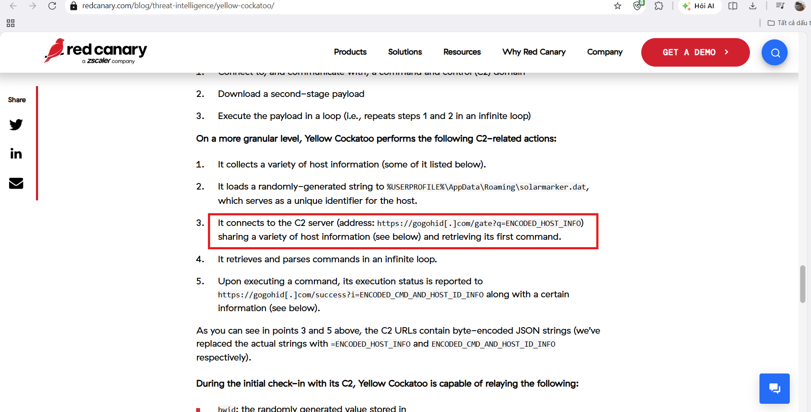

# CyberDefenders Lab: Yellow RAT Writeup

**Category:** Threat Intel | **Difficulty:** Easy | **Tools:** VirusTotal, Red Canary

**Scenario:** During a regular IT security check at GlobalTech Industries, abnormal network traffic was detected from multiple workstations. Upon initial investigation, it was discovered that certain employees' search queries were being redirected to unfamiliar websites. This discovery raised concerns and prompted a more thorough investigation. Your task is to investigate this incident and gather as much information as possible.

**Sample hash provided:** SHA-256 `30E527E45F50D2BA82865C5679A6FA998EE0A1755361AB01673950810D071C85`

---

### Q1: What is the name of the malware family that causes abnormal network traffic?
*   **Approach:** Look up the sample hash on VirusTotal to identify the malware family, cross-referencing with a threat intel report from Red Canary.
*   **Steps Taken:** Based on the SHA-256 hash provided in the challenge, searched on **VirusTotal** and identified this as a malicious DLL file containing a **Trojan** belonging to the **Polazert threat family**, also known by the alias **Yellow Cockatoo RAT**. Cross-referenced with a report from **Red Canary** on this malware strain to confirm.
*   **Evidence:**
    
    
*   **Flag:** `Yellow Cockatoo RAT`

---

### Q2: What is the common filename associated with the malware discovered on our workstations?
*   **Approach:** Check the file information on the VirusTotal results page for the sample.
*   **Steps Taken:** According to the VirusTotal search results, the malicious DLL file was identified with the name `111bc461-1ca8-43c6-97ed-911e0e69fdf8.dll`.
*   **Evidence:**
    
*   **Flag:** `111bc461-1ca8-43c6-97ed-911e0e69fdf8.dll`

---

### Q3: What is the compilation timestamp of the malware that infected our network?
*   **Approach:** Check the Details tab on VirusTotal to look up the PE file's compile time.
*   **Steps Taken:** In the **Details** tab on VirusTotal, identified the malware's Creation Time as `2020-09-24 18:26`.
*   **Evidence:**
    
*   **Flag:** `2020-09-24 18:26`

---

### Q4: When was the malware first submitted to VirusTotal?
*   **Approach:** Continue checking the Details tab on VirusTotal to look up the First Submission date.
*   **Steps Taken:** Also in the **Details** tab, identified the malware's First Submission as `2020-10-15 02:47:37 UTC`.
*   **Evidence:**
    
*   **Flag:** `2020-10-15 02:47`

---

### Q5: What is the name of the .dat file that the malware dropped in the AppData folder?
*   **Approach:** Look up the Red Canary report on Yellow Cockatoo RAT's file-dropping behavior.
*   **Steps Taken:** According to the report on **Red Canary**, Yellow Cockatoo RAT generates a randomly-generated string and saves it to the path `%USERPROFILE%\AppData\Roaming\solarmarker.dat` — this file serves as a unique identifier for the infected host.
*   **Evidence:**
    
*   **Flag:** `solarmarker.dat`

---

### Q6: What is the C2 server that the malware is communicating with?
*   **Approach:** Continue reviewing the Red Canary report on the C2 infrastructure the malware connects to.
*   **Steps Taken:** According to the report on **Red Canary**, identified the C2 server the malware connects to for sharing host information and retrieving its first command as `https://gogohid[.]com`.
*   **Evidence:**
    
*   **Flag:** `https://gogohid.com`
